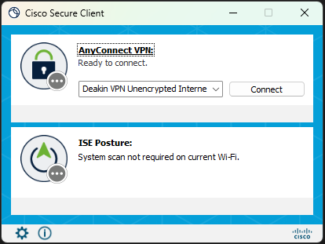
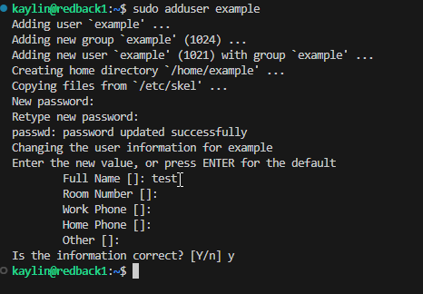
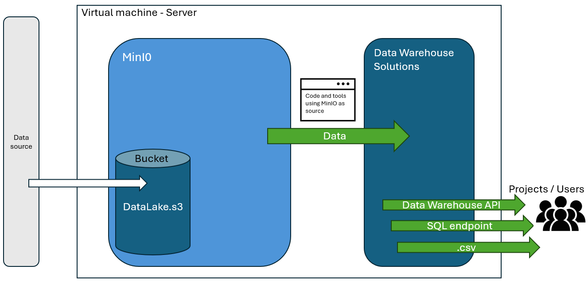
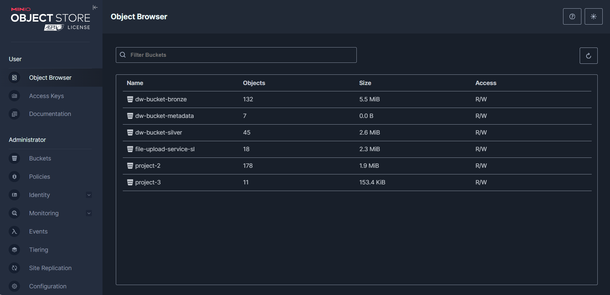
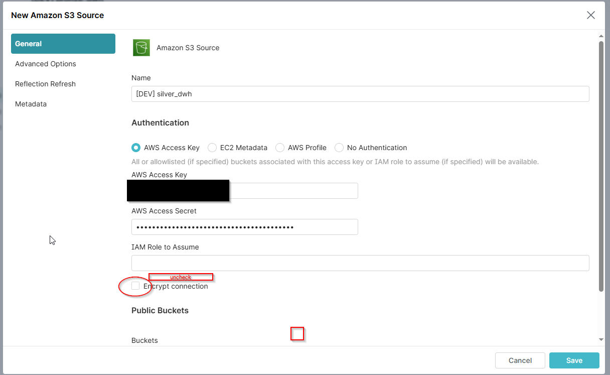
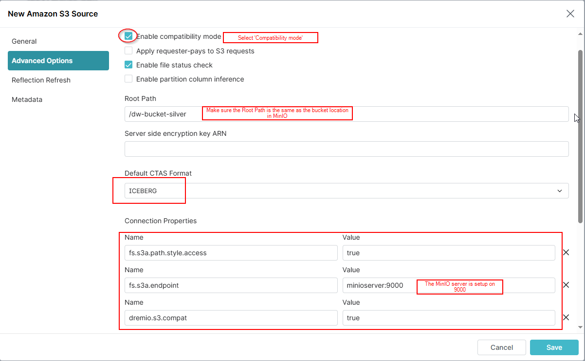
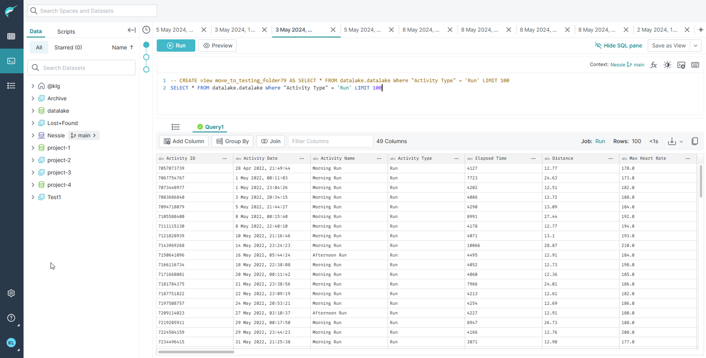
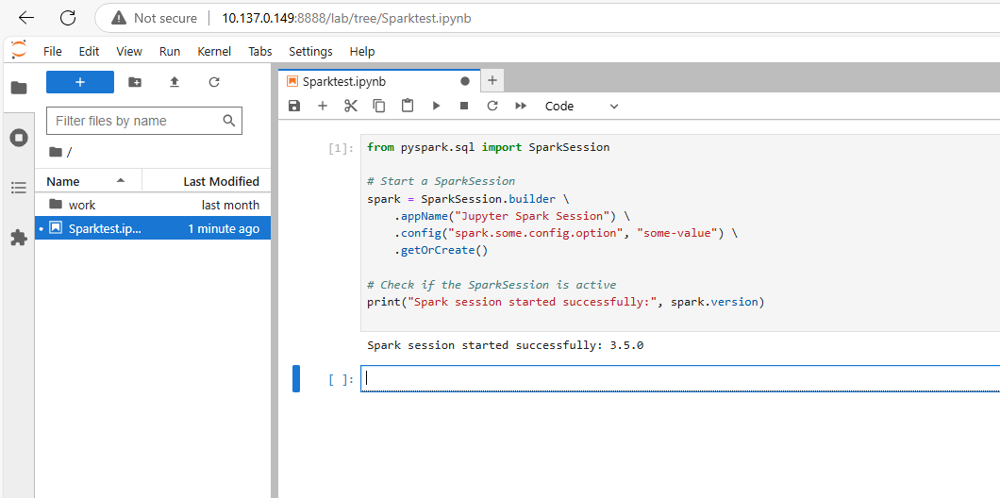

--- 
sidebar_position: 1
---

# Data Warehouse Administration

  The Data Warehouse in Redback Operations exists to serve the company by providing storage and Data Warehouse solutions to the associated Projects in Redback Operations.
  It has been the goal of Data Warehouse to provide multiple options and satellite services that accompany our overall aim to enhance the data quality, ease-of-access and governance of Redback Operations.

This document contains information on the different parts of the Data Warehouse and brief explanations on how they work. It does not expand on the individual 'Data Warehouse Solutions' which all have their own documentation. Instead, this document outlines how to use the tools of the Data Warehouse project from an administrator's perspective.

Data Warehouse has three 'Data Warehouse Solutions' that can facilitate company data.

- The File Upload Service
This is based in a streamlit app, it can take data and store it in a folder on the VM the files can be viewed in a separate tab, downloaded from the VM and replaced.
It has built-in preprocessing for data clean-up and Machine learning specific pre-processing for .csv files. located here: [File Upload Service](http://10.137.0.149:80/)

- The Structured Dremio Solution
The Dremio solution takes structured data (flat files, .csv .xlsx) and stores them on the virtual machine in a MinIO object store. From here the data is connected to the Dremio user interface where tables can be created from SQL commands.
The data can be access out through the UI or through a Flask API that connects to Dremio and can retrive data based on SQL statements in the API request. Located here: [Dremio](http://10.137.0.149:9047/) with documentation here: [Structured Solution Documentation](https://redback-operations.github.io/redback-documentation/docs/data-warehousing/Data%20Lakehouse/Managing-the-structured-solution)

- The Semi-structured MongoDB solution
The MongoDB solution takes semi-structured data in the form of .json files from Redback projects and parses them into the MongoDB database that runs on the virtual machine. The data is able to be accessed back out through either an API or the MongoDB Atlas user interface. The MongoDB solution is also a source of data for the Dremio UI and can be queried there also.
[MongoDB API](http://10.137.0.149:5003/documents)
 

A main part and fundamental aspect of the Data Warehouse is its storage base which is a Deakin Virtual Machine. 

## The Virtual Machine (VM)

The virtual machine is a Deakin server located on Deakin campus and owned by the Deakin I.T team. it is an on-premises bare-metal storage device and is therefore cloud incapable.

The VM uses a Linux operating system and therefore has some differences to consider compared to Windows or Mac.

At the time of writing the virtual machine has a 1TB total capacity.

There are a few documents in the Data Warehouse documentation repository that recount the steps to access the virtual machine in more detail however below is a short quick-start explanation.

Here are a few basic steps to begin accessing the VM:


1. Account
If you don't already have access: please request it from the Data Warehouse leader or mentor as soon as practical.

  

2. Connecting to the Deakin VPN
The next part of accessing the Data Warehouse is connecting to Deakin's network which requires downloading and connecting to the Deakin anyconnect VPN and authenticating, using [anyconnect VPN](https://www.deakin.edu.au/students/student-life-and-services/health-wellbeing-and-safety/safety-security/online-safety-security/secure-your-devices/vpn)



There are two recommended ways to access the virtual machine.
#### Method 1. Using Command prompt.

You can use command prompt to access the VM 
1. Open command prompt from the start menu
2. Use the command in the terminal ` ssh yourusername@redback.it.deakin.edu.au`
3. Enter your password.
4. Use the terminal commands to navigate the VM

#### Method 2. Using VS Code IDE
Using an IDE makes accessing and navigating the VM easier with the additional user interface instead of relaying code in CMD prompt.
 1. Open VS code
 2. Click on open remote in the bottom left corner open remote picture
3.  '+' add New SSH host...
4. Enter 'redback.it.deakin.edu.au'
5. Enter password for your VM user
6. You will see the redback ip in the bottom left-hand corner confirming your entry into the VM 
7. From here, it's recommended that you create your own folder to operate in the VM where you can then clone the data-warehouse GitHub repository and utilize the git functionality from the virtual machine as if it were an IDE on your PC. This is highly recommended and elaborated on later in the document. 

### Adding a new user to the Virtual Machine

Adding a new user is a common occurrence and once you have sudo/admin privileges the process is straightforward.

1. Use the `sudo adduser <username> `

2. Give the user a password

3. Confirm details

Ensure to write down the credentials and send them through an appropriate means.



The user will now have access to the VM providing they follow the steps and authenticate through the VPN first as well.


### List of Data Warehouse Addresses

  

#### Virtual Machine Address : 10.137.0.149

  

File upload service (streamlit app):[http://10.137.0.149:80/](http://10.137.0.149:80/)

MinIO: [http://10.137.0.149:9001/login](http://10.137.0.149:9001/login)

Dremio: [http://10.137.0.149:9047/](http://10.137.0.149:9047/)

MongoDB: [http://10.137.0.149:5003/documents](http://10.137.0.149:5003/documents  "http://10.137.0.149:5003/documents")

Spark Notebooks: [http://10.137.0.149:8888/](http://10.137.0.149:8888/)

Flask-API: [http://10.137.0.149:5000/](http://10.137.0.149:5000/)

  

*The virtual machine also shares some capacity with the cybersecurity team including ports and containers not covered here.

  

## The VM and Docker

⚠️ **WARNING:** Changes made to the Docker containers inside the VM affect the shared production environment. These containers are **NOT** isolated per user.

The VM uses a Docker instance to run 'containers' or apps (different software we use as tools e.g. MongoDB).

This makes it easier to keep track of what's running on the virtual machine, the apps dependencies and how it is interacting with the other apps in the Docker environment.

  

Accessing the Docker instance and containers is done through a terminal.

  

The Docker commands are beneficial because they are in the context of the Docker environment/instance and the containers/apps within it making them easier to control and modify.

Here are some of the commonly used commands:

  

`docker ps` Show all the docker containers and their status in the VM.

`docker up` Restarts the containers in the Docker environment.

`docker start` Usually followed by the container ID or name of the app.

`docker compose` usually followed by the dockerfile that contains a list of containers.

  
To run the docker compose which starts the core infrastructure (everything besides mongo db) the command done in the "Core DW Infrastructure" directory is:

`docker compose up -d`

  
There is a lot of documentation freely available for using docker on a Linux VM for more detailed information.

  

#### Removing, stopping and restarting Docker

It is important to note that stopping docker containers individually or as a collective will remove data associated with the container.

For instance, if I need to stop or restart the Dremio container and I have data within the Dremio container (SQL scripts, source information, usernames and admin information) this will remove this associated information unless there is a 'volume' consideration in the docker file. In the case of the core infrastructure there are volumes set up to capture information in the event of a restart or stop of the container.

  

Below is an extract from the docker-compose.yml. This serves as an example of using volumes to retain data.

```

(at the Dremio container code block)

dremio:

volumes:

- fileuploadservice_dremio-data:/var/lib/dremio

  

(at the 'volumes' code block)

volumes:

fileuploadservice_dremio-data:

external: true

```

  

## How to Use MinIO

  

MinIO is the object storage for data warehouse.

  

MinIO stores files in buckets that can be accessed with the combination of MinIO created 'Access Keys' and 'Secret Keys'. These work similar to AWS S3 storage and can be used with other software downstream as if it was AWS S3.

  

MinIO serves as a set of folders that use the VM's storage and can be accessed through credentials to upload/download data. Making it more user friendly than storing files on the VM directory alone.

  

At the time of writing MinIO is located on port `9000` and is accessed by a number of other Data Warehouse tools it's recommended this port isn't modified unless absolutely necessary as it will break tools downstream.

  

### To access existing MinIO data

  

1. Using the GUI

Accessing the MinIO object store through the GUI will first require entering the username and password. This is not included in this text for obvious security reasons but can be retrieved from the Data Warehouse mentor or current Data Warehouse leader.

Once authenticated the user will be presented with a MinIO object store user-interface.



As mentioned above MinIO stores files in 'buckets' to accommodate for different file types (flat, semi-structured and object).

There are already buckets that exist in the MinIO server on the virtual machine including 'dw-bronze-bucket' and 'dw-silver-bucket'. These are sources of the Redback File Upload System.

For the purposes of inspection following the MinIO address in browser will offer a GUI where navigation of buckets and files is possible as well as creation of credentials. This makes it easy to keep track of where files are being sent to and what path they can be accessed from as well as deleting and other admin tasks.

  

3. Using code

This is the most suitable way for data warehouse to utilise the MinIO object store.

Any code or file that needs to access files from MinIO or aims to upload files to MinIO requires an Access Key and Secret Key as mentioned above. It's recommended that these are stored in environment variables (.env file) and then excluded using a .gitignore file. Redback security policies won't allow for files with hardcoded credentials to be uploaded to GitHub.

  

An example code block to access a file from MinIO:

(referencing environment variables from a .env file)

```

get env ()

access_key = AWS_ACCESS_KEY

secret_key = AWS_SECRET_KEY

  

```

  

## How to Use Dremio

  

### Why Dremio?

Dremio in the Data Warehouse is the GUI for table storage. It accesses data from the Data Warehouse sources of MinIO and Mongo DB.

  

Dremio was decided upon after a series of redback requirements gathering tasks where it was considered cost-effective (free) and would allow for storage from different data sources, with the SQL functionality and GUI making it a smaller learning curve than other FOSS that were mostly terminal based.

  

### How To Add A Source in Dremio

There are a few steps to adding a source in Dremio.

(For this example we will add a MinIO bucket as a source)

  

1. Add source

Use the 'Add source' button on the user interface

2. Enter Credentials

Enter Credentials according to the source.



3. Go to 'Advanced Options' and tick 'enable compatibility mode'



  

At this point, 'save' and the source should appear in the object storage list quickly.

  
  

### Adding a Table in Dremio with SQL

Dremio allows for creating tables or 'views' with T-SQL. What this means is with the SQL language it's possible to modify the source data to a more meaningful state depending on the data analysis purpose.

  

Once a source has been added. Enter the SQL interface on the left side of the GUI. This will bring up a text box that SQL commands can be written in and executed from. Resulting in a modified table that can be accessed downstream.



  

Dremio also has the capability of storing files in Iceberg or **Parquet** format allowing for time-series versions of the same file and their metadata, which would aid in recording historical versions of the same files.

#### SQL Endpoint

Alternatively, Dremio offers a SQL endpoint that through code you can query the source data through Dremio with SQL statements.

  

See the documentation of [Dremio API ](https://redback-operations.github.io/redback-documentation/docs/data-warehousing/Data%20Lakehouse/Dremio-API(For%20data%20analysts)) also located in the Data warehouse documentation for a detailed explanation.


## Data Provenance Pipeline

A key part of the infrastructure introduced in T3 of 2024 was the provenance pipeline with the purpose of tracking and storing historical meta data about all changes that occur in the system including data upload, transformation, access, deletion, etc.

The key aspects of the pipeline are the ELK stack (elasticsearch, logstash, kibana) and a postgres database acting as a provenance store.

### Logstash 

Logstash is a tool for parsing data of various schemas and formats and directing them to another source, it is running on port 5044 though is only access through code.

### Elasticsearch 

Elasticsearch is the storage and querying tool for logs and has its own external volume and the raw json storage can be accessed through the below ports.

See indexes: [http://10.137.0.149:9200/_cat/indices?v](http://10.137.0.149:9200/_cat/indices?v)

Query minio logs: [http://10.137.0.149:9200/minio-*/_search?pretty/](http://10.137.0.149:9200/minio-*/_search?pretty/)

Query file upload service logs: [http://10.137.0.149:9200/upload-service-*/_search?pretty](http://10.137.0.149:9200/upload-service-*/_search?pretty)

### Postgres

Postgres is the provenance store and must be accessed after terminal ssh into the VM using this command:

```sh
docker exec -it postgres psql -U <username> -d <database-name>
```

### Kibana

Kibana is a tool for visualizing the logs stored in elasticsearch. Whilst it is connected to elasticsearch and operational, no dashboards have been created as of yet.

Kibana: [http://10.137.0.149:5601](http://10.137.0.149:5601)
  

### Nessie (Not currently running in production)

Nessie is a metadata store that captures information about the files in Dremio and keeps it in case of corruption or for historical analysis.

Because the Nessie file in Dremio has the details of each file it can work as a data catalog to quickly sort and find information in a data model which was the original intention to include it in the Data Warehouse stack.

The Data Warehouse VM is running a Nessie instance, and the proof of concept has been performed successfully using sample data in Dremio, however at the time of writing there is no Nessie files being stored or utilised in the Data Warehouse Dremio instance.

  

### Spark Notebooks and the Virtual Machines (Not currently running in production)

The Data Warehouse virtual machine is successfully running Apache Spark as part of the dockerfile.

By following the address: [http://10.137.0.149:8888/](http://10.137.0.149:8888/) this will open a window and start a new Jupyter notebook.

This notebook exists and is running in the virtual machine where Spark jobs can be configured and ran. This represents a functionality to code and run distributed Spark jobs within the virtual machine and has the advantage of being able to process large datasets using the Spark DAG scheduler and partitioning data with distributed computing. At the time of writing without large production datasets in the VM there isn't currently a need for this functionality yet.


  

### GitHub and the Virtual Machine

  

It is important to clone the GitHub repository [redback-data-warehouse](https://github.com/Redback-Operations/redback-data-warehouse) to your working directory on the virtual machine. In order to push your changes and work to the GitHub repository it needs to be on the virtual machine not PC. 

There are vast resources for working in GitHub including resources in the Redback Teams channel.

Here is a Redback video series that explains the steps to incorporate GitHub. You can also contact your mentor for further information.

[GitHub cloning and forking Video](https://youtu.be/FVEpojv_Jxg?si=QxcT3Cgwr6BACQLk)

  

### Credentials and Admin Users

There are many credentials for each tool or software associated with the Data Warehouse.

There is a list of credentials that is maintained by the **Data Warehouse leader & Mentor** will also have access and if appropriate, will be able to grant access to new users.

There is not nor should there be credentials in plain text for Data Warehouse files.

  
  

## Data Warehouse Next Steps

  

The Data Warehouse has come a long way but there is still work to do.

  

At the time of writing there are opportunities to:

  
  
- Implement the ability to bulk upload to the file upload service

- Refine and expand the pre-processing data in the file upload service to accommodate more dynamic transformations of different types of data/data types.

- Provide integration and orchestration designs to the existing data warehouse solutions

- Incorporate production data (not sample data) from Redback projects into the Data Warehouse solutions in a meaningful way.
