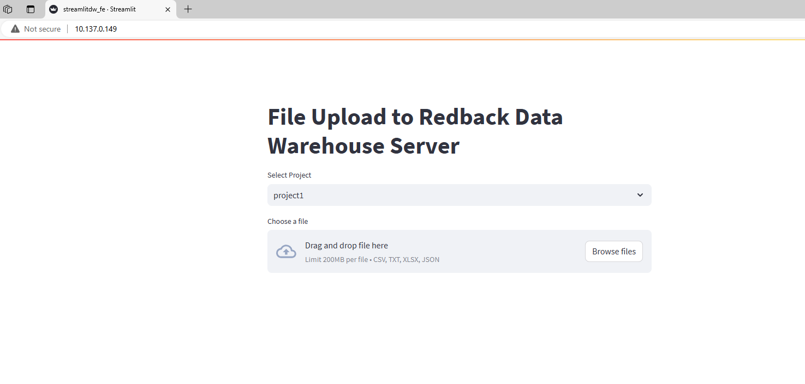
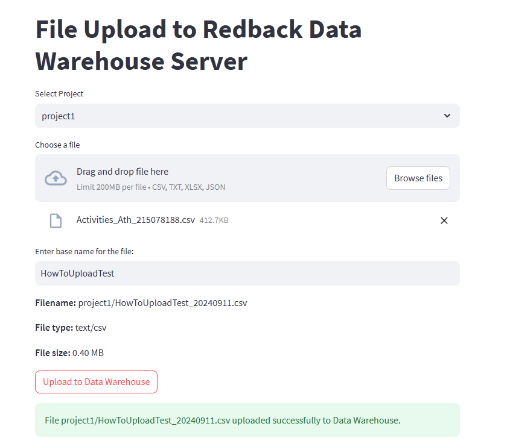

--- 
sidebar_position: 1
---

# How To Use The Data Warehouse File Upload Service

## Part 1 - Uploading a File

#### Step 1 - Log into the Deakin VPN

Because the 'File Upload Service' is running on a Deakin virtual machine you need to be authenticated via the VPN to access the port.

The link below contains a guide to a quick setup for the Deakin VPN
##### NOTE: you may need to 'log in' on the top right corner to access the VPN webpage
[Cisco AnyConnect – Deakin Software Library](https://software.deakin.edu.au/2019/04/16/cisco-anyconnect/)


#### Step 2 - Accessing the Streamlit app

Once the VPN is successfully set-up and if properly authenticated you can access the streamlit app that serves as the user interface for the service using the following address
				http://10.137.0.149/



#### Step 3 - Uploading a file

Using the drop-down box select the project of which the data is related to.

(This decided the directory in the VM and the MinIO bucket that the data will be stored in and how it will be able to be accessed once it is stored.)

The FUS will ask for a file name and enforce some naming conventions.
Please make the name descriptive but brief.

If successful, the website will show 'Uploaded Successfully'.



## Part 2 - Retrieving a File

There are a few options to retrieve/download a file from the VM using the file upload service.

### Option A - Retrieving the file in code

To access the file through an IDE you can access the list of files withe the Flask API
to do this use the following code.

#### To View the list of files

http://localhost:5000/list-files


````import requests
url = "http://localhost:5000/download-file/example.txt" 
 = requests.get(url)
````


### Option B - Download from browser


