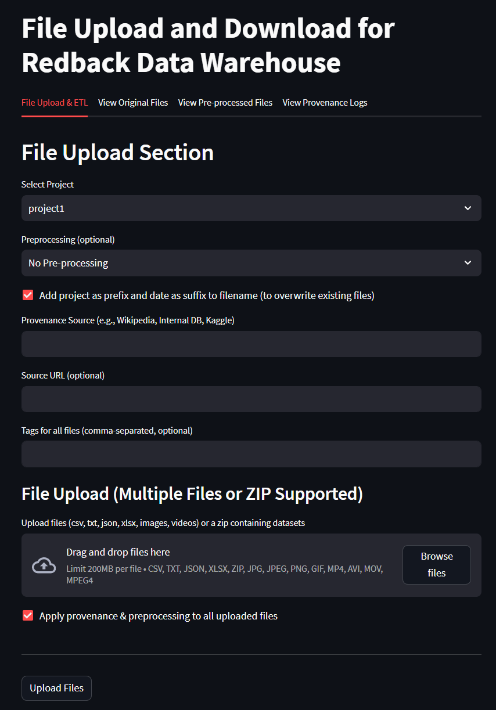
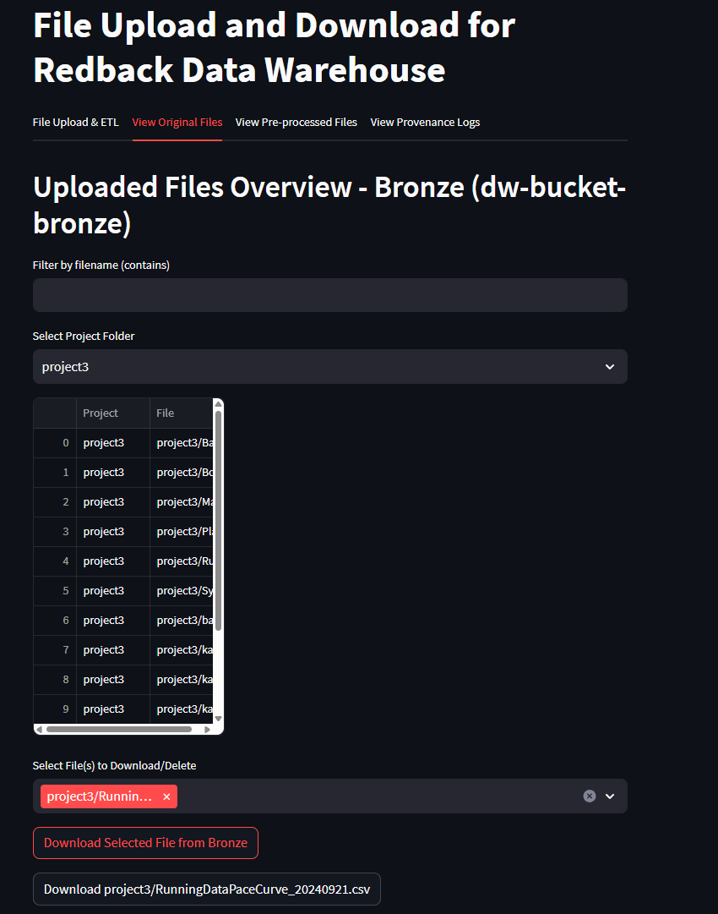

--- 
sidebar_position: 5
sidebar_label: File Upload Service
---

# How To Use The Data Warehouse - File Upload Service

:::info **Document Creation:** 22 September, 2024. **Last Edited:** 25 September, 2025. **Authors:** kghdxx, shimrxn. <br></br> **Document Code:** ONB5. **Effective Date:** 25 September 2025. **Expiry Date:** 25 September, 2026. :::

## Part 1. Accessing the File Upload Service

#### Step 1 - Log into the Deakin VPN

Because the 'File Upload Service' is running on a Deakin virtual machine you need to be authenticated via the VPN to access the port.

The link below contains a guide to a quick setup for the Deakin VPN
##### NOTE: you may need to 'log in' on the top right corner to access the VPN webpage
[Cisco AnyConnect – Deakin Software Library](https://software.deakin.edu.au/2019/04/16/cisco-anyconnect/)


#### Step 2 - Accessing the Streamlit app

The File Upload Service is based on a streamlit app that is accessed through the browser. 

Once the VPN is successfully set-up and if properly authenticated you can access the streamlit app that serves as the user interface for the service using the following address
				http://10.137.0.149/




## Part 2 - Using the File Upload Service

### Upload Options 
The File Upload Service (FUS) supports multiple file types, simultaneous uploads, provenance tracking, and improved governance features.

#### Choose Files
- Upload **single or multiple files** using drag-and-drop or the file picker.  
- Supported formats:  
  - **Documents:** CSV, JSON, Excel  
  - **Images:** PNG, JPG  
  - **Video files:** MP4, AVI  
  - **Compressed archives:** ZIP   

When uploading a ZIP archive, the service automatically inspects its contents:  
- A list of all files inside the ZIP is displayed.  
- If the ZIP contains any **CSV files**, a **preview of the CSV data** is shown directly in the app before upload.  
- This helps you verify the file contents (e.g., column names, sample rows) without extracting the archive manually.  
- Other file types (such as MP4, JPG) are listed and stored as-is without preview.  


#### Provenance Logging 
All uploads now include provenance information to ensure data governance and traceability.

- **Provenance Source (required):** e.g., Kaggle, Wikipedia, Internal Project. 
- **Source URL (optional):** must be a valid web link if provided. Captured metadata includes: - Filename - Project - Uploader identity - Provenance source and URL - Preprocessing method - Timestamp These details are written to a provenance.json log file and displayed in the new **Provenance Logs tab** in the app. 


## Preprocessing 
Choose a pre-processing option if desired. Explained further below.

#### Add Prefix and Suffix to Filename
The check-box if ticked will add a Project Prefix and a timestamp to the end of the csv stored in the VM's filename. This is recommended as it helps with data governance.

By not unticking the checkbox the filename will enter storage as the base name entered below. This will remove the timestamp and allow for overwriting the file if it is modified by performing the file upload again with the same name.

#### Entering the Filename
Enter the name of the file it will only accept alphanumeric values.

Clicking the 'Upload to Data Warehouse' button will produce a summary and confirm or reject the file.

## Preprocessing Explained 
what is each preprocessing actually doing

**Data Clean Up Preprocessing**

The Data Clean Up option performs basic formatting and data cleansing for data that is intended for general use. The code focuses on cleaning the dataset by removing irrelevant or potentially problematic data (empty columns, duplicate rows etc.), before standardizing columns for consistency and adding metadata with an extract date and unique ID columns.


**Preprocessing for Machine Learning** 

The Machine Learning option intends to prepare data in a way that will optomise it for machine learning tasks downstream by transforming numeric data for ML algorithms by handling missing values and scaling features as well as ensuring that numeric features are on a comparable scale, which is a common pre-processing step in data science and analysis tasks.

#### Add Prefix and Suffix to Filename 
The checkbox, if ticked, adds a project prefix and timestamp. Unticking allows overwriting of files by re-uploading with the same name. 

#### Entering the Filename 
Filenames must be **alphanumeric**.

## Step 3 - Uploading a File

1. Select the relevant project.  
2. Choose one or more files (documents, images, video, or zip archives).  
3. Enter provenance details.  
4. Select preprocessing if required.  
5. Click **Upload to Data Warehouse**.  

A progress bar will appear during the upload showing the status of the file(s) being uploaded.  
If successful, the interface will show **"Uploaded Successfully"**.    


## Part 3 - Retrieving a File

There are a few options to retrieve/download a file from the VM using the file upload service.

### Option A - Retrieving the file with code

To access the file through an IDE you can access the list of files with the Flask API
to do this use the following code.

Downloading from web browser:
`http://http//10.137.0.149/:5000/download-file?bucket=dw-bucket-bronze&filename=project3/testdocument_20240921.csv`

Using a variation of the address above will download a file through the browser.

#### Using Curl in Command Line

Open a terminal or command prompt and use a variation of the code below to download the file.

`curl -o file.txt "http://localhost:5000/download-file?bucket=dw-bucket-bronze&filename=project1/data/file.txt"`


#### Using requests Package in an IDE

Using the Requests package will access the data through the Flask API.
```
import requests url = "http://<server_address>:5000/download-file" params = { 'bucket': '<bucket_name>', 'filename': '<file_path>' } response = requests.get(url, params=params)
```

### Option B - Download from browser

Utilising the streamlit app interface for the file upload service provides several options to view and download previously uploaded files.

Perform the following steps to download a file from the browser.

Upon successfully uploading a file the following tabs can be used to download a file. 

 - 'View Original Files'
 - 'View Pre-Processed Files'

1. Use the dropdown to select the appropriate project which will indicate the folder in which the file is in storage
2. Use the 'Download Selected File from Bronze/Silver' 
Original files are stored in Bronze and Pre-processed in silver
3. Once download is initiated an API URL will appear and a second download button that can be used to execute the download.





## Part 4 - Provenance Log Search

The **Provenance Logs tab** includes a **Search by Tag** function.  
- Users can enter a tag (exact match) into the search bar.  
- The system will filter and display only provenance records that match the tag.  
- This helps quickly locate files based on project names, file types, or parts of a filename.  

Example: entering the tag **“test”** will display all provenance entries and filenames containing the word *test*.  


## Part 5 - Managing Provenance Logs

The File Upload Service provides governance features for tracking the history of every uploaded file.  
In addition to viewing provenance details, users can also **delete provenance entries** when required.

### Viewing Provenance Logs
- Go to the **Provenance Logs** tab in the Streamlit app.  
- All uploads are listed with metadata such as filename, project, provenance source, URL, preprocessing method, and timestamp.  
- Multiple entries may exist for the same file (updates are tracked over time).  


### Deleting a Provenance Entry
- Each log entry includes a **delete option**.  
- Selecting delete will remove the provenance record from `provenance.json`.  
- This action **does not delete the actual file** from storage (Bronze/Silver buckets).  
- Use this feature to clean up duplicate or incorrect provenance entries while keeping the uploaded data intact.  


:::note
Deleting provenance entries should be done carefully, as this reduces traceability.  
For compliance, avoid deleting provenance logs unless they were created in error or for test data.
:::
