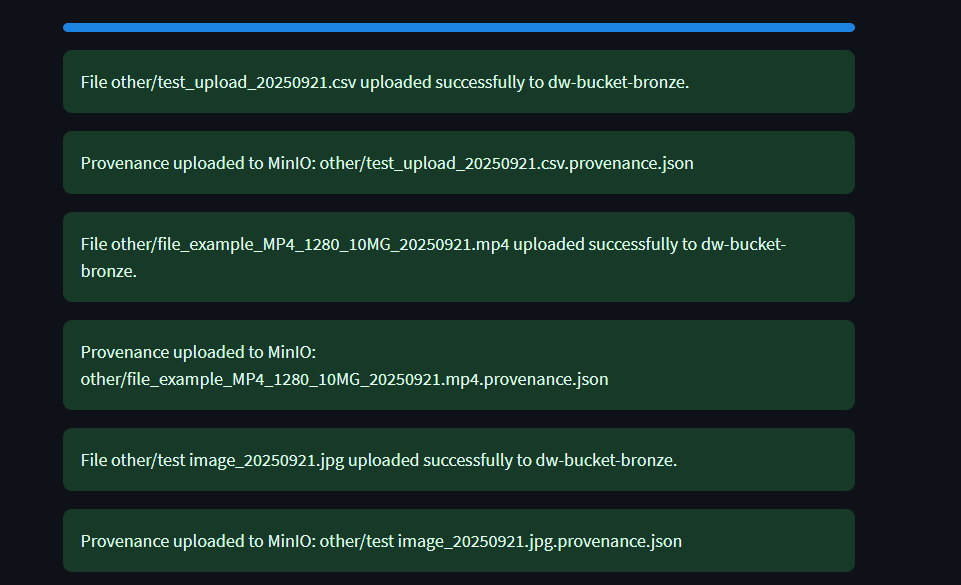

--- 
sidebar_position: 2
---

# How To Use The Data Warehouse - File Upload Service

## Part 1. Accessing the File Upload Service

#### Step 1 - Log into the Deakin VPN

Because the 'File Upload Service' is running on a Deakin virtual machine you need to be authenticated via the VPN to access the port.

The link below contains a guide to a quick setup for the Deakin VPN
##### NOTE: you may need to 'log in' on the top right corner to access the VPN webpage
[Cisco AnyConnect – Deakin Software Library](https://software.deakin.edu.au/2019/04/16/cisco-anyconnect/)


#### Step 2 - Accessing the Streamlit app

The File Upload Service is based on a streamlit app that is accessed through the browser. 

Once the VPN is successfully set-up and if properly authenticated you can access the streamlit app that serves as the user interface for the service using the following address
				http://10.137.0.149/


## Using the File Upload Service 

### Upload Options 
There are a number of options to modify the way you can store data in the FUS 

#### Project Selection
chose the appropriate redback operations project 

#### Choose a File
Use the drag and drop function or browse files to select the relevant file.
Only .csv files will be accepted for pre-processing options.

#### Preprocessing 
Choose a pre-processing option if desired. Explained further below.

#### Add Prefix and Suffix to Filename
The check-box if ticked will add a Project Prefix and a timestamp to the end of the csv stored in the VM's filename. This is recommended as it helps with data governance.

By not unticking the checkbox the filename will enter storage as the base name entered below. This will remove the timestamp and allow for overwriting the file if it is modified by performing the file upload again with the same name.

#### Entering the Filename
Enter the name of the file it will only accept alphanumeric values.

Clicking the 'Upload to Data Warehouse' button will produce a summary and confirm or reject the file.

## pre-processing 
what is each preprocessing actually doing

**Data Clean Up Preprocessing**

The Data Clean Up option performs basic formatting and data cleansing for data that is intended for general use. The code focuses on cleaning the dataset by removing irrelevant or potentially problematic data (empty columns, duplicate rows etc.), before standardizing columns for consistency and adding metadata with an extract date and unique ID columns.


**Preprocessing for Machine Learning** 

The Machine Learning option intends to prepare data in a way that will optomise it for machine learning tasks downstream by transforming numeric data for ML algorithms by handling missing values and scaling features as well as ensuring that numeric features are on a comparable scale, which is a common pre-processing step in data science and analysis tasks.


## Step 3 - Uploading a file

Using the drop-down box select the project of which the data is related to.

(This decides the directory in the VM and the MinIO bucket that the data will be stored in and how it will be able to be accessed once it is stored.)

The FUS will ask for a file name and enforce some naming conventions.
Please make the name descriptive but brief.

If successful, the website will show 'Uploaded Successfully'.



## Part 2 - Retrieving a File

There are a few options to retrieve/download a file from the VM using the file upload service.

### Option A - Retrieving the file with code

To access the file through an IDE you can access the list of files with the Flask API
to do this use the following code.

Downloading from web browser:
`http://http//10.137.0.149/:5000/download-file?bucket=dw-bucket-bronze&filename=project3/testdocument_20240921.csv`

Using a variation of the address above will download a file through the browser.

#### Using Curl in Command Line

Open a terminal or command prompt and use a variation of the code below to download the file.

`curl -o file.txt "http://localhost:5000/download-file?bucket=dw-bucket-bronze&filename=project1/data/file.txt"`


#### Using requests Package in an IDE

Using the Requests package will access the data through the Flask API.
```
import requests url = "http://<server_address>:5000/download-file" params = { 'bucket': '<bucket_name>', 'filename': '<file_path>' } response = requests.get(url, params=params)
```

### Option B - Download from browser

Utilising the streamlit app interface for the file upload service provides several options to view and download previously uploaded files.

Perform the following steps to download a file from the browser.

Upon successfully uploading a file the following tabs can be used to download a file. 

 - 'View Original Files'
 - 'View Pre-Processed Files'

1. Use the dropdown to select the appropriate project which will indicate the folder in which the file is in storage
2. Use the 'Download Selected File from Bronze/Silver' 
Original files are stored in Bronze and Pre-processed in silver
3. Once download is initiated an API URL will appear and a second download button that can be used to execute the download.


