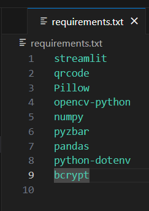
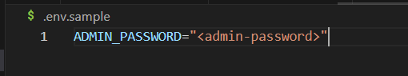
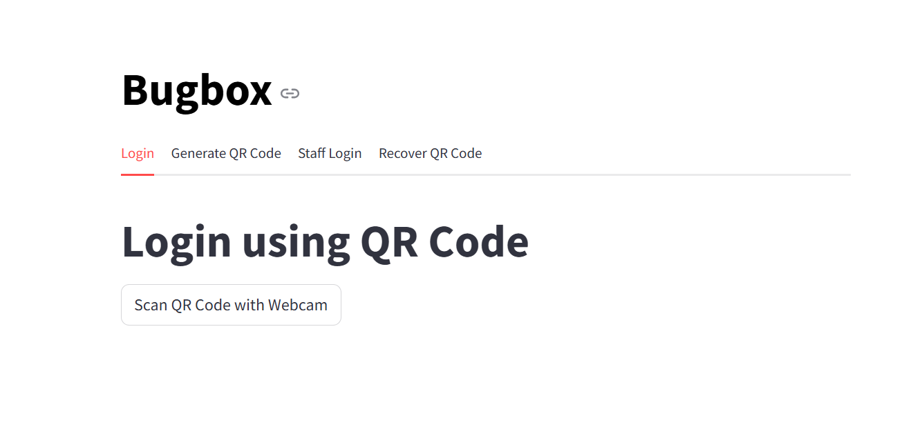
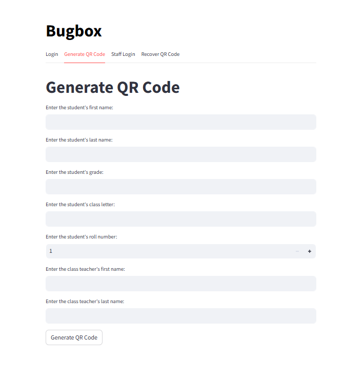
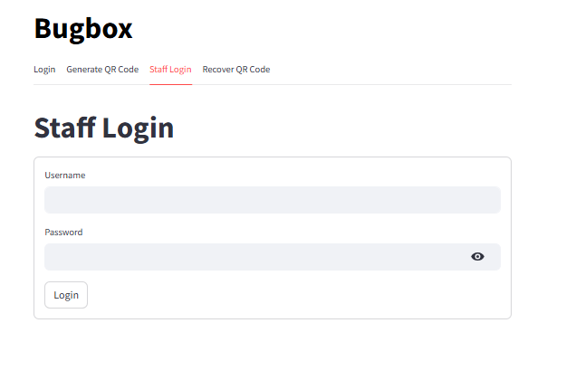
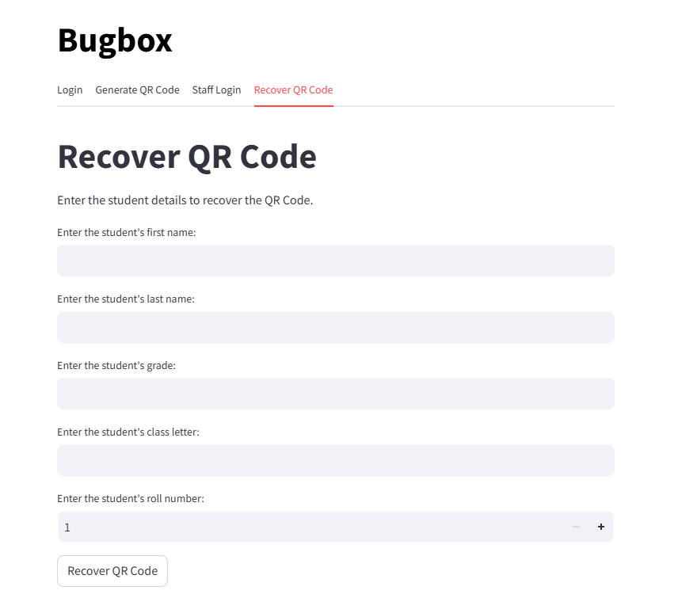
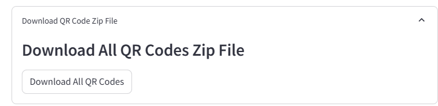
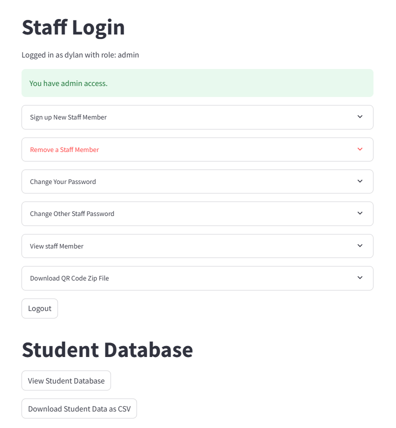

# STREAMLIT BUGBOX (QR-Code Solution) TUTORIAL

## Introduction

The purpose of this project was to design a user-friendly game login page for school kids. Given that the target audience is children, the solution emphasizes simplicity by utilizing QR codes instead of traditional ID and password combinations, which can be cumbersome and easy to forget. The game is intended for school kids, with staff members playing a role in managing the game. Therefore, a staff login and access page has been incorporated, allowing staff members to view the list of students participating in the game. The system ensures that major functionalities are controlled by an admin, whose credentials are predefined in the code.

To achieve this, we leveraged Streamlit, a Python-based framework known for its ease of use and extensive library support. Streamlit provides several built-in functions that made it simple to implement features like QR code generation and handling, which are central to this application.

### Technologies Used

- **Streamlit:** Chosen for its simplicity and powerful built-in functions, especially for creating web applications quickly with minimal code. Streamlit's built-in libraries made it easy to generate and manage QR codes, which are crucial for the kid-friendly login process. If you're new to Streamlit or need help setting it up, please refer to the [Streamlit Tutorial](https://redback-operations.github.io/redback-documentation/docs/data-warehousing/Streamlit%20tutorial/streamlit_tutorial)
 included in the project folder.

- **SQLite:** Used as the database to store information about students and staff members. SQLite is lightweight, easy to set up, and integrates well with Python applications, making it ideal for this project.

- **bcrypt:** Employed for hashing passwords to ensure secure storage in the database. bcrypt is a robust library for password hashing, which helps protect against unauthorized access by securely storing password hashes instead of plaintext passwords.

- **Python Libraries:**
  - **qrcode:** Used to generate QR codes from the unique IDs created for each student. This library makes it easy to create QR codes that can be scanned to log in.
  - **PIL (Python Imaging Library):** Utilized extensively for image manipulation, including creating QR codes, adding captions to images, and other visual elements. PIL provides robust tools for handling image files, making it integral to the QR code functionality in this project.
  - **pyzbar:** A crucial library for decoding QR codes from images. This library is used to interpret the QR codes when scanned, allowing the system to retrieve and process student information during the login process.
  - **cv2 (OpenCV):** Employed to capture images from a webcam, which are then processed to scan QR codes. OpenCV is a powerful library for computer vision tasks, making it an excellent choice for integrating real-time QR code scanning.
  - **numpy:** Utilized for handling arrays and matrices, which are fundamental in processing images captured by the webcam. numpy is highly efficient and plays a significant role in the backend processing of image data.
  - **zipfile:** Used for compressing multiple QR codes into a single ZIP file for easy download.
  - **pandas:** Used for data manipulation and export functionalities. Pandas allows for easy handling of data, including exporting student lists to CSV files. This library simplifies working with structured data in Python.
  - **io.BytesIO:** Utilized for in-memory binary streams, making it easier to handle images and data without needing to write to the disk. This is especially useful in scenarios like dynamically generating and downloading QR codes.


## **Setup Instructions**

### Prerequisites

Before you begin, ensure you have the following installed on your system:
- **Python:** The project requires Python 3.7 or later. You can download it from [python.org](https://www.python.org/).
- **Streamlit:** Streamlit is the framework used to run this application. If you are unfamiliar with Streamlit or need to install it, please refer to the [Streamlit Tutorial](https://redback-operations.github.io/redback-documentation/docs/data-warehousing/Streamlit%20tutorial/streamlit_tutorial)
 included in the project folder.

### Installation

1. **Clone the Repository:**
   - To get started, you need to clone the repository where this project is hosted. Run the following command in your terminal:
     ```bash
     git clone <repository-url>
     ```
   - Replace `<repository-url>` with the actual URL of the repository.

2. **Navigate to the Project Directory:**
   - After cloning, navigate to the directory where the project files are located:
     ```bash
     cd <project-directory>
     ```

3. **Install Dependencies:**
   - The project has a list of dependencies specified in the `requirements.txt` file. Install these dependencies by running:
     ```bash
     pip install -r requirements.txt
     ```
        

### Environment Setup

1. **Create a `.env` File:**
   - For security reasons, sensitive information like database credentials are not hardcoded into the application. Instead, they are stored in a `.env` file.
   - Use the `.env.sample` file provided in the project as a template to create your `.env` file. The `.env` file should contain your environment-specific settings.
    

   - Your `.env` file should be structured as follows:
     ```env
     ADMIN_PASSWORD="<admin-password>"
     ```

2. **Run the Application:**
   - Once all dependencies are installed and your environment variables are set, you can run the application by navigating to the directory containing the Streamlit files and running:
     ```bash
     streamlit run <filename>.py
     ```
   - Replace `<filename>.py` with the name of the Python file that contains the main Streamlit application, such as `app.py` or `game_login.py`.

3. **Admin Setup:**
   - The admin user must ensure that the `.env` file is correctly set up with the necessary credentials as outlined above. This file will be critical for accessing various services securely within the application.

### Additional Notes

- **Database Initialization:** The SQLite database (`school_kids.db`) will be automatically created if it does not already exist when the application runs for the first time.
- **Updating Passwords:** If you need to update the admin password or add new staff members, ensure you follow the secure password hashing procedures described in the project.
- **QR Code Handling:** The application automatically generates and handles QR codes for student logins. Ensure your webcam is properly configured to scan QR codes when using the login feature. (For instance, make sure camera is not already in use, like in live meeting with camera on, the app will not be able to detect QR Code In that case)

## **Database Setup**

### Creating the Database

The database used in this project is SQLite, and it stores all necessary data for both students and staff. The database file (`school_kids.db`) will be created automatically when you first run the application.

However, if you want to manually set up or modify the database, follow these steps:

1. **Navigate to the Project Directory:**
   - Open your terminal and navigate to the directory where your project files are located.

2. **Run the Python Script to Set Up the Database:**
   - The database and necessary tables (`students` and `staff`) are automatically created by the provided Python script. Simply run the application to generate the database:
     ```bash
     streamlit run <your_script_name>.py
     ```

### Modifying the Database

If you want to modify the database or manually inspect its contents:

1. **Access SQLite Command-Line Interface:**
   - Open your terminal and start the SQLite command-line interface by typing:
     ```bash
     sqlite3 school_kids.db
     ```
   - This command opens an SQLite prompt where you can execute SQL commands to modify or inspect the database.

2. **List Existing Tables:**
   - To see the tables in your database, run:
     ```sql
     .tables
     ```

3. **View Contents of a Table:**
   - To view the contents of the `staff` table, for example, run:
     ```sql
     SELECT * FROM staff;
     ```

4. **Modify the Database:**
   - You can use any valid SQLite commands to make changes to the database. For example, to update a staff member's role, you might use:
     ```sql
     UPDATE staff SET role = 'admin' WHERE username = 'example_user';
     ```

5. **Exit the SQLite Command-Line Interface:**
   - To exit SQLite, type:
     ```bash
     .exit
     ```

By following these instructions, you can set up, modify, and manage the SQLite database used in this project. **Additionally, you have the flexibility to use all other SQLite commands to perform any further customizations or modifications to the database.**

## **Application Features**

### User Authentication

- **Login Process:**
  - The application uses a secure login system where staff members can log in using their username and password. The passwords are hashed using the `bcrypt` library before being stored in the database, ensuring that even if the database is compromised, the plaintext passwords are not exposed.
  - During the login process, the entered password is hashed and compared against the stored hashed password using `bcrypt.checkpw`. If the passwords match, the user is authenticated and granted access to the application.

- **Role-Based Access Control:**
  - The application implements a role-based access control (RBAC) mechanism to restrict access to certain features. There are two roles: `admin` and `user`.
  - Admins have access to all features, including managing staff members and downloading QR codes. Regular users have limited access and can only perform basic actions such as logging in and viewing student data.
  - This control ensures that sensitive operations, like adding new staff members or viewing the complete list of students, are restricted to authorized personnel only.

- **Multiple Tabs Functionality:** The application is organized into multiple tabs, each serving a specific purpose:
  - **Login Tab:** Allows students to log in using their QR codes.
    
  - **Generate QR Code Tab:** Helps generate new QR codes for students.
    
  - **Staff Login Tab:** Provides login access for staff members and admins, with additional features for admins.
    
  - **Recover QR Code Tab:** Allows students or staff to regenerate and download lost QR codes.
    

### QR Code Generation and Management

- **QR Code Generation:**
  - The application generates QR codes for each student based on their unique ID, which is constructed from their personal information such as grade, class letter, and roll number.
  - The `qrcode` library is used to create these QR codes. The generated QR code images are then stored temporarily in memory for display and download.

- **QR Code Login:**
  - Regular users (students) can log in using their QR codes. This feature is designed to be simple and user-friendly, making it easy for children to access the game without needing to remember complex passwords.

- **QR Code Storage:**
  - Although the QR codes are primarily used in-memory, they can also be downloaded by the user. The `download_all_qr_codes` function allows admins to download all QR codes in a single ZIP file.

    
  - This function includes security checks to ensure that only authorized users (admins) can access this feature. Additionally, the unique IDs are sanitized to prevent any potential security issues during file operations.

- **File Operations Security:**
  - In the `download_all_qr_codes` function, several precautions are taken to secure file operations. These include:
    - Sanitizing the unique IDs to prevent unauthorized data access or manipulation.
    - Restricting the download feature to admins only, ensuring that sensitive data is not accessible to regular users.

#### Admin Features



- **Sign Up New Staff Members:**
  - Admins can sign up new staff members directly through the application. During the signup process, the entered password is hashed using `bcrypt` before being stored in the database.
    
- **View Staff Members:**
  - Admins have the ability to view all staff members and their roles. This feature is restricted to admins, ensuring that only authorized personnel can see sensitive staff information.


- **Download QR Codes:**
  - Admins can download all student QR codes as a ZIP file. This feature is secure and restricted to admins, preventing unauthorized access to the QR codes.

- **Manage Staff:**
  - Admins can manage staff members by adding, removing, or updating their information. This includes changing passwords and updating roles, ensuring that the application’s user management is always up-to-date.

 


#### Regular User Features


- **QR Code Login:**
  - Regular users (staff) can log in using their login details. 

- **View Student Data:**
  - Staff members have access to student data which are in the database and can also download all the student data as csv if needed. This will enable them to find the unique id/other details of students and recover QR Codes(in case they loose them)


