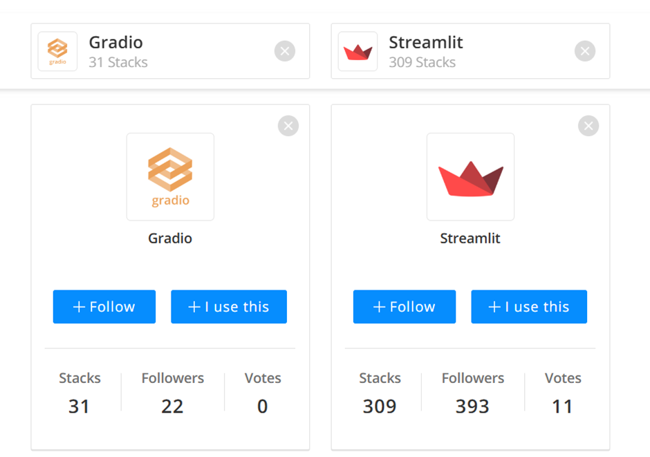

# Streamlit vs Gradio

:::info

**Document Creation:** 22 September, 2024. **Last Edited:** 22 September, 2024. **Authors:** Daezel.
   **Document Code:** DOC1. **Effective Date:** 22 September 2024. **Expiry Date:** 22 September 2025.
:::

## INTRODUCTION

Streamlit and Gradio are popular open-source frameworks that simplify the process of transforming complex machine learning models into interactive applications. They cater to the needs of developers and data scientists, each offering distinct features and benefits.

# Streamlit: Empowering Data Apps

**Overview:** Streamlit is celebrated for its simplicity and flexibility, allowing developers to convert data scripts into shareable web apps effortlessly.

## Key Features
1. **Rapid Prototyping:** Streamlit’s intuitive syntax enables quick prototyping, with instant updates upon saving the script.
2. **Customization:** Offers predefined widgets and supports personalized themes and layouts.
3. **Wide Language Support:** Primarily Python-based but supports multiple languages.
4. **Seamless Integration:** Integrates smoothly with libraries like Matplotlib, Plotly, and pandas for dynamic visualizations.
5. **Deployment:** Easy deployment on various platforms, including cloud services and local servers.

# Gradio: Simplifying Model Deployment

**Overview:** Gradio focuses on easing model deployment with user-friendly interfaces, targeting both technical and non-technical users.

## Key Features
1. **Interface Generation:** Automatically generates interfaces using a straightforward Python API.
2. **Variety of Input Types:** Supports diverse input types, such as images, text, and audio.
3. **Multi-Model Integration:** Facilitates ensemble deployments and model comparisons.
4. **Shareable URLs:** Allows easy collaboration by sharing model interfaces as URLs.
5. **Adversarial Robustness:** Provides protection against adversarial attacks, enhancing model security.

# Comparison and Considerations

## Commonalities
1. **Ease of Use:** Both platforms simplify the deployment process, even for non-technical users.
2. **Interactive Visualizations:** Enable the creation of visually appealing and interactive dashboards.
3. **Community Support:** Both have active communities offering resources, tutorials, and extensions.

## Differences
1. **Customization:** Streamlit offers more customization options for app appearance and functionality.
2. **Multi-Model Deployment:** Gradio excels in multi-model deployment, ideal for projects involving multiple models.
3. **Ease of Sharing:** Gradio’s shareable URLs enhance collaboration and stakeholder engagement.
4. **Robustness:** Gradio’s adversarial robustness features provide an added security layer for sensitive applications.

Choosing between Streamlit and Gradio depends on specific project requirements and the target audience. Streamlit is ideal for projects needing advanced customization and wide integration options, while Gradio is better suited for projects requiring ease of use, multi-model deployment, and robust security features. By understanding the strengths of each platform, developers can make informed decisions to meet their AI deployment goals.

Reference: [Gradio vs. Streamlit Comparison on StackShare](https://stackshare.io/stackups/gradio-vs-streamlit#:~:text=In%20summary%2C%20Gradio%20and%20Streamlit%20have%20some%20key,community%20and%20documentation%20support%2C%20and%20ease%20of%20use.)
