# Streamlit Tutorial

:::info

**Document Creation:** 22 September, 2024. **Last Edited:** 22 September, 2024. **Authors:** Daezel.
<br></br> **Document Code:** DOC1. **Effective Date:** 22 September 2024. **Expiry Date:** 22 September 2025.
:::

# Streamlit Tutorial

## Open-Source Python Framework

Streamlit is a powerful, open-source Python framework that empowers data scientists and AI/ML practitioners to rapidly build interactive data applications. Tailored for machine learning and data science projects, Streamlit simplifies the process of developing web apps that are both engaging and visually compelling, requiring only minimal code to get started.


**Streamlit Website is the Fastest Way to Build Data Applications**


# 1.  Installation and Setup

To get started with Streamlit, we need to install the library using pip. Make sure Python is already installed on your system, as Streamlit requires it.

1. **Install Streamlit:**

   Open your terminal or command prompt and run the following command:

   ```sh
   pip install streamlit
   ```

2. **Verify Installation:**

    After installation, we can check if everything is set up correctly by running:

    ```sh
    streamlit hello
    ```

This will launch a sample web application, which is also featured on Streamlit's gallery page.
   
### Setting Up a Virtual Environment

It’s recommended to create a virtual environment for your project to manage dependencies and avoid conflicts.

1. **Navigate to Your Project Directory:**

    Use the `cd` command to move to your project folder. For example:

    ```sh
    cd path/to/your/project
    ```

2. **Create the Virtual Environment:**
Run the following command to create a virtual environment named .venv:

    ```
    python -m venv .venv
    ```

3. **Activate the Virtual Environment:**

    On Windows:

    ```
    .venv\Scripts\activate
    ```
    
    On macOS and Linux:

    ```
    source .venv/bin/activate
    ```


### Installing Streamlit:
1. Install streamlit: With the virtual environment activated, run
```
pip install streamlit
```

2. Verify Streamlit Installation:
Check if Streamlit is installed correctly by running
```
streamlit --version       
```

## Troubleshooting:

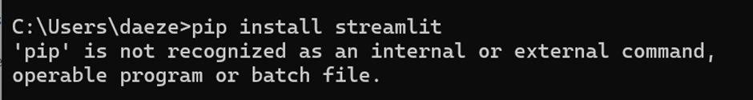

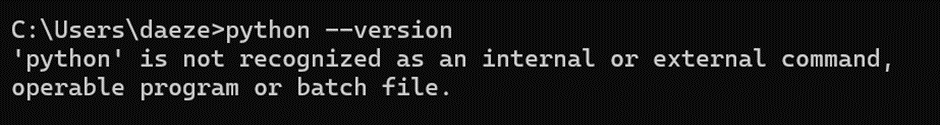

If an error like this is received that probably means that python is not installed on internal system and hence we will try to install streamlit using alternative methods.

# 2. Step-by-Step Guide to Install Streamlit using Anaconda
1. **Open Anaconda Navigator:** Open the Anaconda Navigator from your Start menu or Applications folder.
2. **Create a New Environment:** 
    1. Click on the "Environments" tab on the left side.
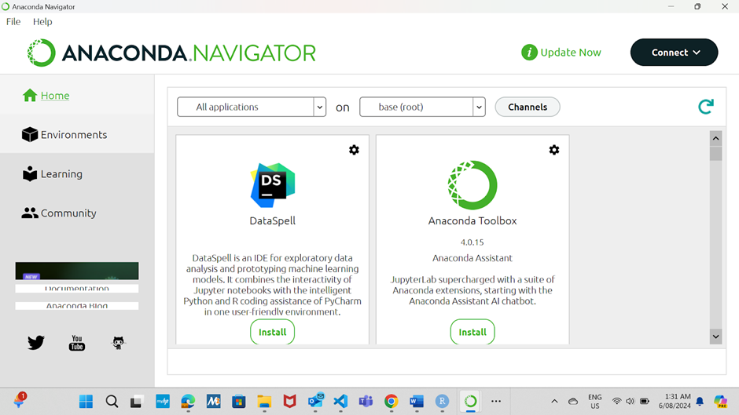
    2. Click the "Create" button at the bottom.
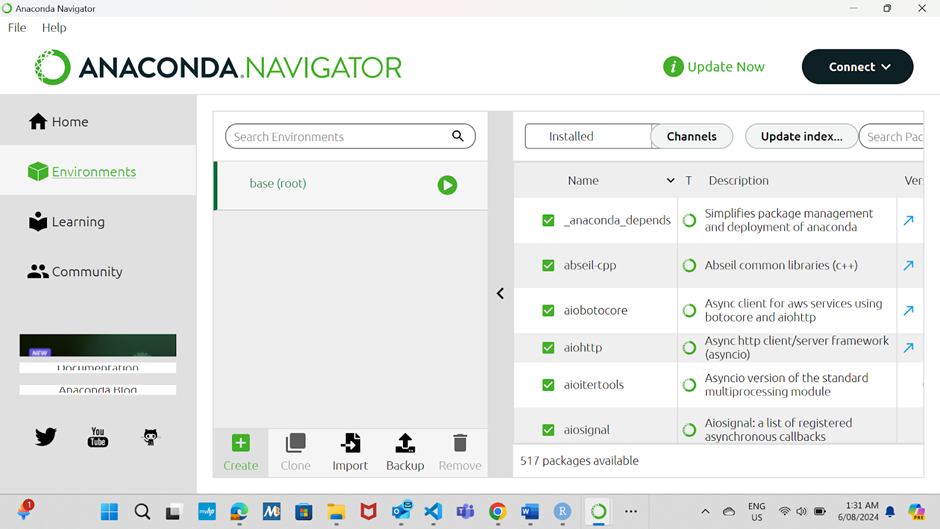

    3. Give your new environment a name (e.g., streamlit_env) and choose the Python version you want to use (e.g., Python 3.8 or 3.9).
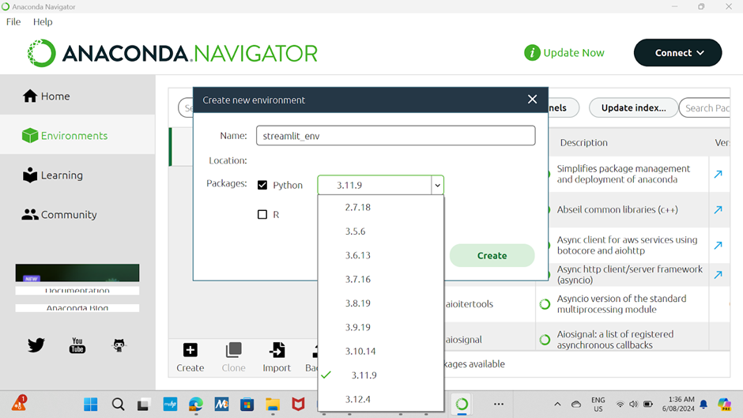

3. **Activate the Environment:**
    1. Once the environment is created, click on it in the list to select it.
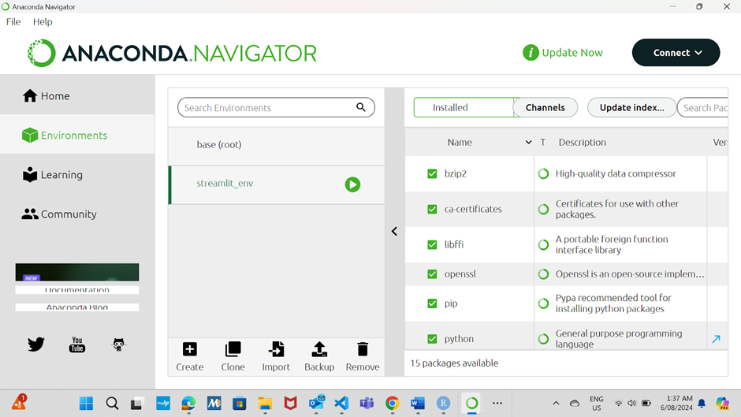

    2. Click the "Open Terminal" button to open a terminal window with the environment activated.
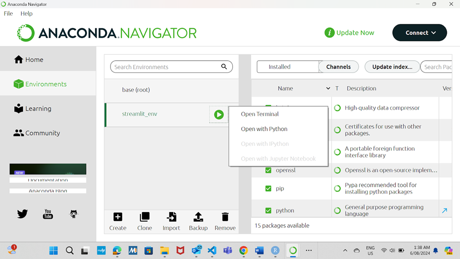

4. **Install Streamlit:**
 In the terminal window, run the following command to install Streamlit:

    ```
    pip install streamlit
    ```
    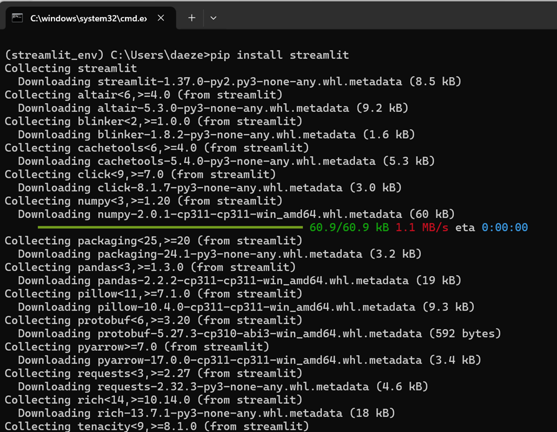

5. **Verify the Installation:**
After the installation is complete, verify that Streamlit is installed correctly by running:
    ```
    streamlit --version
    ```
    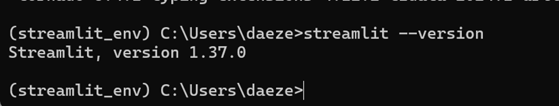

    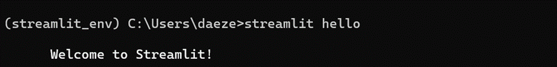
 
**Streamlist is successfully installed.**


# 3.  Step-by-Step Guide to Create and Run a Streamlit App

1. Set Up Your Project Directory:
Create a directory for your Streamlit project if you don't already have one.
    ```
    mkdir my_streamlit_app
    ```
        

    ```
    cd my_streamlit_app
    ```

    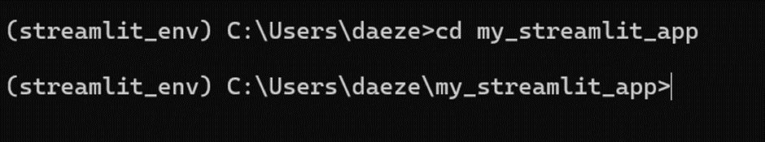


2. Create a Python Script:
    1. Open your favorite text editor or IDE (e.g., VSCode, PyCharm, Jupyter Notebook).


    2. Create a new file named app.py
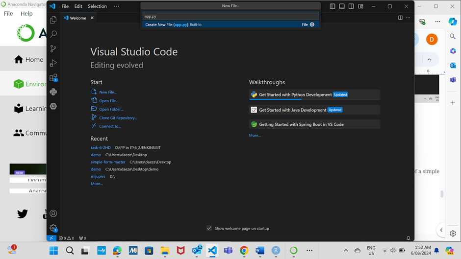

3. Write Your Streamlit Code:
Open app.py and write your Streamlit application code. Here’s an example of a simple Streamlit app:
```python
import streamlit as st

st.title("Hello Streamlit!")
st.write("This is my first Streamlit app.")

# Add some interactive widgets
name = st.text_input("Enter your name:")
if name:
    st.write(f"Hello, {name}!")

number = st.slider("Pick a number:", 0, 100)
st.write(f"Your number is {number}")
```
4. Run Your Streamlit App:
Open a terminal or Command Prompt.
Navigate to the directory containing your app.py file.
Run the Streamlit application:
```
streamlit run app.py
```

This command will start a local server and open your default web browser to http://localhost:8501, where you can see your Streamlit app running


# 4. Step-by-Step Guide to Code and Run a Streamlit App Using Anaconda
1. Set Up Your Project Directory:
    1. Choose a location on your system where you want to store your project files.
    2. Create a new directory for your project, for example, my_streamlit_app.

```
mkdir my_streamlit_app
```
```
cd my_streamlit_app
```

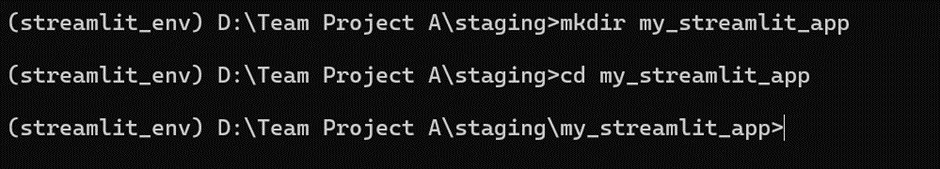

2. Create the app.py File:

    1. Open your text editor or IDE.
    2. Create a new file named app.py in the my_streamlit_app directory.

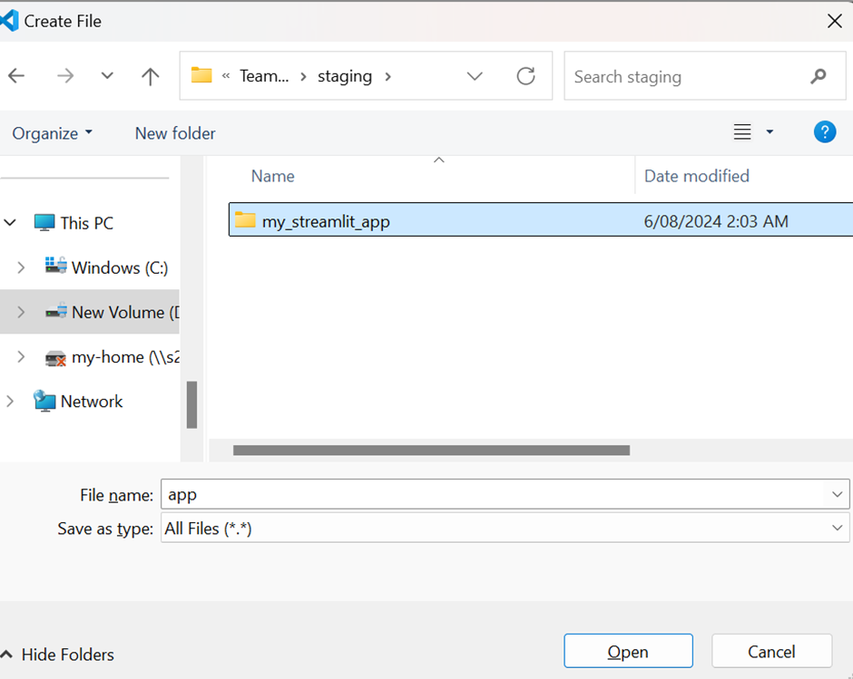


3. Write Your Streamlit Code:
Open app.py in your preferred text editor or IDE (e.g., VSCode, PyCharm, Jupyter Notebook).
Add your Streamlit code to app.py(example code same as used in previous step)

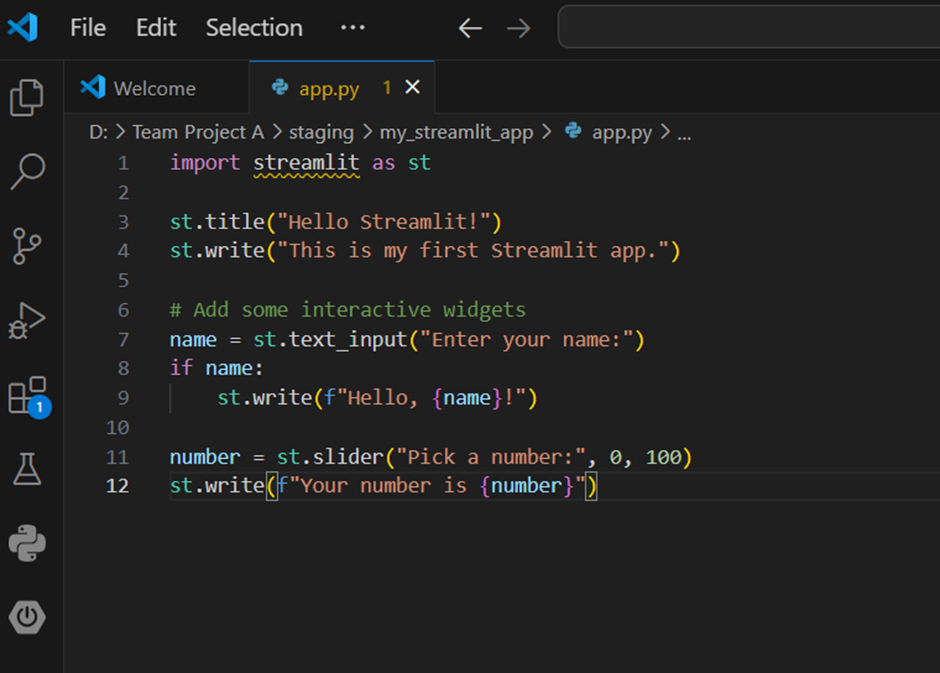


4. Activate Your Anaconda Environment:
    1. Open the Anaconda Prompt.
    2. Navigate to your project directory:

    ```
    cd path\to\my_streamlit_app
    ```

    3. Activate the environment where you have installed Streamlit. For example, if you created an environment named streamlit_env:

    ```
    conda activate streamlit_env
    ```
    

5. Run Your Streamlit App:
With the environment activated and while in the project directory, run your Streamlit app:

    ```
    streamlit run app.py
    ```
    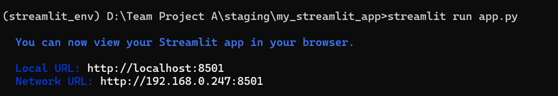

    This command will start a local server and open the default web browser to http://localhost:8501, where we can see the Streamlit app running
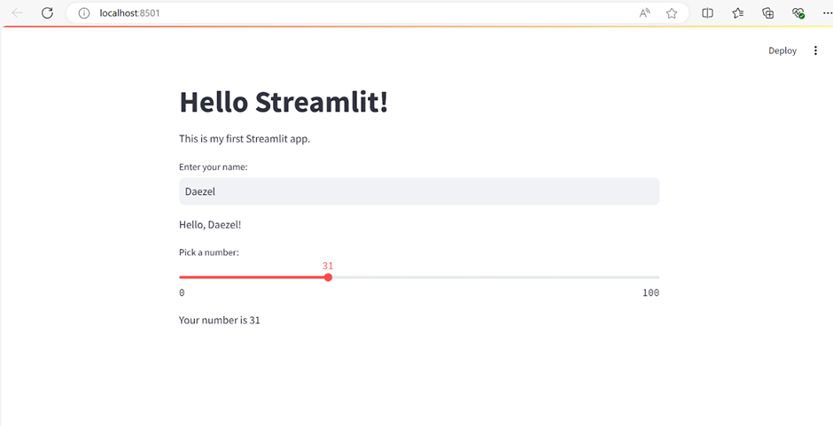

Whenever any change is done to the source code,
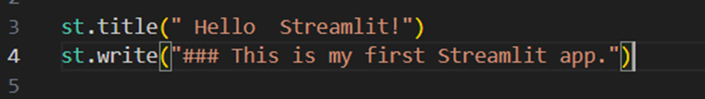

It is updated automatically in the app. We select always re-run(Can manually re-run after each change is done too )

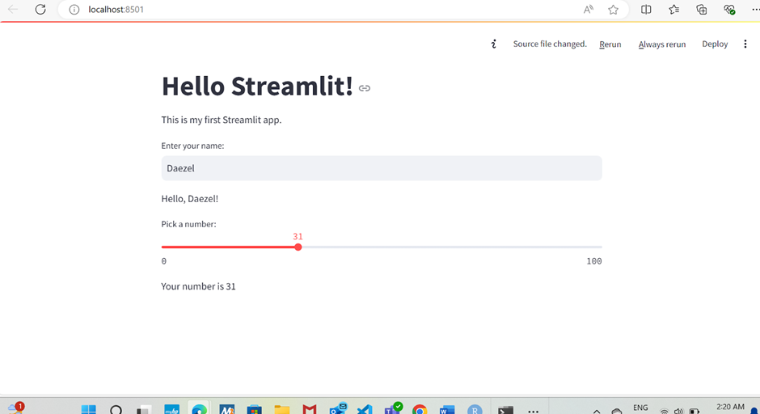

**Markdown Cheatsheet Link :** https://github.com/adam-p/markdown-here/wiki/Markdown-Cheatsheet


# FREQUENTLY ASKED QUESTIONS

### STOPPING THE STREAMLIT SERVER:
When you run a Streamlit app using the command streamlit run app.py in the terminal, the server will continue to run and serve the Streamlit app until you stop it manually. 

1. **In the Terminal Window:**
Windows/Linux/macOS: Press Ctrl + C. This keyboard shortcut sends an interrupt signal to the terminal, which stops the Streamlit server.
2. **Alternative Method:**
If you started the Streamlit app in a terminal window that you don’t have access to, you can close the terminal window. This will also stop the Streamlit server.

### NAVIGATING BETWEEN DIRECTORIES:

Assuming your directory structure is like this:

```
D:\Team Project A\staging\
    ├── file_upload
    └── my_streamlit_app
```

-*To navigate from ```file_upload``` to ```my_streamlit_app```:*

**Navigate Up One Level:**
```
cd ..
```
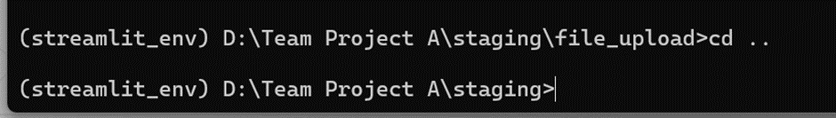

-*Navigate to ```my_streamlit_app```:*
    
```
cd my_streamlit_app
```


### REFERENCES

1. [The guidance on installing Streamlit using Anaconda](https://chatgpt.com/)
2. [Streamlit Official Website](https://streamlit.io/)
3. [YouTube Tutorial on Streamlit](https://www.youtube.com/watch?v=ZZ4B0QUHuNc&list=PLtqF5YXg7GLmCvTswG32NqQypOuYkPRUE)
4. [Streamlit vs. Gradio: A Comprehensive Comparison](https://medium.com/@ShahabH/streamlit-vs-gradio-a-comprehensive-comparison-cc2f28b7b832)

