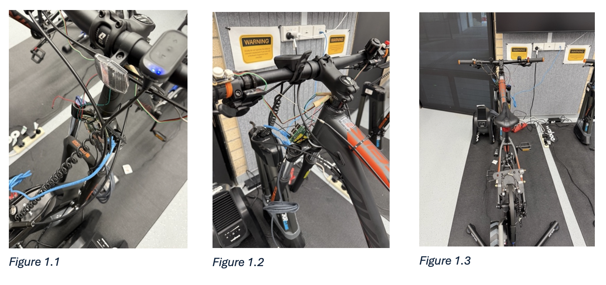
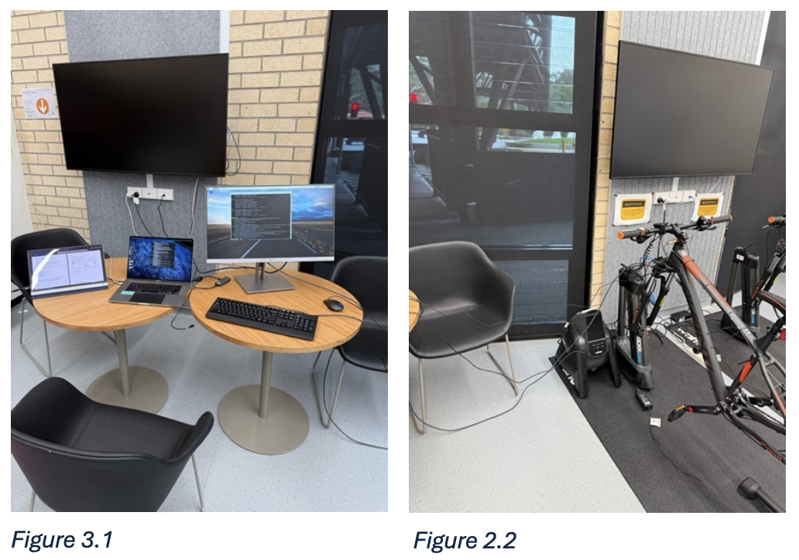
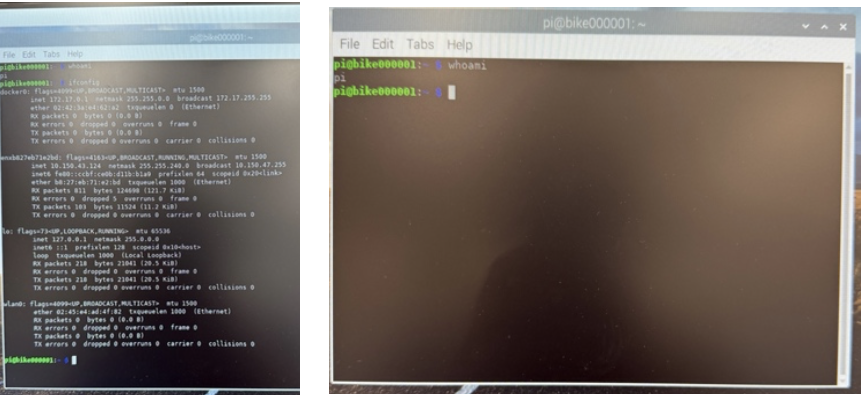
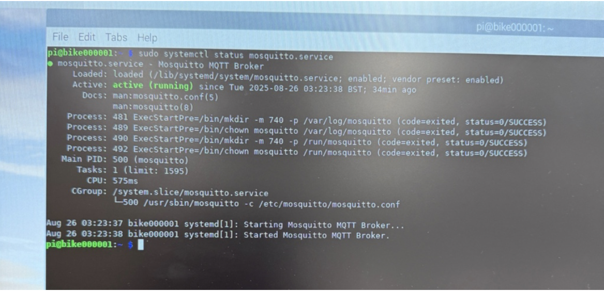
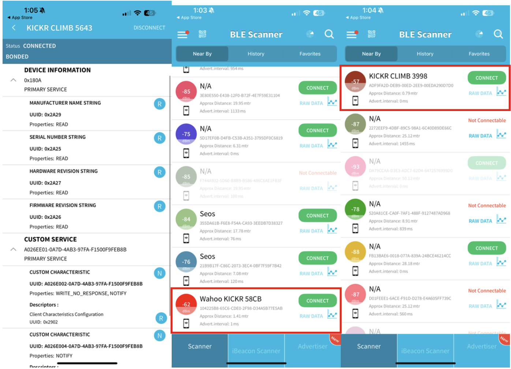
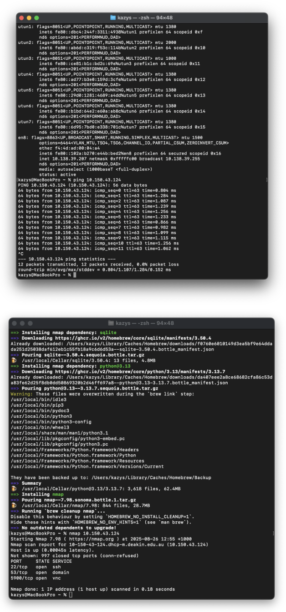
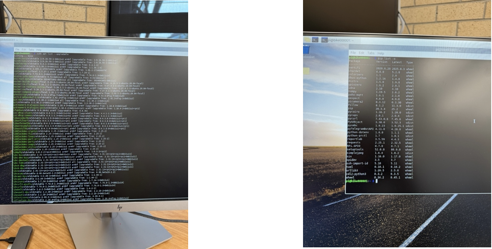

# Redback Operations — Smart Bike Cybersecurity Audit Report

**Project:** Smart Bike (IoT)
**Organisation:** Redback Operations
**Author:** Kazys Skudutis
**Version:** v1.0
**Date:** 3 September 2025

## Executive Summary

This audit evaluates the security posture of the Redback Smart Bike platform with a primary focus on the embedded Raspberry Pi, wireless interfaces (BLE/Wi-Fi), network exposure, operational security, and data privacy. Tests were performed over several hours to capture realistic behaviour and restrict possible outlying occurrences.

### Headline observations

- **Remote SSH access** was **denied** during testing, which reduces remote attack surface.
- **Physical access to the Raspberry Pi** was possible and provided immediate shell access, implying **inadequate tamper resistance** and the ability to **set a new password locally**.
- Network scans indicated **open services**: SSH (22), DNS (53), **VNC (5900)**; VNC in particular expands the attack surface and should be disabled or tightly constrained.
- **BLE advertising/connections** were observed (KICKR/Wahoo). Security mode, pairing method, and data sensitivity require validation.
- **MQTT traffic** requires confirmation of **broker address, auth method, and TLS**; plaintext MQTT would be a critical finding.
- **Outdated libraries** were reported on the Raspberry Pi, indicating **vulnerability exposure** pending patching.
- **Data privacy artifacts** (e.g., consent/waiver) and **live data capture evidence** were not fully provided and are flagged as **TBD**.

### Risk posture (initial, by domain)

- **Device & Physical:** High (due to easy console access); mitigation feasible with enclosure/tamper controls and secure boot/hardening.
- **Network Exposure:** Medium-High (VNC/DNS/SSH exposure); reduce via least-service, firewall, and segmentation.
- **Wireless (BLE/MQTT):** Medium pending confirmation of TLS/mTLS and BLE pairing security.
- **Ops & Patch Management:** Medium-High due to outdated packages.
- **Data Privacy/Governance:** TBD pending waivers, retention, and DPIA artifacts.

### Top recommendations (prioritised)

1. **Eliminate or lock down VNC (5900)**; restrict SSH to keys only; apply firewall allow-lists/VLAN segmentation.
2. **Enforce MQTT over TLS (8883)** with per-device credentials or mutual TLS; prohibit plaintext credentials.
3. **Harden Raspberry Pi**: disable local auto-login, enforce strong creds/keys, enable disk encryption where practical, apply updates.
4. **Implement tamper resistance** (sealed enclosure, anti-tamper seals, internal switch/alert on case open).
5. **Rework and update the security framework** (previously written by Kazys, updates required)

## 1. Introduction

This report consolidates the results of hands-on testing and observation of the Smart Bike platform and supporting infrastructure. The objective is to provide actionable, prioritised guidance to reduce risk while enabling continued development and testing.

### 1.1 Scope

- **Hardware:** Raspberry Pi (onsite device)
- **Network:** Wi-Fi, MQTT, BLE
- **Operations:** Update/patch posture, credential hygiene, basic logging/monitoring
- **Privacy:** Data capture, consent, and retention considerations

### 1.2 Out-of-Scope

- Cloud/Backend components not directly exercised during tests
- Third-party mobile apps beyond interface observation
- Formal cryptographic validation of BLE pairing/bonding (requires additional instrumentation)

## 2. Photo Gallery — Smart Bike, Setup & Raspberry Pi Module

### 2.1 Smart Bike — Exterior & Components

_Figure 1.1, 1.2, 1.3_: Smart bike close-up/Raspberry Pi View/Afar. 26 August, Makerspace. **Notes:** Physical access to Pi. Exposed SD card, accessible USB/HDMI, unsealed casing.

### 2.2 Test/Lab Setup

_Figure 2.1, 2.2:_ Test laptop, Monitors, Direct Connection, Power. 26 August, Makerspace.

## 3. System Overview (As Observed)

- **Embedded Controller:** Raspberry Pi (model 4).
- **Network Addressing:** Observed IP **10.150.43.124**.
- **Wireless:** BLE advertising; MQTT broker **[TBD broker/port]**; Wi-Fi Connection.
- **Services:** SSH(22), DNS(53), VNC(5900) discovered during scan.

## 4. Methodology

- Observation, network discovery, and protocol analysis.
- Tooling: **Wireshark** (traffic analysis), **nmap** (port/service enumeration), basic OS commands.
- Evidence captured as screenshots/photos.

## 5. Findings & Evidence (by Test)

### Test 1 — Raspberry Pi Access (Physical & Remote)

**Objective:** Assess exposure via remote login and on-device console.

**Observed**

- **Remote access (SSH):** **Denied** during test window.
- **Physical access:** **Permitted**; console access achieved without credentials; local password change was immediately possible.
- **Connectivity:** Stable; **ping successful** to **10.150.43.124**.
- **Notes:** Screenshots captured during testing.

**Risk**

- **High**: Physical compromise enables privilege escalation, credential resets, offline data extraction (via SD card), and persistence implants.

**Recommendations**

1. **Enclosure & Tamper Controls:** Lockable casing, tamper-evident seals, conceal SD card; internal microswitch to log/alert on case open.
2. **Local Hardening:** Disable auto-login; require creds for local terminal; consider **full-disk encryption** or at minimum encrypt secrets; minimize shell tools on prod image.
3. **Identity & Keys:** Unique host keys per device; enforce **SSH key-only** auth; disable password auth; implement rate-limiting (Fail2ban/MaxAuthTries).
4. **Monitoring:** Local audit logs (journald), remote log shipping, tamper alerts.

### Test 2 — Wireless Communications (BLE & MQTT)

**Objective:** Validate discoverability, pairing, and transport protection.

**Observed**

- **BLE:** Device discoverable; connections observed with KICKR/Wahoo.
- **MQTT:** Traffic analysis captured during testing sessions.

**Risk**

- **Medium–High** if BLE uses insecure pairing ("Just Works") or if MQTT is plaintext (creds/topic data interception, injection, replay).

**Recommendations**

1. **BLE:** Enforce **LE Secure Connections** with passkey/OOB; restrict services/characteristics; rotate keys; disable unused profiles.
2. **MQTT:** Mandate **TLS (8883)**; **device-unique credentials** or **mutual TLS**; least privilege per topic (ACLs); QoS per use-case; set retain wisely; disable anonymous access.
3. **Broker Hygiene:** Hide broker from public; IP allow-list/VPN; audit topics; enable authz logs and client ID governance.

### Test 3 — Network Configuration & Exposure

**Objective:** Enumerate open ports and assess segmentation posture.

**Observed**

- nmap indicated **open ports 22/53/5900** on the device.
- **Ping** to peers successful.
- Services on 53 (DNS) and 5900 (VNC) require justification.

**Risk**

- **Medium–High**: VNC is a common remote desktop vector; DNS service could enable amplification/misuse if misconfigured; SSH brute-force risk without key-only.

**Recommendations**

1. **Least Service:** Disable **VNC** unless essential; if needed, bind to localhost + SSH tunnel only.
2. **Firewalling:** Apply ufw/nftables default-deny; allow only needed egress; restrict ingress to management VLAN.
3. **Segmentation:** Place devices on dedicated **IoT VLAN**; isolate from corporate/admin networks; apply L2 protections (ARP inspection).
4. **SSH Hardening:** Keys-only, no password, change default user, banner warning, idle timeouts.

### Test 4 — Data Privacy Validation

**Objective:** Confirm presence of user consent and data mapping.

**Fore notes:** This test has not been actioned and will need to be checked before this report can be finalised. Kazys to meet with a team member and discuss.

**Observed**

- **Waiver/Consent:** **[TBD – Provide copy or reference]**.
- **Live Data Capture:** **[TBD]** Wireshark captures to confirm whether PII/telemetry traverse in plaintext; need sample MQTT topics.
- **Data Use/Retention:** **[TBD]** policy link or summary.

**Risk**

- **TBD** pending confirmation of storage location, retention, and user rights process.

**Recommendations**

1. **Data Inventory:** Create/maintain a **data map**.
2. **Consent & Notices:** Provide user-friendly notices; capture consent where required; document lawful basis.
3. **Retention & Minimization:** Default short retention; anonymise or aggregate wherever possible.

### Test 5 — Operational Security (Patching & Vulnerabilities)

**Objective:** Determine update posture and vulnerability exposure.

**Observed**

- **Outdated libraries:** **Yes** — analysis indicates multiple packages requiring updates.
- **Team Response:** **[TBD]** posture on incident handling and breach hypotheticals.

**Risk**

- **Medium–High**: Known CVEs may be exploitable; outdated dependencies undermine trust in telemetry/control software.

**Recommendations**

1. **Patch Cadence:** Monthly baseline updates; emergency out-of-band for critical CVEs.
2. **Secure Build:** Reproducible images; sign OS/application artifacts; verify signatures on boot/update.
3. **Backups & Rollback:** Test backups; support safe rollback of device images.

## 6. Risk Register (Initial)

_Update team leads during remediation._

| ID   | Risk                                                                       | Likelihood | Impact | Severity   | Owner   | Mitigation                                                       | Target Date |
| ---- | -------------------------------------------------------------------------- | ---------- | ------ | ---------- | ------- | ---------------------------------------------------------------- | ----------- |
| R-01 | Physical console access to Pi enables credential reset & data exfiltration | High       | High   | **High**   | _[TBD]_ | Enclosure + tamper controls; encrypt secrets; disable auto-login | _[TBD]_     |
| R-02 | VNC (5900) exposed                                                         | Medium     | High   | **High**   | _[TBD]_ | Disable VNC or restrict to localhost/SSH tunnel; MFA             | _[TBD]_     |
| R-03 | MQTT without TLS/mTLS                                                      | Medium     | High   | **High**   | _[TBD]_ | TLS 1.2+; mTLS; topic ACLs; no anonymous                         | _[TBD]_     |
| R-04 | BLE insecure pairing/data leakage                                          | Medium     | Medium | **Medium** | _[TBD]_ | LE Secure Connections; restrict services; rotate keys            | _[TBD]_     |
| R-05 | Missing consent/retention artifacts                                        | Medium     | High   | **High**   | _[TBD]_ | Publish privacy notice; consent capture; data map                | _[TBD]_     |

## 7. Standards & Best-Practice Alignment (Guidance)

- **OWASP IoT Top 10**: device hardening, secure update, secure comms, privacy.
- **CIS Benchmarks (Debian/Raspberry Pi OS)**: SSH, firewall, logging, services.
- **ASD Essential Eight (where applicable)**: patching, application hardening, MFA.
- **ISO/IEC 27001/27701**: policy/controls and privacy management mapping.

## 8. Open Items (TBD)

- Provide copy of user waiver/consent and data retention policy.
- Confirm BLE pairing mode/security level and data sensitivity.
