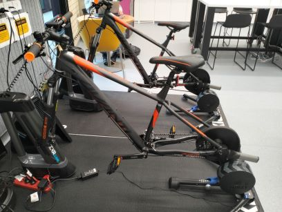
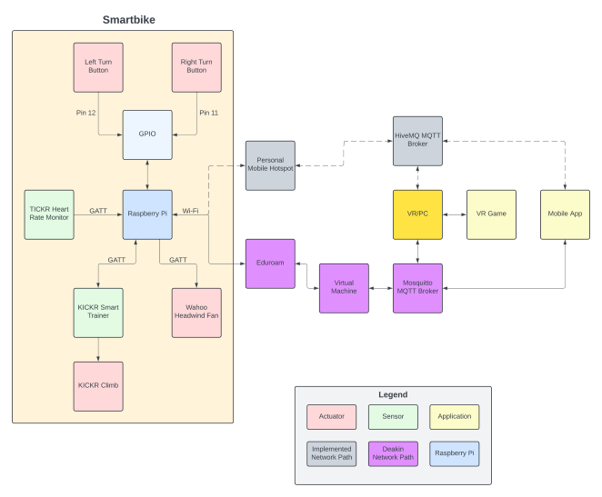

**Last updated by:** KasparByrne, **Last updated on:** 23/09/2024

**Last updated by:** KasparByrne, **Last updated on:** 23/09/2024

# Onboarding Welcome

**Project 1 - Smartbike VR** combines our physical Smartbike with our self-developed applications to enhance exercise through gamification and technology. Project 1 is split into three teams, the **VR team** is responsible for development of the VR game, the **IoT team** is responsible for the Smartbike and any other IoT requirements, and the **mobile team** is responsible for the development of the mobile app. The IoT team is primarily focused on the development of the Smartbike, with the goal of producing an API like interface for other applications to use the Smartbike. As a member of the IoT team, whether you are a leader, senior, or junior, you will help achieve this goal by:

1. Developing and maintaining an interface which allows other applications to command and read data from the Smartbike system.
2. Collaborate and communicate with other teams to identify IoT functional requirements and develop solutions.
3. Document solutions so that future teams may use and modify them.

By adhering to these three ideas, you can ensure that your contributions will have a meaningful, and hopefully long-term, impact on the project's progress.

# The Smartbike

If you are joining this team then you are likely interested in our **Smartbike**. The Smartbike is largely an off-the-shelf product, an indoor exercise bike produced by a company called Wahoo. It can do a bunch of cool things including:

- Changing the **incline** of the bike to simulating going up-and-down hills.
- Simulate the **speed** of the bike.
- Detect **cadence** & **power**.
- Increase **resistance** of the pedals - making it easier or harder to pedal.
- Simulating a **headwind** using a controlled fan positioned in from of the bike.

More technically interesting, is that the Wahoo indoor exercise bike does not have an API or anyway to interface with the bike beyond their app. Previous team members had to reverse engineer the BLE connections between its components and the app to interface with it. The bike relies on the **BLE** protocol **Generic Attribute (GATT)** to communicate between its components (for more on GATT see our [documentation](../technical-background-information/GATT.md)). Unfortunately, the reverse engineering process was not documented but there are tutorials on the internet if you are interested. A **Raspberry Pi** was setup to directly connect and control the bike's components using GATT and the information figure out by reverse engineering.

To communicate externally, with applications like the VR game and mobile app, the Smartbike uses **MQTT**. If you are not familiar with MQTT it is very simple and you can find resources online to learn it in less than 20-minutes.

# Project 1 Repositories

Project 1 uses multiple repositories. You will likely need to contribute to all of them - so it is a good idea to bookmark and fork all of them ASAP:

- [IoT Repo](https://github.com/Redback-Operations/redback-smartbike-iot)
- [Documentation Repo](https://github.com/Redback-Operations/redback-documentation)
- [VR repo](https://github.com/Redback-Operations/redback-smartbike-iot)

# What Next?

- [Setup your developer environment](Developer-Environment-Setup.md)
- [Learn more about the Smartbike](Smartbike-Introduction.md)
- [Learn how to start the Smartbike](../operation/Starting-Smartbike.md)
- [Delve into the code!](https://github.com/Redback-Operations/redback-smartbike-iot)