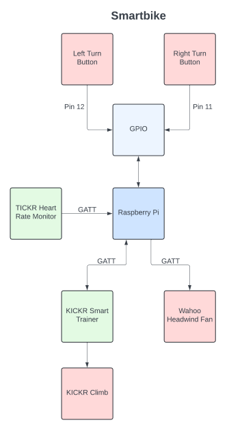
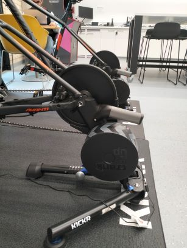
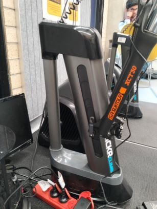
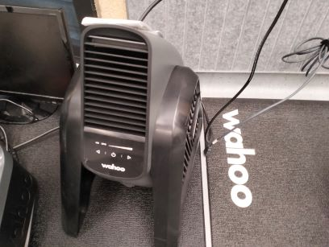
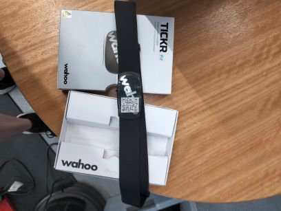
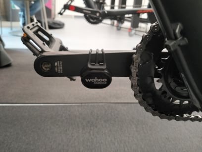
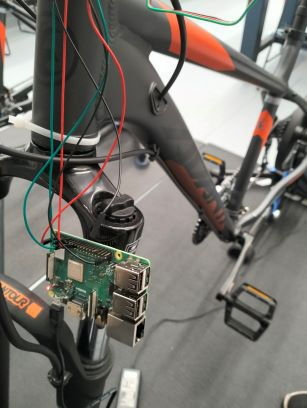
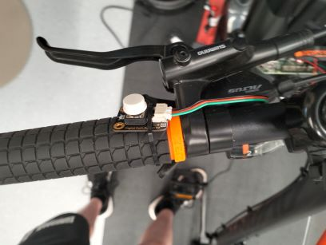

# Smartbike Introduction

...

## Quick Start Guide

Follow these steps to quickly get started with the Smartbike:

1. **Access the Makerspace**: Complete the [online induction](https://d2l.deakin.edu.au/d2l/home/1381894) and schedule your in-person induction.
2. **Set Up Your Developer Environment**: Follow the guide [here](Developer-Environment-Setup.md).
3. **Power On the Smartbike**:
    - Connect the KICKR smart trainer to a power source.
    - Connect the Raspberry Pi to the internet.
4. **Connect Devices**:
    - Pair the KICKR smart trainer, KICKR Climb, and TICKR heart rate monitor.
    - Test the connections using the provided drivers.
5. **Run the VR Application**:
    - Start the VR game and ensure the Smartbike components are synchronized.

> ⚠️ **Note**: Follow safety rules while using the Smartbike.

## Makerspace

The Smartbike is kept in the Makerspace under [building HF](https://www.deakin.edu.au/__data/assets/pdf_file/0003/817365/burwood-campus-map.pdf) on the Burwood campus. This is a fairly new space intended for IoT development which gives students access to equipment like soldering irons, 3D printers, laser cutting machines, etc. 

To access the Makerspace you first need to complete the [online induction](https://d2l.deakin.edu.au/d2l/home/1381894) (good chance this link does not work) and then schedule an in-person induction.

The Makerspace is open from 10:00 am to 4:00 pm on weekdays.

## Safety & Rules

Use of the Smartbike has limitations as to ensure safety and follow university rules. The following rules must be followed:

- Follow all rules of the Makerspace.
- **DO NOT** ride the Smartbike *unless* you have signed the waver.
- Be respectful of the equipment - it is expensive and some equipment is not owned by members of the team.
- Ride the Smartbike with caution as it can be unstable.

## Wahoo

The core of the Smartbike is an off-the-shelf indoor exercise bike produced by Wahoo. It is formed by several different smart components which each offer unique and useful functionality.

### KICKR Smart Trainer

The **KICKR smart trainer** is a central piece of the Smartbike:

- Sensing/simulating **speed**
- Sensing cycling **cadence**
- Sensing cycling **power**
- Actuating pedal **resistance**
- Connecting to the **KICKR Climb**
- Connecting to the **KICKR Headwind Bluetooth Fan**

The **VR game** uses the KICKR smart trainer's speed simulation to control the speed of the in-game bike.

The **KICKR Climb** and **KICKR Headwind Bluetooth Fan** also automatically pair with the KICKR smart trainer. The KICKR Climb cannot be controlled directly but rather is a sort of extension of the KICKR smart trainer. The KICKR Headwind Bluetooth Fan can either be paired with the KICKR smart trainer, meaning the sensed speed will determine the power of the fan, or directly connected to and controlled by the **Raspberry Pi**.

**Find out more on the [Wahoo website](https://au.wahoofitness.com/devices/indoor-cycling/bike-trainer-bundles/zwift-bundles/kickr-core-zwift-buy)**

**See its [driver](https://github.com/Redback-Operations/redback-smartbike-iot/blob/main/Drivers/kickr_climb_and_smart_trainer/wahoo_device.py)**

### KICKR Climb

The KICKR Climb can alter the **incline** of the Smartbike. It is attached to the front of the bike and can shift it up or down, increasing or decreasing the incline. It can be controlled by a **remote mounted to the handle bars**. It has an incline range from **-10° to 19°** - a total range of **30°** including the **0° (flat) level**.

The KICKR Climb is an extension of the **KICKR smart trainer**. It automatically connects to the KICKR smart trainer and cannot be connected to directly. It could be possible to spoof the connection between the KICKR smart trainer and KICKR Climb to control the KICKR Climb directly but this has not been investigated.

The KICKR Climb's incline control is used by the **VR game** to give *haptic* feedback to the player as they go up and down terrian in-game.

**Find out more on the [Wahoo website](https://au.wahoofitness.com/devices/indoor-cycling/accessories/kickr-climb-buy)**

**See its [driver](https://github.com/Redback-Operations/redback-smartbike-iot/blob/main/Drivers/kickr_climb_and_smart_trainer/wahoo_device.py)**

### KICKR Headwind Blueooth Fan

The KICKR Headwind Bluetooth Fan is positioned in front of the Smartbike and blows air at different strengths to simulate a headwind. It can be paired with either the **KICKR smart trainer** or **TICKR heart rate monitor** to automatically blow proportional to the speed of the bike or heart rate of the user. Alternatively, the `fan` driver can be used to control the fan directly.

**Find out more on the [Wahoo website](https://au.wahoofitness.com/devices/indoor-cycling/accessories/kickr-headwind-buy-au)**

**See its [driver](https://github.com/Redback-Operations/redback-smartbike-iot/blob/main/Drivers/fan/fan.py)**

### TICKR Heart Rate Monitor

The TICKR heart rate monitor is a heart rate monitor which is **strapped around the chest**. It must be directly connected to the **Raspberry Pi** and automatically goes to sleep after **30-seconds** of non-use. It senses heart rate in **beats per a minute (BPM)**.

Connecting to the TICKR heart rate monitor can be tricky due to its short awake time. 

1. To awaken the TICKR press both thumbs against the diodes on the back of the TICKR - it has awaken when the LEDs turn on. 
2. To connect to the Raspberry Pi, run the driver code and wait for the blue LED to change from flashing once a second to twice a second.
3. The TICKR is connected and the LEDs will switch off in about 30-seconds but the connection will persist.

**Find out more on the [Wahoo website](https://au.wahoofitness.com/devices/heart-rate-monitors/trackr-heart-rate-buy)**

**More information on the [TICKR's LEDs](https://support.wahoofitness.com/hc/en-us/articles/204281534-What-do-the-TICKR-LEDs-mean)**

**See its [driver](https://github.com/Redback-Operations/redback-smartbike-iot/blob/main/Drivers/heart_rate_sensor/heartrate.py)**

### Wahoo Cadence Sensor [Redundant]

The Wahoo cadence sensor is attached to the right pedal of the Smartbike. While it was initially developed for, it was discovered that the **KICKR smart trainer** has the same native capabilities, automatically sensing cadence, and hence the Wahoo cadence sensor is **redundant**. It is possible that the Wahoo cadence sensor has reduced latency. If this is the case it would be worthwhile reintegrating it.

**Find out more on the [Wahoo website](https://au.wahoofitness.com/devices/bike-sensors/wahoo-rpm-cadence-sensor)**

**See its [driver](https://github.com/Redback-Operations/redback-smartbike-iot/blob/main/Drivers/cadence_sensor/cadence.py)**

## Raspberry Pi

The Raspberry Pi is the central controller of the Smartbike system. The above components can be connected to and controlled by the Raspberry Pi. To **interface with applications**, the Raspberry Pi is connected to the internet and uses a **MQTT broker**. The Raspberry Pi can be connected to using **SSH**, a **monitor** or even over **VNC**. 

*To login to the Raspberry Pi ask your project lead for the credentials (or if you are the project lead - see the handover document).*

### Turning Buttons

Connected to the Raspberry Pi is two turning control buttons. The buttons are mounted on the handle bars and intended to be pressed when a user wishes to turn in-game. They are connected to **pins 11 and 12** on the Raspberry Pi's **GPIO** pins.

**See the [button's driver](https://github.com/Redback-Operations/redback-smartbike-iot/blob/main/Drivers/button_control/button_control.py)**

## Get Ready to Work with the Smartbike

- Setup your [developer environment](Developer-Environment-Setup.md).
- Learn how to [start the Smartbike](../operation/Starting-Smartbike.md).

## Troubleshooting

### Common Issues and Fixes

1. **Raspberry Pi Not Connecting to Wi-Fi**:
    - Check if the Wi-Fi credentials are correct in the configuration file.
    - Restart the Raspberry Pi using `sudo reboot`.

2. **TICKR Heart Rate Monitor Not Pairing**:
    - Ensure the TICKR is awake by pressing its diodes until the LED lights up.
    - Retry connecting within 30 seconds using the driver script.

3. **KICKR Climb Not Responding**:
    - Verify its connection to the KICKR smart trainer.
    - Restart the KICKR smart trainer and reconnect.

4. **VR Game Sync Issues**:
    - Check the MQTT broker logs for connection errors.
    - Restart the Raspberry Pi and VR application.