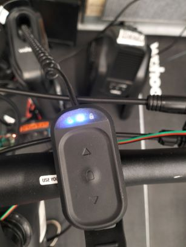
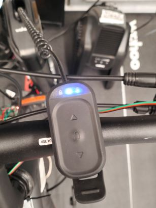
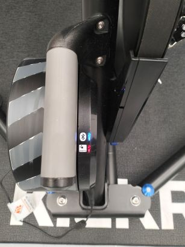

# Starting the Smartbike

The Smartbike can be started from the Raspberry Pi. After being started, the Raspberry Pi will send and receive data over MQTT.

## Before Powering the Raspberry Pi

Before you turn the Raspberry Pi on, do the following:

1. Power on the Smartbike devices
2. Ensure the wireless signal on the KICKR Climb remote is solid (paired)



*If not - hold down the remote's button until quickly flashing and ensure the KICKR smart trainer is powered*

3. Press the button on the KICKR Climb remote to unlock it



4. Ensure that your PC and the Raspberry Pi are connected to your personal mobile hotspot

## Start the Raspberry Pi

5. Power the Raspberry Pi
6. Connect via `SSH`, `VNC`, or monitor

*The Raspberry Pi can be `SSH` into using port `22` and its hostname: `bike000001`.*

7. Login to the Raspberry Pi

*Ask your project lead for login credentials (or if you are the lead - check the handover document).*

8. Awaken the TICKR heart rate monitor - follow instructions in the [Smartbike Introduction](../introduction/Smartbike-Introduction.md) document
9. Start the Smartbike process by running the follow command in the home directory:

```
bash iot/scripts/start_all.sh
```

*The KICKR smart trainer BLE indicator light should turn solid:*



*If BLE errors are encountered see the [ble-auto-connect script](../ble-connectivity/BLE-Auto-Connect-Script.md) or [BLE connectivity fix document](../ble-connectivity/BLEConnectivityFix.md).*