# Design Handbook

By **Dennis Yu**. **23/09/2024**

When modelling, attention should be paid to the separation of movable parts for animation production. The polygon of a bicycle should be below 10000 faces. Please use the standardized PBR mathematical modelling process and export at least the following textures: Normal map, Base colour, and metallicity. The texture specification is 2K resolution. In addition to this requirement, please freely design the assets you are responsible for at your discretion. All 3D assets, please import Unity and adjust the materials to package as prefab. **Remember, all models should export as FBX format.**

**DO NOT** include unnecessary objects when you export .fbx file (e.g. Lighting, Camera).

When creating a model, name each part properly and attach materials to the parts separately.

## Assets still need to work on

### 1. Road Module (Complete)

It is necessary to construct road modules with sufficient shapes for road laying, such as straight sections, intersections, and T-junctions. And different road conditions are required, such as paved and unpaved roads.

a)  Appropriate and uniform size is required.

b)  Assets need to be prefabricated into unit prefabs.

### 2. Bike and Custom Painting

1. Road bikes (**Complete**)
2. Mountain bikes (**Complete**)
3. Women's bikes (**Complete**)
4. Custom painting in the **Garage Scene** (**Complete**) (Due to the bike model update, all setting of bike color change needs to be adjusted in the **Garage Scene**)

>Bike Parts Name

### 3. Map Resources

1. Vegetation (Need to Work on). **Create** temperate shrubs and trees. The Assets folder contains a Plants folder that includes plants commonly found around tropical desert areas.

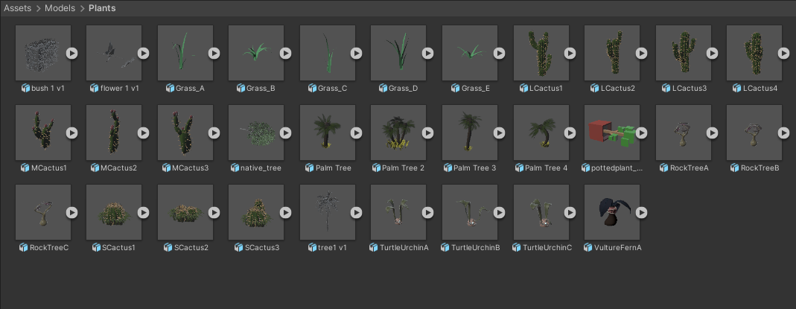
>Figure 1 Plants Assets

2. More types of building (**Complete**)
3. There are only two shapes of buildings placed in the city scene. These need to be **replaced** with different buildings from the building assets folder.
4. Special locations include mission locations, interest exploration points, buildings, and environments.
5. Teleport portal needs animation.
6. The map is designed for coastal towns in southeastern Australia, according to the different areas in the map, building modeling needs to consider the different distribution of buildings in different areas for differentiated differentiation.

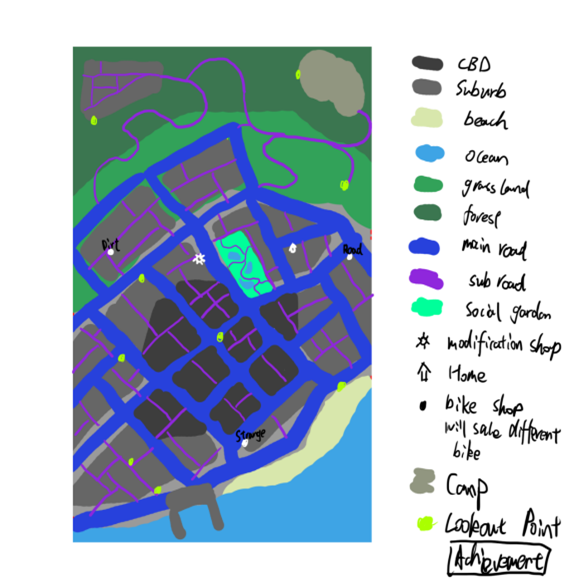
>Figure 2 Planned Map

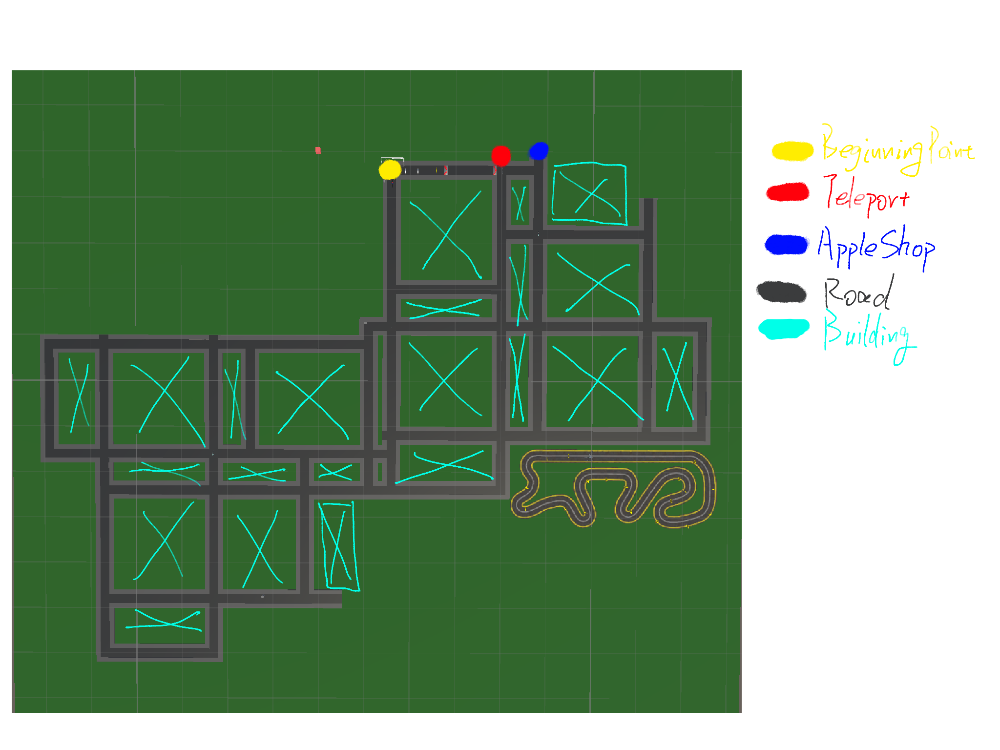
>Figure 3 Current Map

### 4. UI

1. **Remake** a better customized bike interface. (**In progress**)
2. **Remake** a better HUD to display scores and other data.

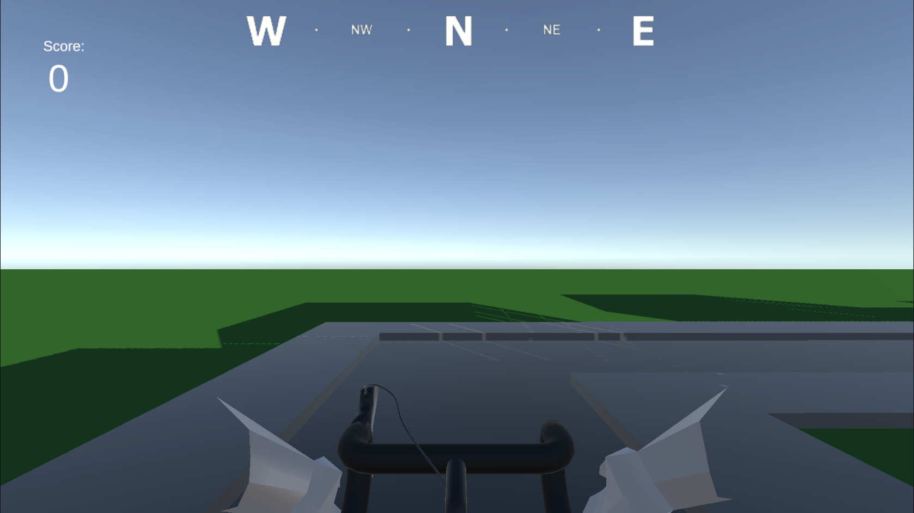
>Figure 4 In-game UI (City Scene)

3. **Add** mission description when selecting a mission in Mission Board. (**Complete**)

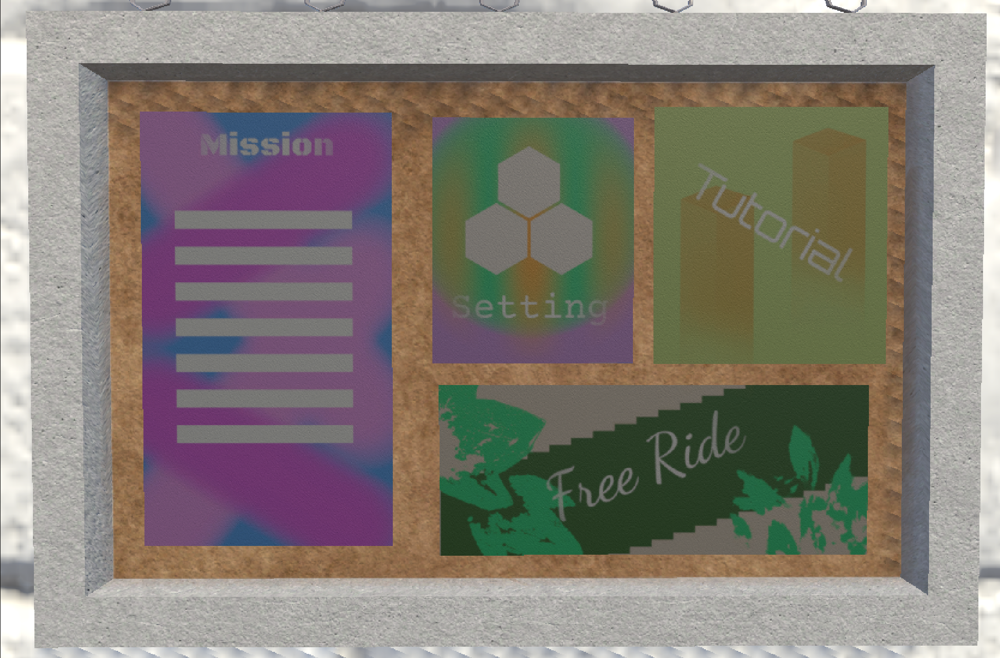
>Figure 5 In-game UI (Garage Scene)

### 5. Garage

### 6. Animation

1. **Update**: Wheel rotation and handlebar steering during cycling. (**Pending**, find the updated PlayerController.cs script in the pull request #74, it is currently not supported with MQTT, **Needs improvement**.)
2. **Update**: The turning pivot of the bicycle should be on the front not middle of the bicycle. (**Completed**)
3. **Add**: animation between legs, crankarm and peddler.

### 7. Special effects

1. **Add** special effects of bicycles driving on different road surfaces (contains sound)
2. **Add** a ring bell function (sound).
3. **Add** bicycle chain sound.
4. **Add** sound effects when updating mission status.
5. **Add** a blur filter when speed is boosted.
6. **Add** visual and sound effects when passing through a teleporter.

### 8. Style and style reference

The overall style tends to be realistic, and attention should be paid to the adjustment of shaders and materials during production, especially the parameters or textures of metallicity.

**Building**
The architectural style of the building complex can be made according to the common styles in Melbourne. It should be noted that due to the geographical factors set, there will not be tall buildings or skyscrapers, and it needs to comply with the geographical setting of the town. In the center (dark gray part), there should be some relatively large buildings, which should be in line with the actual design infrastructure buildings, such as fire stations, hospitals, schools, etc.

Building models should be packed and delete redundant building models. Although different building models are already in the asset s folder, we need to replace the current game building with them.

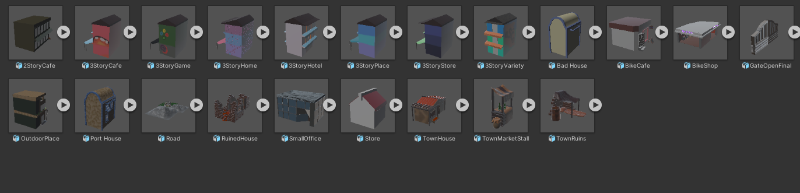
>Figure 6 Building Models Assets

**Urban design reference**
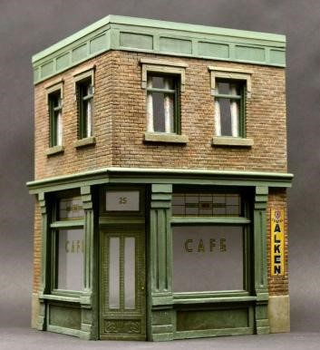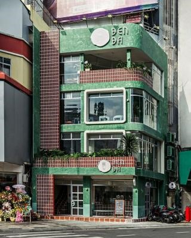!
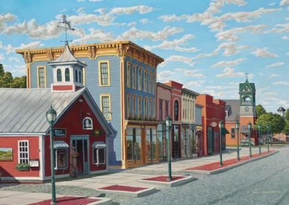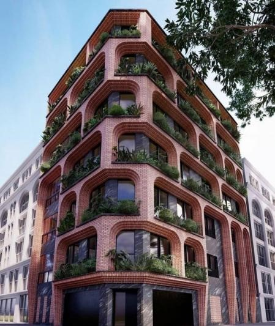
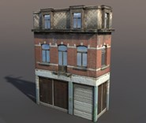

When designing, attention should be paid to a certain mix of new and old buildings, but the overall style of the town should maintain a relatively old and rustic style. In residential areas, the scale of houses should be maintained at a moderate level and there should be no large-scale buildings.

Modern design can be carried out for facilities such as hospitals, schools, etc. Colorful designs can be enriched to make the town more vibrant.

## Exist 3D Assets {#exist-3d-assets .unnumbered}

### 1.Bicycle

**File\'s location**: (Assets\Models\Bicycles)

**Notice**: There are a few old versions of RoadBike model in the folder, just in case if new model has any bugs.

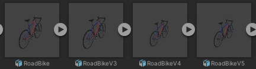
>Old Bike Assets

Bicycles are used for NPCs that automatically ride on the road and also for the player. Currently, there are three types of bicycles.

1. Bicycle_1 (Currently used by NPC bike, poorly made, recommend change to WomenBikeV2 in the future.)

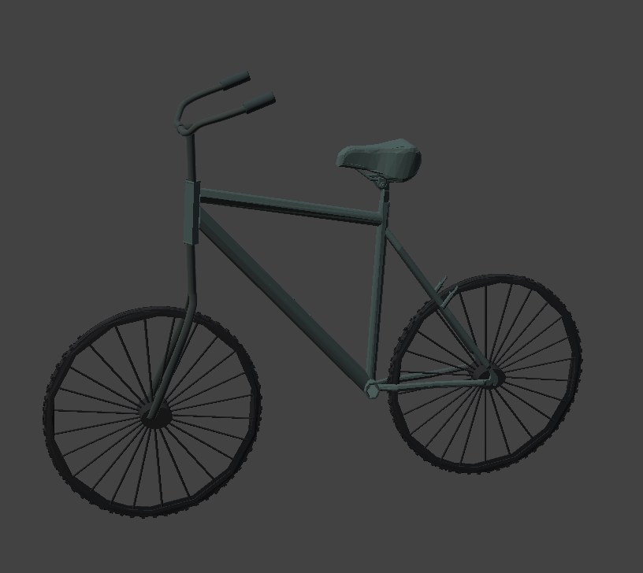
>Figure 7 Bicycle_1

2. Bicycle_2: (Currently used by NPC bike, poorly made, recommend change to MountainBikeV2 in the future.)

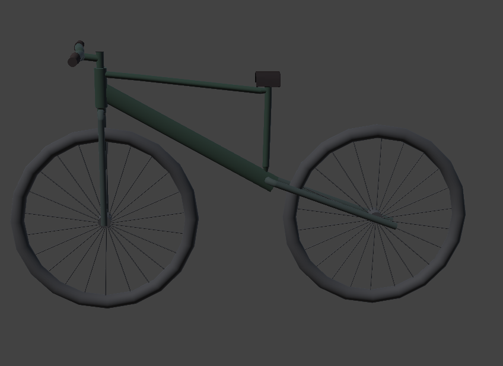
>Figure 8 Bicycle_2

3. RoadBikeV7: Currently used by player

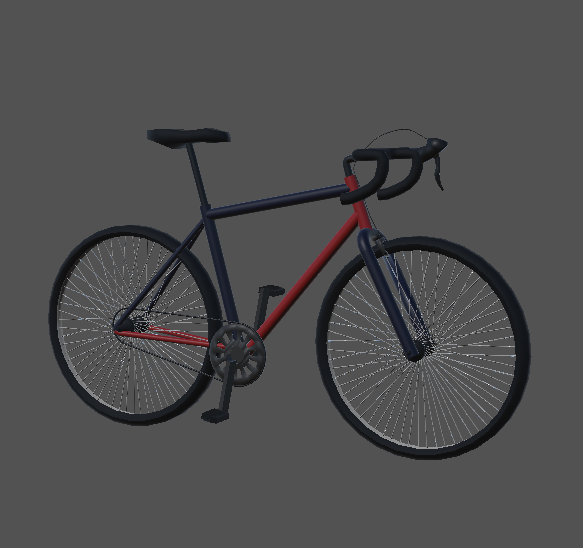
>Figure 9 RoadBikeV7

4. WomenBikeV3: (Completely remake bike model base on Bicycle_1, perform same functionality as RoadBikeV7)

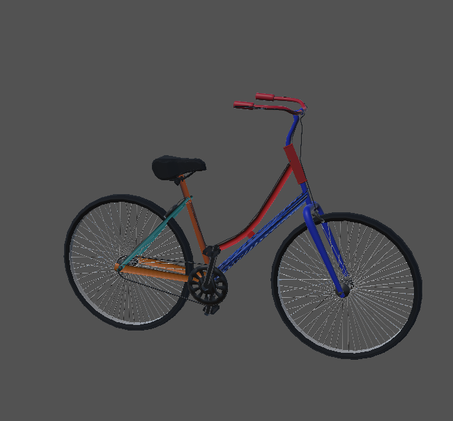
>Figure 10 WomenBikeV2

5. MountainBikeV2: (Completely remake bike model base on Bicycle_2, perform same functionality as RoadBikeV7)

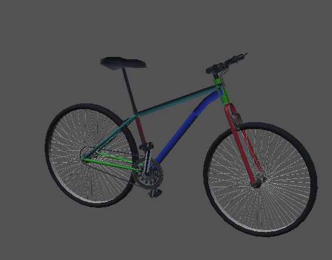
>Figure 11 MountainBikeV2

### 2.Building in the scene

**Files located**: (Assets\Models\Buildings)

1. Building 1

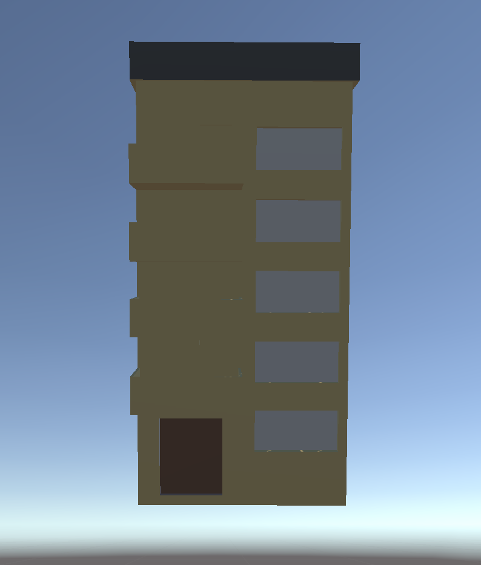
>Figure 12 Building 1

2. Building 2

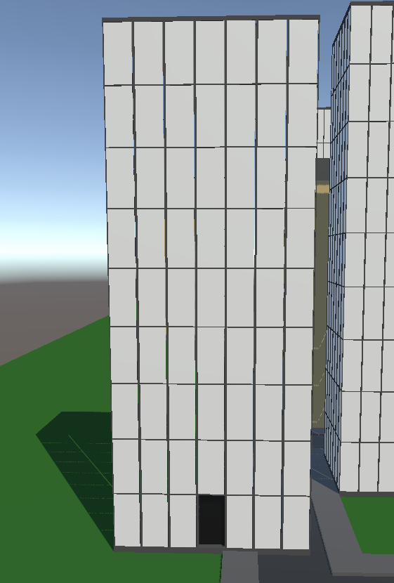
>Figure 13 Building 2

3. 2StoryCafe

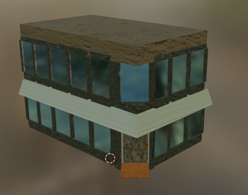
>Figure 14 Building 3

4. 3StoryCafe

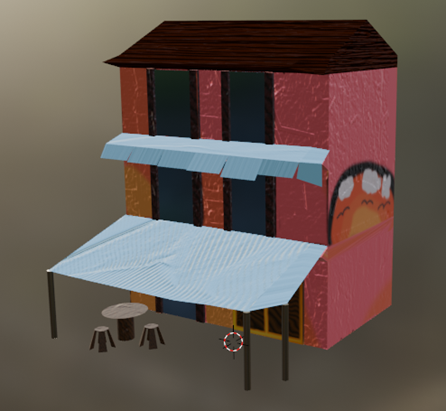
>Figure 15 Building 4

5. 3StoryGame

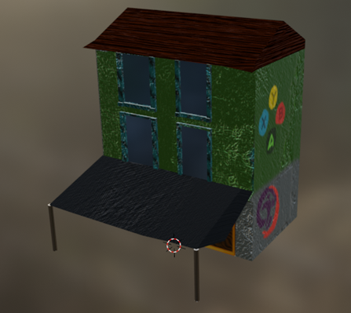
>Figure 16 Building 5

6. 3StoryHome

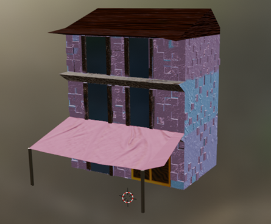
>Figure 17 Building 6

7. 3StoryHotel

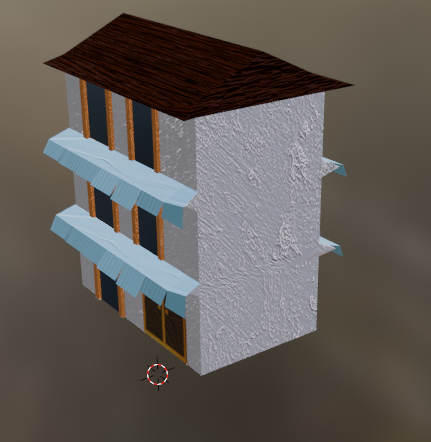
>Figure 18 Building 7

8. 3StoryPlace

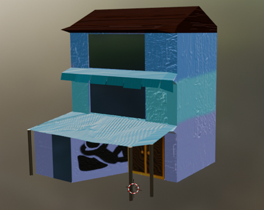
>Figure 19 Building 8

9. 3StoryStore

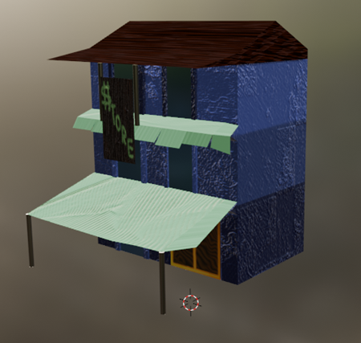
>Figure 20 Building 9

10. 3StoryVariety

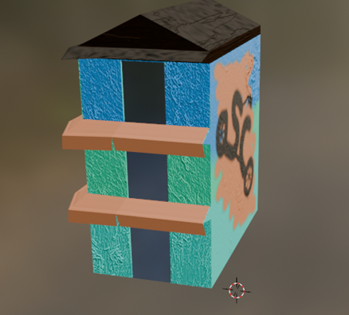
>Figure 21 Building 10

11. OutdoorPlace

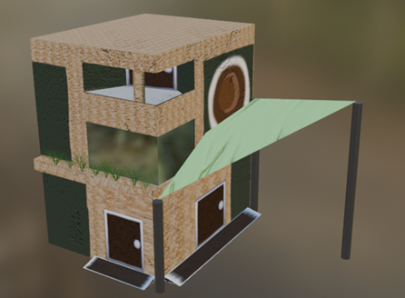
>Figure 22 Building 11

12. SmallOffice

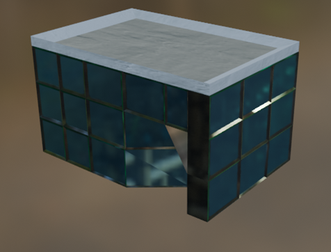
>Figure 23 Building 12

13. BikeCafe

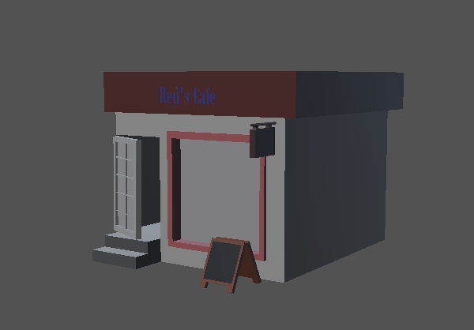
>Figure 24 Building 13

14. BikeShop

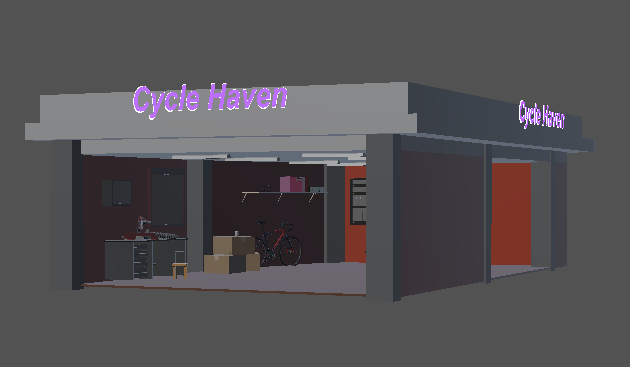
>Figure 25 Building 14

15. Gate

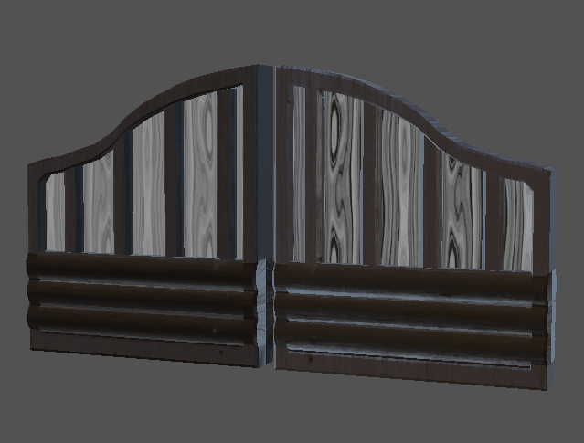
>Figure 26 Gate

### 3.Collectable

**Files located**: (Assets\Models\Pickups)

Collectibles include coins and stars. A silver coin will add 1 point, a gold coin will add 2 points, and a star will add 5 points. Players can use points to buy an apple at the apple shop.

1. Silver coin

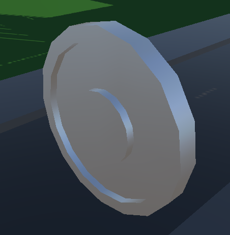
>Figure 27 Silver Coin

2. Gold coin

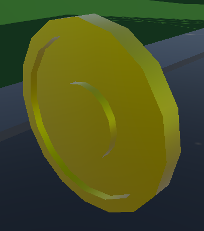
>Figure 28 Gold Coin

3. Star

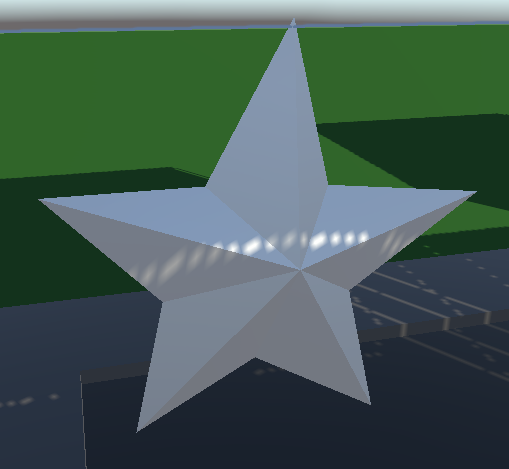
>Figure 29 Star

### 4.Road

1. City Road

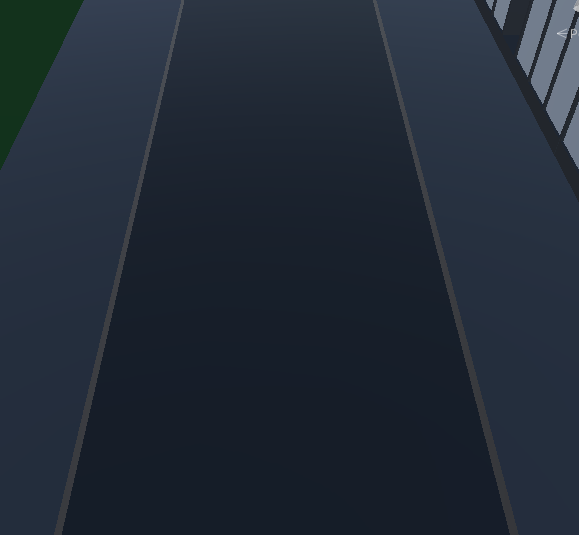
>Figure 30 City Road

2. Race Road

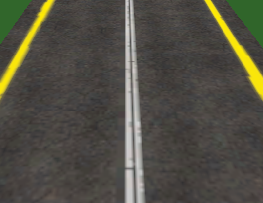
>Figure 31 Race Road

### 5.Boost Ramp

Files located: (Assets\Models\Interaction)

When the player rides over a boost ramp, their speed will increase for a few seconds. Multiple speed boosts can accumulate.

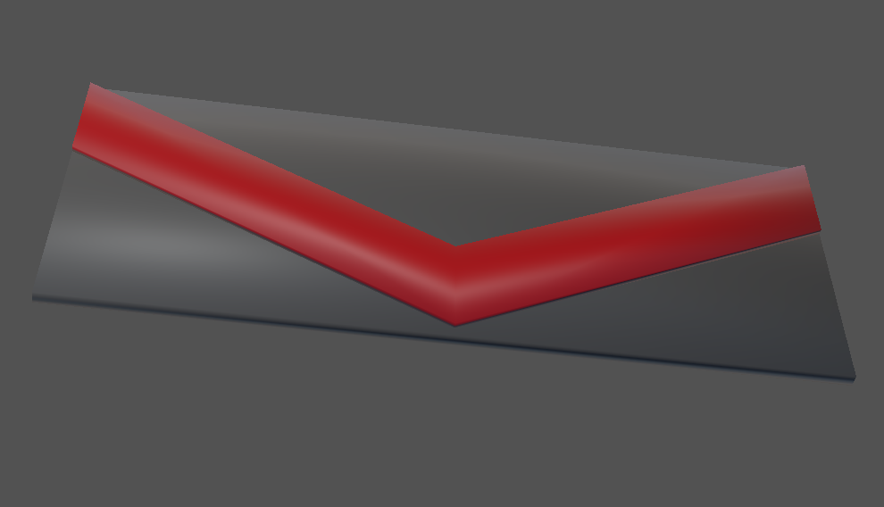
>Figure 32 Boost Ramp

### 6.Teleport Portal

The player can ride into the teleporter to teleport back to the Garage scen (**Model needs improve and animation**).

!Teleport](img/Teleport.png)
>Figure 33 Teleport Portal

### 7.Apple Shop

Files located: (Assets\Models\Market Stalls)

The player can use their points to buy apples.

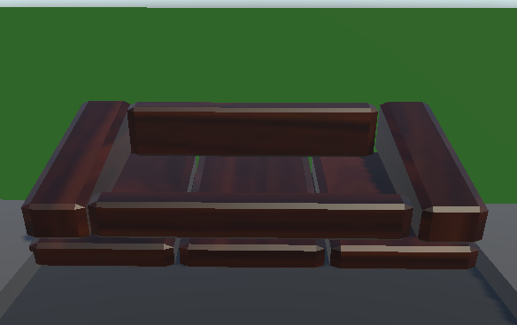
>Figure 34 Apple Shop

### 8.Avatars

Files located: (Assets\Models\Avatar)
The characters players can select and have ride on the bike.

1. Male Avatar

>Figure 30 Male Avatar

2. Female Avatar

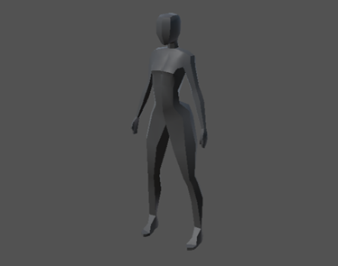
>Figure 31 Female Avatar

### 9.Trash Bin

Files located: (Assets\Models\Other)

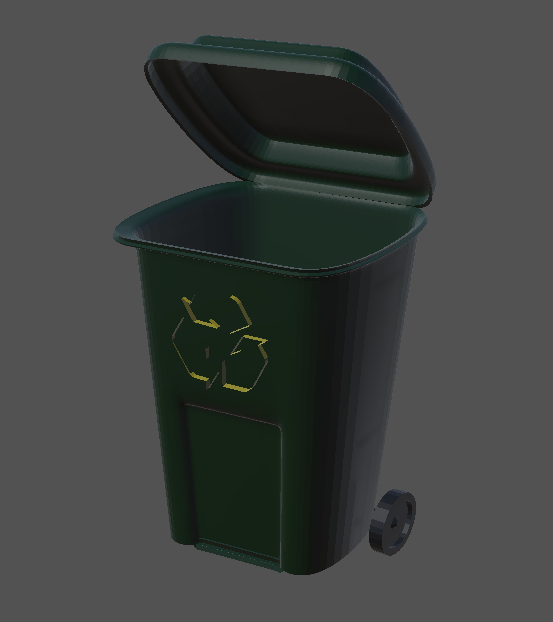
>Figure 35 TrashBinGreen

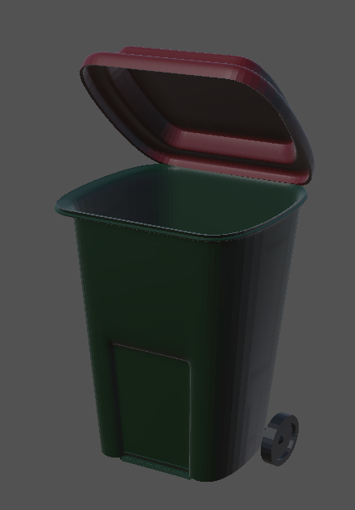
>Figure 36 TrashBinRed

### 10.Others

Files located: (Assets\Models\Other)

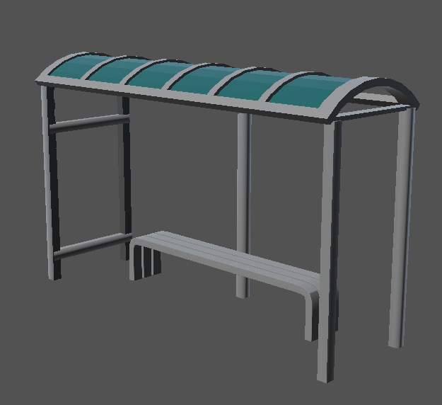
>Figure 37 BustopV2

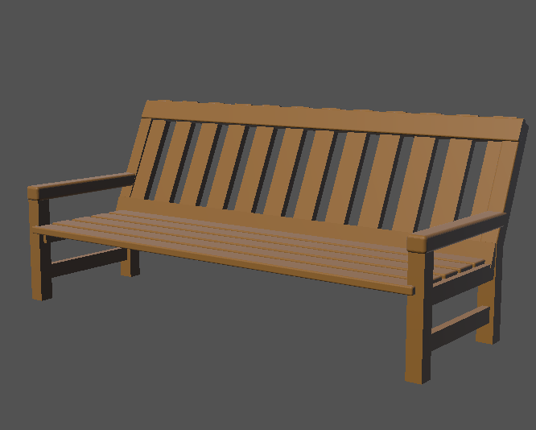
>Figure 38 ParkBench