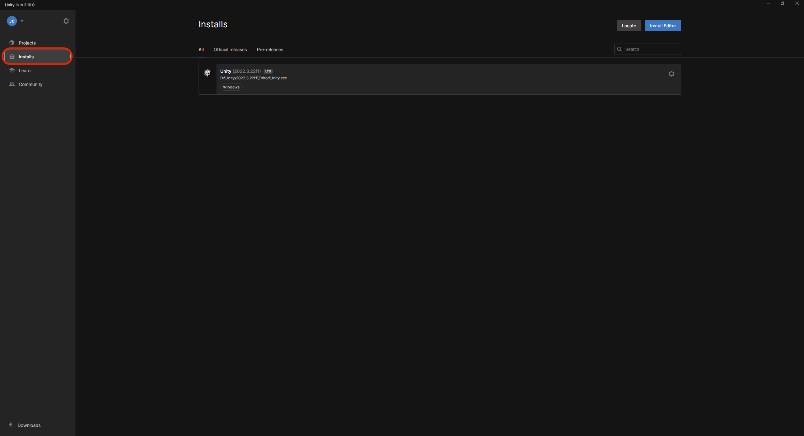
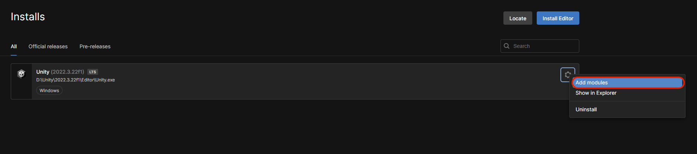
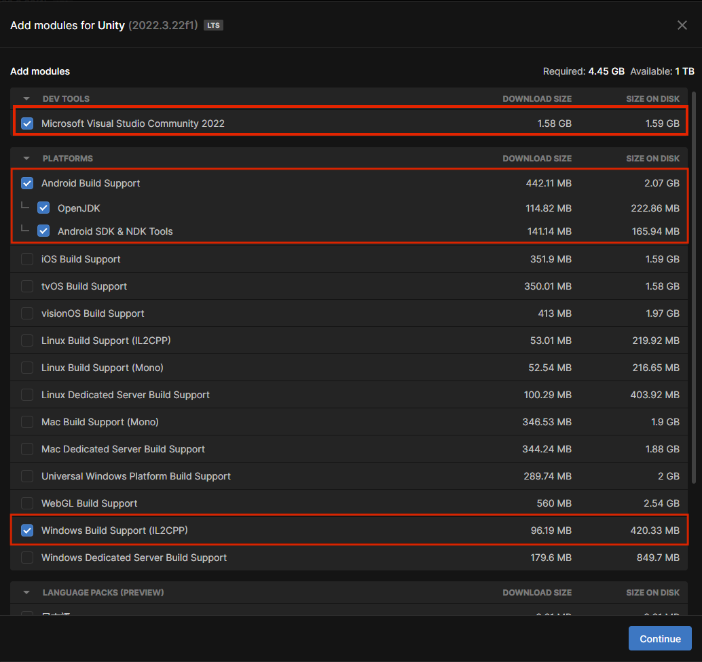
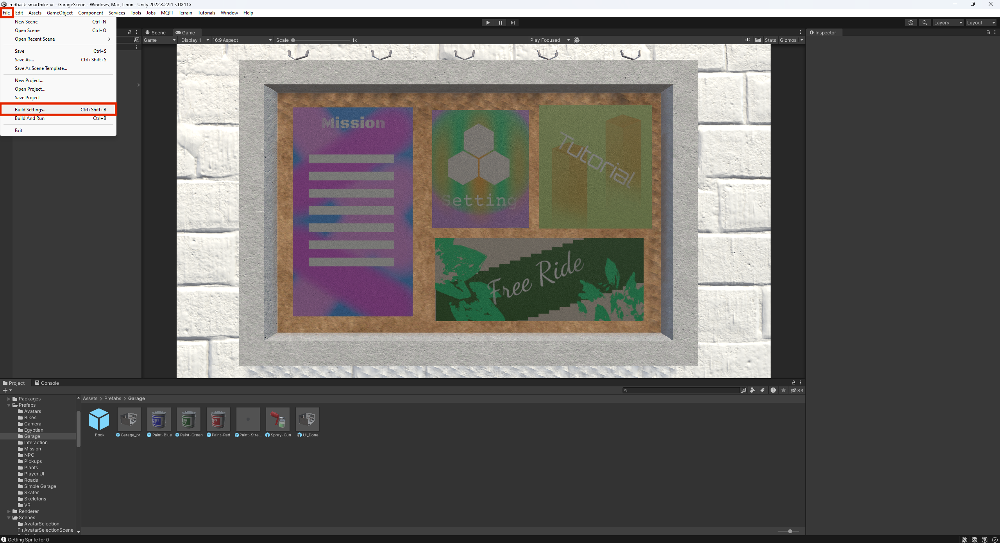
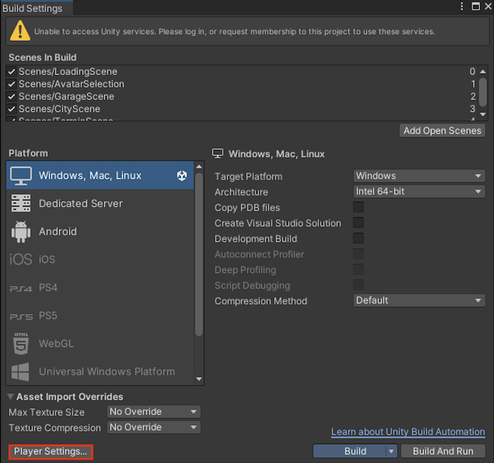
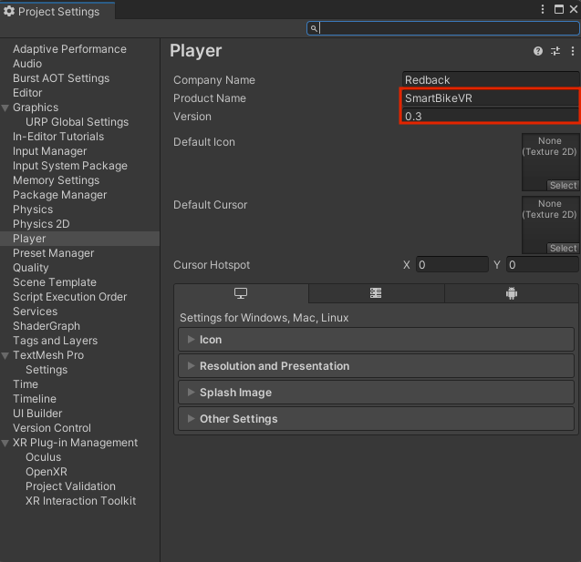
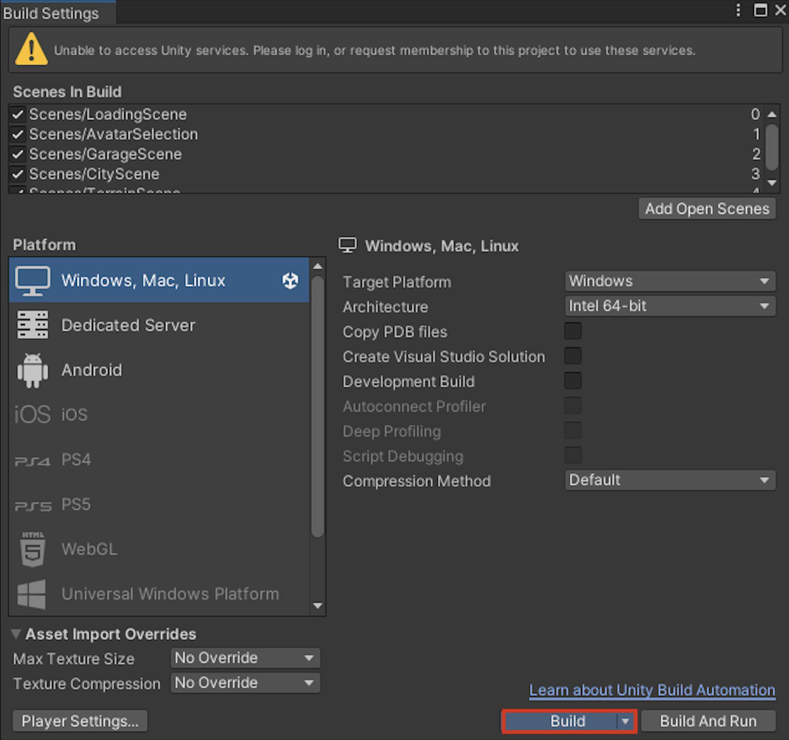
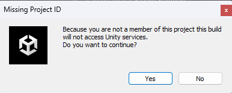
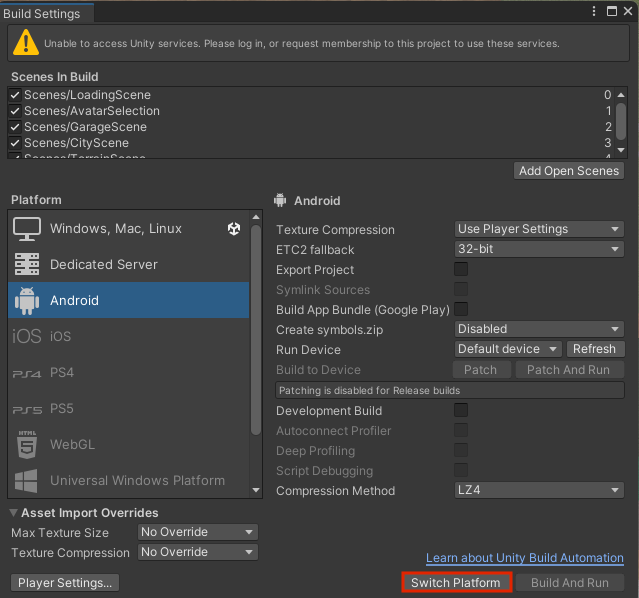
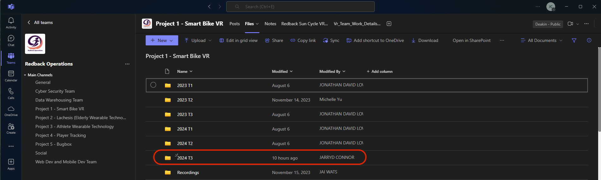

# How to update the APK and EXE files 

It is essential to update the Android Package Kit (APK) and Executable (EXE) files of the VR game to include all the students’ additions to the game, creating a final build version playable on both a PC and a VR headset. The APK file is used to play the game on the VR headset in the Makerspace, while the EXE file can run on a variety of devices, including Windows, Mac, and Linux systems. 

Update the APK and EXE files only after all updates from GitHub have been merged into a single, fully updated file. 

Before attempting to update the build files, you may need to install some additional files into your Unity Hub. 

### Step 1: 

Open Unity Hub and click on ‘Installs’.

### Step 2: 

Click on the cog icon to the top right of your Unity install. Then click on ‘Add modules’. 

### Step 3: 

A new window should open and there will be many different modules. Install the ones that are highlighted as they are required to complete the build files. 

### Step 4: 

After installing the modules, open your updated game file. Now open the build settings by clicking ‘File’ > ‘Build settings’. 

### Step 5: 

Click on ‘Player settings’ in the bottom left of the new window. 
 

### Step 6: 

Update the version number so the build files are different from the previous builds. If this isn’t updated, it can cause issues. Also ensure that the product name doesn’t contain any spaces in the name. After updating the version number and checking the product name, the window can be closed. 

### Step 7: 

Highlight ‘Windows, Mac, Linux’ in the platform options, then start the build process by clicking ‘Build’ in the bottom-right corner of the window. You will need to choose a location to save the build files. It’s recommended to create a new folder to keep all the files organised and in one place. Ensure this folder is saved in a memorable location so the files can be easily accessed and shared later. This step generates the EXE file.  

:::important

This process can take a considerable amount of time, depending on the specifications of your device or PC. The build may take several hours to complete. Plan ahead and avoid leaving this step until the last minute. It’s best to set aside some time to leave it running a while.

:::

### Step 8: 

After completing step 7, this prompt should appear. Click ‘Yes’. The files will begin building. 

### Step 9: 

After completing the first build, click on ‘Android’. You will need to click ‘switch platform’ to get it ready to be built. After switching the platform, you will need to click ‘Build’ and select a file location to save the build files again. This step generates the APK file. 

:::important

Again, this process can take a considerable amount of time, depending on the specifications of your device or PC. Plan ahead and avoid leaving this step until the last minute. It’s best to set aside some time to leave it running a while.

:::

### Step 10: 

Create a new folder in the project 1 files with the trimester and year you are studying this unit. Upload the APK and EXE files to your new folder so they can be accessed by everyone.  

