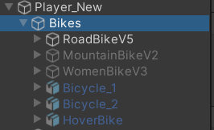

**Last updated by:** Оргил-Эрдэнэ, **Last updated on:** 16/05/2025

**Last updated by:** Оргил-Эрдэнэ, **Last updated on:** 16/05/2025

# Bike Customization System – Architecture & Script Interaction

This document describes how the bike customization and selection system works across three Unity scripts: `BikeSelector`, `SaveLoadBike`, and `Bike`. These scripts operate within a GameObject hierarchy and allow players to view, customize, and persist different bike configurations.

---

## 📦 Hierarchy

###  `Bike` – (Attached to: `RoadBikeV5`)

The `Bike` class is the core data model and controller for a single bike instance.

* Handles:

  * Visual part customization (`SetPartColor`)
  * IK setup for avatar alignment
  * Spray paint interaction targets (`SetupSprayTargets`)
  * Export/import of configuration as `BikeData`
* Provides:

  * `ToBikeData()` → export current customization
  * `LoadBikeData()` → apply saved customization

---

###  `BikeSelector` – (Attached to: `Bikes`)

Responsible for managing multiple bike prefabs

* Handles:

  * Switching between different bikes (`DisplayBike(int id)`)
  * Tracking the currently active `Bike` object (`CurrentBike`)
* Acts as a central registry and display handler for the bikes

---

###  `SaveLoadBike` – (Attached to: `Bikes`)

Handles persistent save/load and selection logic.

* At startup:

  * Loads the last selected bike index via `PlayerPrefs`
  * Displays and loads the saved customization
* When selecting a bike:

  * Updates `PlayerPrefs`
  * Loads customization data from JSON
  * Subscribes to `Bike.OnBikeDataChange` to auto-save
  * Invokes `onBikeSelected` callback
* Saves changes to: `PlayerPrefs.SetString("Bike_{id}", json)`

---

##  How They Work Together

### 🔹 Initialization (`Start()` in `SaveLoadBike`)

1. `PlayerPrefs.GetInt("SelectedBike")` retrieves the last selected bike ID.
2. `DisplayBike(id)` uses `BikeSelector` to show the correct bike.
3. `LoadBikeData(id)` fetches saved JSON and applies it to the `Bike`.

### 🔹 Customization Flow

* User paints or customizes a part.
* `Bike.SetPartColor()` updates the material.
* If `save=true`, the bike:

  * Converts the new state to `BikeData`
  * Triggers `OnBikeDataChange`
  * `SaveLoadBike.SaveBikeData()` is automatically called

### 🔹 Selection Flow

* `SelectBike()`:

  * Updates selection in `PlayerPrefs`
  * Calls `onBikeSelected` to notify listeners
  * Ensures the selected `Bike` is subscribed for auto-save

