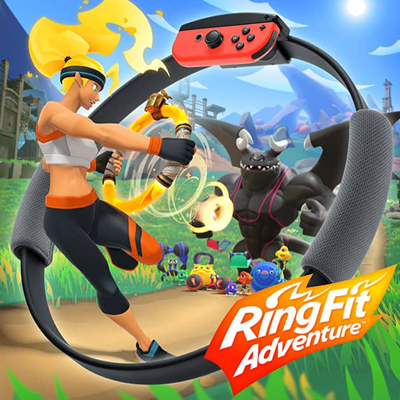
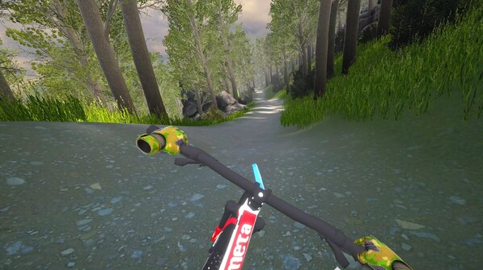
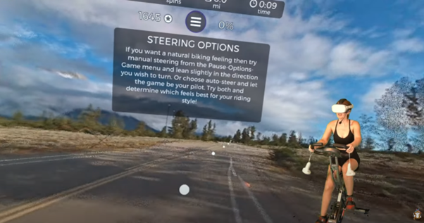

# Game Design Document

## 1. Game Overview

### 1.1. Game Concept

**Title**:  
SmartBike VR

**Theme**:  
Exergaming, health, VR, Open-World Exploration, Competition, Sports and Racing

**Catchphrase**:  
Ride, Race, and Conquer Reality in SmartBike VR: Where Your Pedals Power Your Adventure

"SmartBike VR" is a virtual reality experience designed to gamify cycling and encourage physical exercise. The game integrates a seamless system of linking smart indoor exercise bikes, currently limited to Wahoo KICKR Core/Climb, with a Unity-built game for controlling the in-game cycling experience and supports Meta Quest 2/3 for immersive VR gameplay. The game also offers a synchronized view on both VR headsets and external monitors, providing a dynamic and engaging experience for both players and spectators. Multiplayer support is provided through Photon Fusion, letting players cycle and compete in a shared virtual world. 

### 1.2. Target Audience

The SmartBike VR system is built for:
 - Fitness enthusiasts who are looking to gamify their exercise routines
 - Casual gamers who are interested in health and wellness
 - Competitive cyclists seeking a virtual training environment
 - VR gamers looking for an immersive and active experience

### 1.3. Platform

**Meta Quest 2/3**:  
"SmartBike VR" is targetted specifically at the Meta Quest headsets and their ability to communicate wirelessly with a physical bike. It allows the player to install the game on their headset, connect to their bike over bluetooth and then explore a virtual world in the comfort of their own home.

**SteamVR**:  
"SmartBike VR" can be used in a tethered mode for PC gaming platforms which utilizes SteamVR as the technology framework to enable virtual reality gameplay. The tethered mode will allow for a simultaneous VR experience, but also be able to remove the headset and experience the game in an onscreen mode. This means that players who own compatible VR headsets and use the Steam platform could access and play "SmartBike VR" through the SteamVR platform.

**PlayStation (PS4, PS5)**:  
With the PS4/PS5 both having a PSVR system, expanding "SmartBike VR" for PlayStation consoles (PS4 and PS5) can capitalize on the platform's extensive player base, spanning casual gamers to enthusiasts, and its well-established VR support through PlayStation VR. With millions of users and the potential for diverse demographics, the game can attract a broad audience. That the PlayStation also utilizes bluetooth connectivity, the ability to connect wirelessly to your physical bike is still able to occur and add that virtual workout to your PlayStation gaming experience.

### 1.4. Elevator Pitch

Embark on an immersive journey of adventure and fitness in 'SmartBike VR.' Pedal your way through an expansive VR world, where your stationary cycling powers the action. Engage in thrilling races across diverse landscapes, embrace the challenge of delivery quests in a free roam map, and collect valuable data using integrated sensors. With the power of VR, 'SmartBike VR' invites players of all backgrounds to experience the fusion of gaming and exercise, while the potential for console platforms like PlayStation and Xbox ensures a broad reach, promising a new era of interactive and healthy entertainment.

### 1.5. Distribution Method

Subscription model with a free-to-play mode.

"SmartBike VR" will be available through the Steam Store, Meta Store and directly on a Meta Quest headset. It will be available to download for free with a basic version allowing the player to experience the game without a cost. If further content is wanted to be experienced, this will be done as a pay-to-play model with a small monthly cost. This monthly cost system is the standard fare of exercise-based virtual reality experience and by keeping the cost low it allows a consistent revenue for the team.

## 2. Game Mechanics

### 2.1. Core Pillar of Gameplay

"Physical Engagement" as a core pillar of gameplay in "SmartBike VR" revolves around the active involvement of players' physical movements to control their in-game avatars and impact their performance. This gameplay is central to the game's concept of combining exercise with virtual reality gaming.

Players use their real bicycles, equipped with sensors, to simulate cycling within the virtual world. As players pedal on their stationary bikes, their movements are translated into in-game actions, allowing them to control the speed and direction of their avatars. Pedaling speed determines the avatar's movement speed in the virtual environment. Players can control the direction of their avatar by steering the handlebars of their real bicycle.

Just like in real cycling, players need to manage their energy levels. Pedaling faster consumes more energy, while slowing down conserve’s energy. This dynamic encourages players to strategize when to speed up and when to maintain a steady pace. Players can use their physical engagement to strategically navigate races. For example, they might pedal intensely during a sprint challenge and then ease up during downhill sections to recover energy.

The physical engagement element adds a layer of challenge to navigating obstacles within the virtual world. Players need to adjust their pedaling intensity and direction to avoid obstacles and hazards effectively. The more players engage physically, the more they can improve their fitness levels and in-game skills. Regular physical activity can result in better performance, faster completion times, and increased stamina. By intertwining physical movement with gameplay, "SmartBike VR" serves as a motivational tool for exercise. Players are encouraged to stay active while enjoying a virtual cycling experience.

Physical engagement aligns with the game's focus on promoting a healthier lifestyle. Players can experience cardiovascular exercise, improved stamina, and other health benefits while having fun. Physical engagement enhances the immersion by making players feel more connected to the virtual world. It also offers a unique way for players to interact with the game environment.

Different types of challenges, such as sprints, endurance races, and hill climbs, provide players with varied gameplay experiences that require adjusting their physical engagement strategies.

### 2.2. Multiplayer Features

In "SmartBike VR", players can join live cycling events, races, or group rides in real-time, where Photon Fusion ensures smooth multiplayer gameplay with minimal latency. This allows participants to experience real-time interactions with other players, simulating the feel of riding alongside each other, whether they're racing head-to-head or engaging in a leisurely group ride. Photon Fusion’s efficient networking is key to providing this seamless multiplayer environment, minimizing lag even with multiple players connected simultaneously.

Player performance is tracked using various metrics, such as time, distance, and calories burned, all of which can be displayed on a real-time leaderboard. This ranking system adds a competitive edge, encouraging players to push themselves harder and improve their results. The system could also highlight personal achievements and improvements over time, motivating users to stay engaged.

In addition to competitive racing, the game offers cooperative challenges. These can include endurance rides, where players team up to cover long distances together, or obstacle courses that require coordinated effort to overcome. Such cooperative activities promote teamwork and foster social interaction among players, creating a sense of camaraderie. Teams can strategize to complete challenges, perhaps with different riders taking on specific roles based on their in-game strengths, making the experience more dynamic and engaging.

By blending competitive elements with cooperative gameplay, the game fosters a community of players who can enjoy both individual challenges and social experiences.

### 2.3. Synchronized View

In "SmartBike VR", both the player in VR and spectators watching on an external monitor can enjoy a highly immersive and engaging experience through synchronized views. While the player navigates the virtual world from a first-person perspective, feeling as if they’re truly riding a bike, the external monitor offers an alternate viewing experience, such as a third-person camera or dynamic angles that showcase the player’s environment and progress from a broader perspective.

On the monitor, a comprehensive HUD (Heads-Up Display) enhances the spectator experience by providing detailed cycling stats. This could include real-time metrics like speed, heart rate, calories burned, and power output, offering viewers insight into the player’s physical exertion. The player’s position in the race or event, along with the overall progress of the ride, can also be displayed, showing lap times, remaining distance, and the positions of other competitors or teammates.

For an added layer of immersion, the camera angle could dynamically shift to highlight key moments in the race. For example, during close competition between players, the camera could zoom in on head-to-head sprints or critical overtaking moments. Alternatively, for longer endurance events, the camera might switch to a bird’s-eye view, giving spectators a clearer view of the terrain, track layout, and rider positions.

This dual view system allows for engaging live streams or in-person events where spectators can cheer on their favorite players, track their progress, and witness the virtual environment in ways that aren’t limited to the player’s VR perspective. By combining the VR experience with detailed stats and race updates on the monitor, you can create a more inclusive and informative environment for both participants and audiences, making the game not only immersive for the player but also compelling for those watching.

## 3. Rules

#### 3.1. What is the _victory_ and _loss_ conditions of SmartBike VR?

**Victory Conditions:**  
The primary victory condition in "SmartBike VR" is achieving personal goals and milestones within the game. Players aim to complete races and delivery quests, earning rewards and progressing through the game's content. Success is measured by reaching the finish line first in races or successfully completing delivery objectives. Additionally, players can track their accumulated data and achievements over time, such as distance travelled, calories burned, and quests completed, fostering a sense of accomplishment and improvement in their fitness journey.

**Loss Conditions:**  
While "SmartBike VR" is designed to promote a positive and engaging experience, there might not be traditional "loss" conditions in the game. Instead, the focus could be on encouraging players to stay motivated and continually improve their performance. If a player doesn't complete a race or quest successfully, they could have the opportunity to retry without significant penalties. The emphasis is more on progress and personal growth rather than outright failure. This approach aligns with the game's goal of providing an enjoyable and active experience.

### 3.2. **What are the _active_ challenges of SmartBike VR?**

**Time Trials**:  
Players compete against their own best times or against friends' times in time trial races. The challenge is to complete the race in the shortest time possible, motivating players to pedal harder and faster.  

**Endurance Races**:  
Endurance Races in "SmartBike VR" are exhilarating challenges that push players' physical limits and provide a platform for showcasing their dedication to fitness and their mastery of the virtual cycling world. These races are designed to simulate the experience of tackling lengthy cycling routes that require sustained effort and stamina.

The key to conquering endurance races lies in finding a balance between pacing oneself and maintaining a consistent level of effort throughout the race. Players need to gauge their energy reserves, strategically manage their pacing, and effectively utilize their virtual bike's capabilities to navigate terrain changes and potential obstacles. Uphill segments demand increased exertion, testing players' ability to power through resistance, while downhill stretches allow for recovery and speed boosts.

Successfully completing endurance races rewards players not only with in-game rewards such as virtual currency, gear upgrades, or cosmetic enhancements but also with a tangible sense of accomplishment. The recognition of their dedication and the progress they've made in their fitness journey is celebrated through virtual achievements and leaderboards that showcase their achievements to other players.

**Sprint Challenges**:  
Sprint Challenges within the captivating realm of "SmartBike VR" introduce exhilarating moments of intense pedal-to-the-metal action, designed not only to deliver bursts of heart-pounding excitement but also to enhance players' cardiovascular fitness in a dynamic and engaging manner. These challenges embody the essence of high-speed competition, demanding rapid and forceful pedalling as players navigate through specially designed virtual tracks that are perfect for unleashing their full cycling potential.

In a Sprint Challenge, the adrenaline rush is palpable as players accelerate their virtual bikes to breakneck speeds, their determination driving them to surpass their previous limits. These challenges encourage players to tap into their energy reserves and unleash explosive bursts of power, providing a workout that not only ignites cardiovascular activity but also intensifies the overall gaming experience.

As players engage in these rapid sprints, they encounter various terrain features that mimic real-world conditions—rolling hills, straightaways, and sharp turns—all meticulously crafted to demand precise control, strategic acceleration, and well-timed deceleration. The short yet intense nature of Sprint Challenges ensures that players maintain an elevated heart rate throughout, promoting endurance and stamina while simulating the intensity of real-world cycling sprints.

**Hill Climbs**:  
"Hill Climbs" in the world of "SmartBike VR" encapsulate the essence of conquering challenging terrains and mastering the art of uphill cycling. These virtual segments intricately recreate the arduous yet rewarding experience of climbing hills, pushing players to summon their inner strength and endurance as they navigate these steep inclines. Just like real-life hill climbs, these segments demand increased effort, determination, and strategic pedalling to overcome the resistance and reach the summit.

As players embark on Hill Climbs, they are transported to captivating virtual landscapes featuring gradients that mirror the complexities of real-world terrain. The challenge lies in the symbiotic relationship between the player's physical exertion and the virtual resistance encountered, providing an authentic sensation of cycling uphill. Pedalling harder against this resistance emulates the sensation of battling gravity and conquering the climb, adding a layer of realism to the gameplay.

Each Hill Climb introduces unique features that replicate the variability of outdoor cycling experiences. Some segments might present prolonged steady climbs, allowing players to find a sustainable rhythm, while others could feature alternating inclines and plateaus that require quick adjustments in pedalling intensity.

**Delivery Quests with Obstacles**:  
In the bright world of "SmartBike VR," "Delivery Quests with Obstacles" adds a dynamic layer of gameplay that gives players a thrilling, immersive experience that mixes the adrenaline of time-sensitive tasks with the art of precision. These adventures immerse players in a narrative where they take on the role of a dedicated courier charged with delivering essential supplies across various virtual environments while overcoming a variety of challenges that put their riding prowess and problem-solving abilities to the test.

As they begin these adventures, players face a range of difficulties, including topographical differences, environmental dangers, and strategic decision-making opportunities. As they pedal through crowded cities, peaceful country roads, and difficult off-road terrain, the time passes. In addition to getting there on schedule, the goal is to strike a careful balance between speed and accuracy because rushing could result in accidents and setbacks.

These objectives are completed to add to the overall sense of success that "SmartBike VR" delivers, encouraging an enjoyable gameplay experience that tests players' mental and physical abilities.

**Distance Challenges**:  
The "Distance Challenges" in the "SmartBike VR" universe weave an engrossing tapestry of success and drive, inspiring players to set out on thrilling travels where each pedal stroke advances them. In order to feel a feeling of success and to increase their motivation to cover longer distances over time, these challenges provide players the ability to set their sights on achieving distance milestones during a single gameplay session.

Players are met by a variety of virtual settings that reflect the diversity and beauty of the real world as they embark on their bicycle odysseys. Each route offers a distinctive environment for players to immerse themselves in their riding experience, from wide open roads that reach into the distance to twisting routes that wind through gorgeous landscapes. The difficulty lies not only in crossing the distance, but also in keeping a steady rhythm and speed to enhance performance.

The mechanisms of the game painstakingly detect each pedal turn as you travel, converting physical effort into virtual advancement. As they pedal forwards, players can see their distance increase, giving them a visual reflection of their effort.

Beyond in-game wealth or aesthetic upgrades, distance challenge completion awards come in a variety of forms. While these incentives provide participants with concrete credit for their efforts, the main victory is the sense of accomplishment that comes from exceeding their distance objectives.

**Calories Burned Goals**:  
The "SmartBike VR" immersive world's "Calories Burned Goals" establish a meaningful link between virtual adventure and actual fitness goals, giving players a concrete and satisfying way to monitor their physical exertion. With the help of these challenges, players may set goals for how many calories they want to burn as they play, turning the act of virtual cycling into a routine workout that fits in well with their efforts to improve their health and wellbeing.

The pursuit of calories burnt turns into a driving force that directs players during games. The game's mechanisms convert players' physical output into calories expended as they pedal through picturesque routes, negotiate difficult terrain, and engage in a variety of virtual activities, enabling them to see the immediate results of their exertion in real time. Players are motivated to persevere by the excitement of seeing their development, which fosters a sense of empowerment and success.

**Virtual Competitions**:  
Within the engaging "SmartBike VR" universe, "Virtual Competitions" provide an electric gameplay dimension where people from all over the world come together in real-time races and challenges, developing a sense of community, friendship, and exhilarating competitiveness. Players can use this dynamic platform to demonstrate their abilities, compete amicably, and enjoy the thrill of global connectivity inside the virtual cycling world thanks to these events.

Virtual competitions offer rewards that go beyond the virtual world, such as the camaraderie of competing and interacting with other players as well as in-game achievements. Players are inspired to continuously improve their talents, pushing their physical and virtual performance to new heights, thanks to the immersive excitement of real-time competition and the validation of one's achievements.

**Interval Training**:  
The unique gameplay mechanic "Interval Training" introduces in the immersive setting of "SmartBike VR" incorporates dynamic cycling sessions that follow the principles of interval training, a well-known fitness method. With times of extreme effort interspersed with periods of active recuperation, these specialised programmes boost players' cardiovascular fitness and endurance while offering an enjoyable and transforming exercise experience.

Players go between quick sprints and more deliberate pedalling throughout these alternate stages, which are all intended to improve cardiovascular training. The virtual environments of "SmartBike VR" serve as the background for these phases. These sessions can have a range of lengths, from quick but intense intervals to longer cycles, providing flexibility for players with different fitness levels and objectives.

The benefits of interval training sessions go beyond the confines of the game, as participants leave with a greater sense of success as well as an improved cardiovascular capability. The interval strategy offers a dynamic integration of gaming and fitness, enabling players to see "SmartBike VR" as both a committed fitness companion and a source of pleasure.

**Progressive Challenges**:  
"Progressive Challenges" in the intriguing world of "SmartBike VR" present a dynamic and gratifying avenue for players to set off on a journey of growth, improvement, and ongoing achievement. These challenges are made to change as players' skill and fitness levels advance, generating a supportive environment and a constant sense of accomplishment throughout the gameplay experience.

Players that participate in Progressive Challenges are involved in a series of tasks that evolve and get harder over time. These tasks are thoughtfully designed to mirror players' developing skills, gradually providing more complicated environments, difficult opponents, and challenging goals. The goal is to engage on a journey of ongoing progress that mirrors athletes' actual journeys towards health, not only to overcome a single challenge.

Players are rewarded for completing each level of the challenge not just with in-game rewards and virtual upgrades but also with the knowledge that they are developing new talents and going beyond their comfort zones. This sense of accomplishment encourages them to continue playing the game and keeping up with their exercise routine, which starts a cycle of personal growth that extends beyond the virtual world.

### 3.3. What is the _Internal Economy_ of SmartBike VR?

#### 3.3.1. What tangible resources does the game use?

| **Tangible resources** | **What value does it have?** | **How is it exchanged in the game?** | **Negative feedback mechanism (to avoid rapid growth)** | **Positive feedback mechanism (to avoid stalemate)** | **Random elements** |
| --- | --- | --- | --- | --- | --- |
| _Virtual Currency_ | _A common component of game economies_ | _Players can use this currency to purchase cosmetic upgrades for their virtual bikes, gear, and accessories, enhancing their in-game appearance._ | _The player will get less currency if they take too long to finish a course and if they crash on any object_ | _Players will get extra currency when they finish the course quick and being flawless_ | _None_ |
| _Cosmetic Items_ | _Self-Expression, Achievement Recognition, Goals and Motivation_ | _Players can purchase cosmetic items using the virtual currency earned by participating in races, quests, and events_ | _None_ | _None_ | _None_ |
| _Quest Rewards_ | _Enhanced Customization and Progression Incentive_ | _Virtual Currency, Cosmetic Unlocks and Achievement Recognition_ | _The same quest cannot give rewards if it is completed more than 1 time_ | _Progressive Unlocks: Instead of delivering all rewards at once, the game could provide incremental rewards for completing certain milestones within a quest or race_ | _None_ |
| _Leaderboard Bonuses_ | _For participating in Virtual Competitions or achieving high rankings in various challenges, players could earn leaderboard bonuses_ | _virtual currency or unique customization options._ | _The player will get less rewards for not being high on the leaderboard once a month_ | _Seasonal Resets, Tiered Rewards, Exclusive Rewards_ | _None_ |

#### 3.3.2. What intangible resources does the game use?

| **Intangible resources** | **What value does it have?** | **How is it exchanged in the game?** | **Negative feedback mechanism (to avoid rapid growth)** | **Positive feedback mechanism (to avoid stalemate)** | **Random elements** |
| --- | --- | --- | --- | --- | --- |
| Experience and Skill | Performance Improvement, Challenge Mastery, Personal Growth | Time, Practice, Learning from Others | None | Skill-Based Leaderboards: Implement leaderboards that focus on different skill categories, such as fastest completion times or most accurate navigation. This allows players to compete with others who share their skill level. | None |
| _Strategic Thinking_ | **_Competitive Advantage:_** _Strategic thinking gives players a competitive advantage by enabling them to plan their moves, anticipate challenges, and make informed decisions during races and challenges._**_Problem Solving_**_: Strategic thinking allows players to analyse complex situations, identify optimal paths, and find creative solutions to overcome obstacles.   _**_Adaptability_**_: The ability to adapt strategies in response to changing conditions_ | **_Varied Terrain:_** _Races and challenges set in diverse terrains require players to employ different strategies._**_Virtual Competitions_**_: Engaging in Virtual Competitions requires strategic planning to outmanoeuvre opponents._  **_Leaderboard Strategies:_** _Players aiming for top leaderboard positions often need to devise strategic approaches to achieve the fastest completion times, highest accuracy, or other specific criteria._ | _None_ | None | _None_ |
| _Community and Relationships_ | _Collaborative Learning, Friendly Competition, Social Interaction_ | _In-Game Chat, Virtual Competitions, Leaderboards, Social Features, Forum or Community Hub_ | _None_ | _None_ | _None_ |
| _Sense of Accomplishment_ | _Motivation, Emotional Reward, Personal Growth, Recognition_ | _Achievement Unlocks, In-Game Badges, Leaderboard Rankings, Reward Systems_ | _None_ | _None_ | _None_ |
| _Player Identity_ | **_Personal Connection:_** _Player identity allows individuals to project their personalities, preferences, and uniqueness onto their in-game avatars, creating a deeper personal connection with the virtual world._ **_Self-Expression:_** _The ability to customize avatars, bikes, and appearances enables players to express their creativity and individuality, fostering a sense of ownership and empowerment_**_.   Recognition_**_: A distinct player identity, reflected through avatars and cosmetic items, can lead to recognition and social interactions within the game's community._ | **_Bike Customization:_** _Enable players to customize their virtual bikes with different paint jobs, decals, and accessories, allowing for personalization and self-expression._  **_Cosmetic Items:_** _Offer a wide range of cosmetic items, such as clothing, helmets, and bike accessories, that players can exchange virtual currency for to enhance their avatar's appearance._  **_Leaderboards_**_: Displaying avatars alongside leaderboard rankings allows players to associate their identities with their performance and accomplishments._ | _None_ | _None_ | _None_ |

## 4. Appendices

### 4.1. Reference Art

RingFit Adventure has the player actively working out while completing races. It uses a ring that has a physical element to squeeze and pull as well as shift left and right and also a thigh holder so the player can run and the game is controlled by the physical activity of the player

> [RingFit Adventure, 2019](https://www.nintendo.com.au/games/nintendo-switch/ring-fit-adventure)

Down Fast VR is a virtual only cycling game where the player rides down a hill using the VR controllers and steer using virtual handlebars. As it is virtual only, there lacks the fine movement that is able to be portrayed with a physical bike.  

> [Down Fast VR, 2022](https://store.steampowered.com/app/1956860/Down_Fast_VR/)

VZFit links to bikes via a physical device that is purchased separately and only works in the VZFit application. It allows you to ride around the world using Google maps imagery which is rendered in a three dimensional view.

> [VZFit, OtterWorldly screenshot, 2022](https://www.youtube.com/watch?v=7Nn9adpeo-M)
