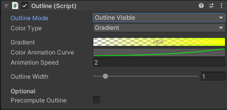
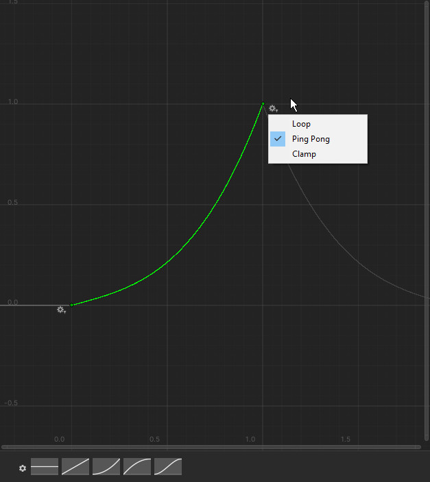

# Outline Component

The `Outline` component adds an animated, customizable outline effect to any GameObject with a Mesh.

## Features

- Outline color supports HDR (glow with Bloom)  
- Optional animated gradient color via `AnimationCurve`  
- Option to pre-bake smooth normals for performance  
- Multiple outline modes including silhouette-only and visible-only  
- Automatically adds necessary materials at runtime  

## 🛠 Usage

### Basic Setup

Add the `Outline` component to a GameObject. It will automatically:

- Detect child renderers
- Add outline materials at runtime
- Apply default outline color and width

### Outline Modes

Control how the outline is rendered:

| Mode | Description |
|------|-------------|
| `OutlineAll` | Always visible, even through walls |
| `OutlineVisible` | Only visible when the object is visible |
| `OutlineHidden` | Only visible when the object is *behind* something |
| `OutlineAndSilhouette` | Visible and includes silhouette outline |
| `SilhouetteOnly` | Only renders silhouette, not full outline |

### Animated Gradient

1. Set `Color Type` to `Gradient`
2. Assign a `Gradient`
3. Define an `AnimationCurve` (typically goes from 0 to 1)
4. Set the end node of the `AnimationCurve` to loop or ping pong to run indefinetily
    
6. Adjust `Animation Speed`
>  Bloom Post-processing is recommended for glowing outlines with HDR colors.

###  Smooth Normals Baking (Optional)

For improved performance:

- Enable **Precompute Outline** in the Inspector
- Smooth normals will be baked in the editor

If disabled, smooth normals are calculated at runtime on `Awake()` (may cause lag on large meshes).

