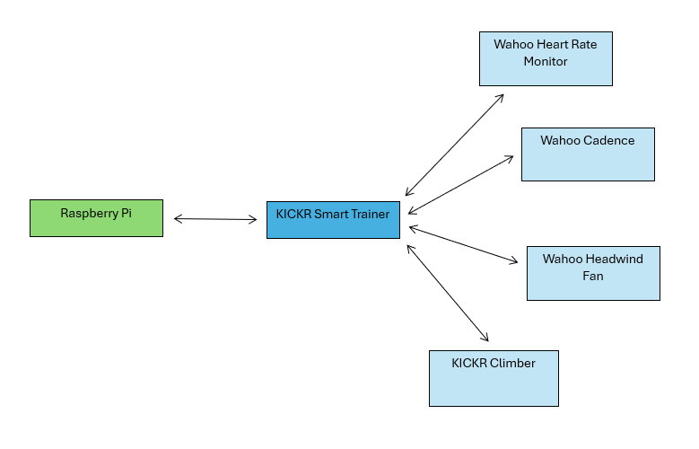
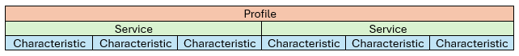
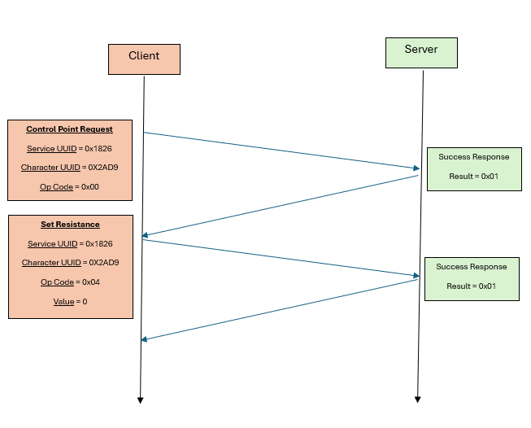

# Wahoo Device Interfacing

The Raspberry Pi communicates with the bike through Bluetooth Low Energy (BLE), specifically by pairing with the KICKR smart trainer (the other devices automatically pair with the KICKR smart trainer). The KICKR smart trainer runs an ATT server on it which the Raspberry Pi can then read and write values from/to. This document covers how the above works regarding the bike.

*A map of the network of Wahoo devices & Raspberry Pi.*

## <u>**G**</u>eneric <u>**ATT**</u>ribute Profile (**GATT**)

GATT is a BLE protocol and an extension to the base Attribute (ATT) protocol. It uses a client-server relationship, where only a single client may be connected to the server at any time. Values are stored in a lookup table on the server side, which the client may request to read or write to depending on the value’s properties. These values are called characteristics and are covered in more detail in another part of this document. GATT establishes a large set of generic profiles (collections of services and characteristics) for common devices and uses of ATT, meaning that we can expect devices built for GATT to behave in certain ways with pre-existing characteristics and services.

### Profiles, Services & Characteristics

Profiles are standardised generic collections of services and characteristics. They are standardised by the Bluetooth standardisation organisation - Bluetooth SIG - and cover a wide range of use cases including fitness machines.

Services are groupings of characteristics under a common context. A service has a 16-bit or 128-bit UUID which identifies it and its characteristics.

Characteristics are the values which can be read or written to and have their own 16-bit or 128-bit UUIDs. They can also have descriptors which provide more context of the characteristic’s use. 

In addition to the generic services and characteristics, manufacturers may also include custom services and characteristics. These custom ones use the 128-bit UUIDs whereas the generic ones use the 16-bit UUIDs.

### Indication & Notification

As GATT is a slave-master relationship (where the client is master) response and acknowledgement from the server must be explicitly authorised by the client. So, if we want to be updated when a characteristic on the server is updated, we must enable notification on that characteristic. Likewise, to receive acknowledgements of success or error on a write, we need to enable indications for that characteristic. The library we use seems to automatically enable indications but this needs to be further investigated.

## Fitness Machine Service (**FTMS**)

The FTMS generic profile deals specifically with fitness machines like the Wahoo devices and the details of their official generic profile can be found [here](https://www.bluetooth.org/DocMan/handlers/DownloadDoc.ashx?doc_id=423422) including generic services and characteristics.

### Control Point

As these machines may also need to be controlled by a client to execute some sort of functions, for instance increasing the incline on the climber, a control point characteristic is exposed for this purpose.

The FTMS control point characteristic enables control over the FTMS functions. Functions have unique operation codes (Op Codes) which are used to request they be executed. To send commands to the control point, the client must first subscribe to indications for the control point and then request control over the control point by using the Request Control Op Code 0x00. If control is given, then other functions can be executed by writing their Op Code and parameter values to the control point. Control over the control point can also be reset by writing the Op Code 0x01.

## Wahoo Devices

- KICKR Smart Trainer
- KICKR Climber
- Wahoo Headwind Smart Bluetooth Fan
- Wahoo Cadence Sensor
- Wahoo Heart Rate Monitor