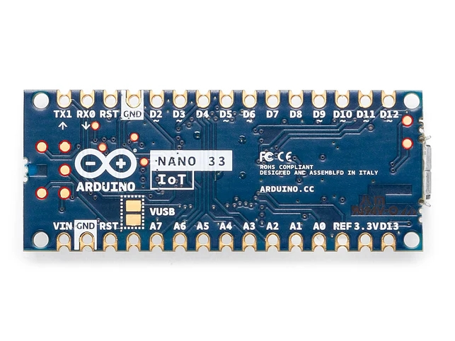
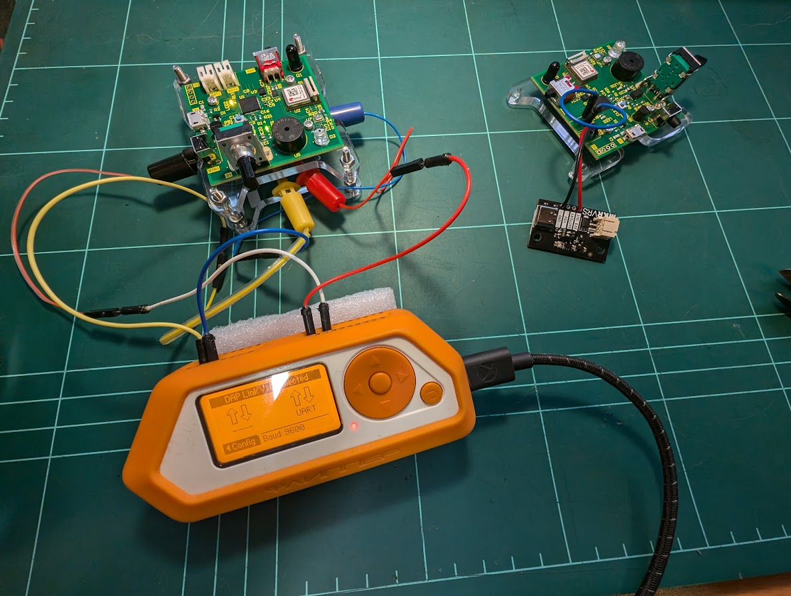

# Burning of the bootloader

## Background

A freshly fabricated PCB will not have any code on it (unless you know to ask and pay extra for the privilege).  
This includes the code that explains to the device how to communicate over USB.  
So how do you teach a USB device to be a USB device without using USB?

Enter test pads.  
  
These pads are often included in PCB designs to test for hardware faults like misplaced or defective components on a board.  
They are also used for directly interfacing with a device for hardware debugging.  

In this case we want to use them to communicate with the board following a version of [these instructions](https://support.arduino.cc/hc/en-us/articles/8991429732124-Burn-the-bootloader-on-Arduino-Nano-33-IoT) but in our case, we need to do some prep work to ensure a solid connection because the layout is jank.  
We could directly solder jumper wires to the pads, but they are small and essentially just copper foil on fibreglass and if the foil peels of then there is no coming back from it (40 bucks wasted on an Arduino to confirm).

Instead, a jig was fabricated that will allow for spring / 'pogo' pins, to make and maintain contact with the test pads.

The vector file in the ``CAD_Designs/Bootloader_Jig`` should be importable to your laser cutter control software of choice.  
The Hackerspace I did this at ([Connected Community Hackerspace](https://www.hackmelbourne.org)) uses lightburn, so I also included my project file if you ever need to make another one.  
Once with the 5 holes in the center (Call this **Piece A**) and once without (**Piece B**).  
You may also want to use that tiny hole pattern in the center to make a "shoe" to catch the backs of the poho pins
The Blue square represents an etch-layer and this can be used to ensure that its oriented correctly.

## Assembly

1. **Piece B**: On the side with the etched face, Insert 4 M3 bolts in the cutout. Screw nuts onto the opposite side to finger tight.  
2. **Piece A**: Insert the pogo pins (A baggy of ~100 has been left in the project box) into the non-etched side of the cutout. The pin heads shouldn't be able to fit through the holes.  
3. **Piece A**: Using M2 nuts and bolts, attach the bottom of the board to the cutout using the threaded holes included for the display. Alignment can be guranteed by lining up the bottom of the rotary encoder with the etch square, with the etch itself on the non contacting face.  
4. You should now be able to slide Piece A onto the bolts of Piece B and tighten them down. Don't press down too much, we just want to make sure that there is a solid contact between the test pads and the pogo pins.  

## Burn Baby Burn

With the jig assmbled you're free to [follow the instructions provided by Arduino for burning the bootloader](https://support.arduino.cc/hc/en-us/articles/8991429732124-Burn-the-bootloader-on-Arduino-Nano-33-IoT).
I made some spring hook hookup wires that can connect onto the exposed pogos and plug into your debugger.  
I didn't want to buy another hardware debugger and discovered that my Flipper Zero could act as a bridge, so I just used that with the DAP-LINK application (Included in most of the unofficial firmwares and stand alone in the [flipper lab](https://lab.flipper.net/apps/dap_link)).  
Apparently you can also use a Raspberry Pi pico with blue tag.
([Good watch if interested in Hardware and or reverse engineering](https://www.youtube.com/watch?v=CvNKtrzIV8Y))

If you do decide to buy a debugger (They're cheap I just didn't want to wait nor the clutter) **Make sure it supports CMSIS-DAP*`*. A regular SWD/JTAG debugger won't work.
:::info
**Document Creation:** 15 December 2024. **Last Edited:** 15 December 2024. **Authors:** Lachlan Costigan
:::
