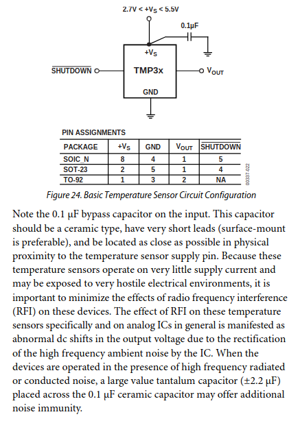
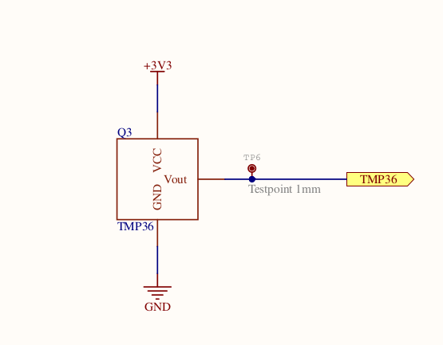

# Board Validation Testing

The Custom PCB was received from the factory at the end of Week 11 T2-24
Unfortunately this means that the Senior that designed the board had graduated from the project by the time it was being worked upon, and he could not learn from the mistakes made on it.  

Here is an overview of the *'quirks'* of the device.

## 1. It will literally burn you

In each example provided in [the datasheet of the TMP36](https://www.analog.com/media/en/technical-documentation/data-sheets/TMP35_36_37.pdf) a 100nF capacitor is placed in front of the Vin pin.
  

This was omitted from the PCB design.  

I believe this is why after about 10 seconds of being plugged in, the sensor becomes too hot to touch.
This may also be compounding other issues noted below.

## 2. No power over USB

The board is only able to receive power via the LiPo JST connectors. Therefore, when attempting to verify that my bootloader burn worked I was a bit confused as to why after seemingly successfully completing it according to the terminal output, I saw no communication between Lachesis and my computer. After some time of steam coming out of my ears pop-eye style I remembered that in T2 I noticed that the board didn't have a charging circuit included for the LiPos to be able to charge over USB. We bought some tiny usb LiPo mediator chips from Core-Electronics to bodge it and I spent a considerable amount of time trying to hack it in but to no avail.

Therefore, if you want to program the board, you need to be draining the battery. Or at least you would if it weren't for...

## 3. Serial Communications dies after roughly 3 minutes

I don't understand why but after performing the ritual to interface with the board, I found that I kept losing the COM port.
I did a few tests and found that it pretty consistently turns off after around 2 minutes and 45 seconds and if you do it in quick succession, the time before comms are lost is lessened. This leads me to believe that the heat from the temperature sensor (which is located next to the USB socket by the by) is increasing the resistance of the traces to the point where not enough current is available to maintain the connection.

## 4. The processor is too weak and too expensive

It can barely run the display by itself. It will probably struggle trying to run both at the same time but when I went to test it I cracked the screen because it turns out the displays don't have caps at the end of the threads either (I ordered replacements)

## Design Flaws

These aren't necessarily dealbreakers, but they are still gripes

1. The wearable looks more like a house arrest ankle monitor than a smartwatch
2. In an effort to minimise the ankle monitor vibe, I was trying to keep the case as compact as possible. However, some layout decisions made that a fool's errand, namely internal interfaces (the JST plugs to the batteries) share a wall with the small hardware switch which must be accessible to turn the board on. This means that unless the case sticks out a bit to provide a channel for the power cable to run through, the cables have to stick out the side and feed back into the watch. The edge with the push button and USB plug has the EXACT same issue. I tried to leave it with the librarian because I was working late to get it ready for innofes and didn't think I'd be able to wake up early enough to hand it to Manan and the librarian / security flat out refused because it "Looks sketchy as hell"

## Advice / Ways forward

1. Fix the Board.
    This is probably a non-starter because we don't even have the source files for the device PCB. I've found the problems that make this a pain to deal and identified the issues.
    Specifically:
        - Add the 0.1 μF capacitor
        - Embed the makerverse 3.3v battery charger module into the design. Incorporate the USB V+ line of the micro USB  

2. New Version  
    My biased opinion is that this is the best way forward.  
    The challenge of hardware design is still present as are the risks, but I believe that if the design philosophy pivots toward making a sensor shield for an off the shelf display with an embedded microcontroller, we can maintain the prestige of making custom hardware while avoiding the pitfalls of the previous iteration.  
    It also affords the opportunity for a cheaper and more modular design. I'm toying with this idea for practice / fun using a [waveshare display with an embedded RP2040](https://www.waveshare.com/wiki/RP2040-LCD-1.28) and if successful I'll document the design and leave it in the Redback Locker for you to continue work on.  

    If custom hardware is to be designed and fabricated by the university please get it checked by someone with experience manufacturing custom PCBs. The mechatronics course has a PCB Fab Lab which so far as I can tell doesn't have the capability to do custom SMT level boards but at least they'll be able to tell you if you've made an obvious mistake.

3. Pivot the project to a Consumer Smartwatch App  
    Considering the relative lack of popularity of IoT as a discipline compared to Data Science, Security and Software Development, as well as the amount of stuff outside the of the scope of the course required to fabricate hardware, it may be worth considering the project pivot toward taking a consumer smartwatch and developing an app based on the wearable version of a mobile operating systems. The advantage here would be it might be quicker to get people making technical contributions and the hardware is known to work and will be more sophisticated from a technical point of view, and the fact that the hardware / embedded specialist(s) spend a trimester learning the project and a trimester working on it only to leave will be less of an issue.  
    The downside is that the project will be limited to the sensor apparatus that Apple, Google, Samsung, etc. deem consumers want, rather than catered to the data capture work that would be beneficial to the project.

Ultimately, you should collectively make the call based on the talents available to you as well as the expected talents of those that come after you.  
In my experience we had 3 people (2 Sr, 1 Jr) in the IoT team in T2-24 and 2 people in T3-24 (1 Sr, 1 Jr).

:::info
**Document Creation:** 15 December 2024. **Last Edited:** 08 January 2025. **Authors:** Lachlan Costigan
:::
