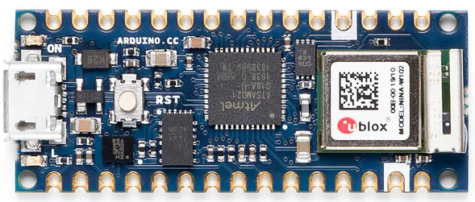

**Last updated by:** Lachlan, **Last updated on:** 17/12/2024

**Last updated by:** Lachlan, **Last updated on:** 17/12/2024

# Components

This page seeks to catalogue the components of the Smart Watch such that future developers can review and extend the boards capabilities. 

If you'd like to build a development version of the board with off the shelf parts, the relevant modules will be referred to and can be ordered from component retailers or micro-electronics stores. 

## Microcontroller

### Arduino Nano 33 IoT
 \
This is a very capable little board that was selected to be the main processor. 

Its processor is an [ARM Cortex M0+](https://content.arduino.cc/assets/mkr-microchip_samd21_family_full_datasheet-ds40001882d.pdf) with up to 48MHz, a separate processor to handle wireless communications in the [u-blox NINA W102](https://content.arduino.cc/assets/Arduino_NINA-W10_DataSheet_%28UBX-17065507%29.pdf), In-built [accelerometer](https://content.arduino.cc/assets/st_imu_lsm6ds3_datasheet.pdf), 12 digital and 8 analogue I/O pins[^1].

This board has been incorporated as the basis for our PCB.

## Sensors
Each of our sensors were selected with consideration for their application to our target userbase, I/O constraints and our requirement that everything on the board runs off 3.3 Volts. 

- ### Heart Rate, Pulse Oximeter
    We're using a [MAX30102](https://www.analog.com/media/en/technical-documentation/data-sheets/MAX30102.pdf) as the basis of our heart rate and oxygen saturation sensor. It communicates over I2C meaning relatively efficient use of out limited I/O, and is used in many similar products. 

    This module will be encorporated into the Watches strap for accurate readings from the underside of the wrist

- ### Temperature Sensor
    Temperature is provided via a [TMP36](https://www.analog.com/media/en/technical-documentation/data-sheets/tmp35_36_37.pdf).

    It has a nominal scale factor ~ 10 mV/°C , accurate to ±2°C from between -40°C to +125°C

- ### Gas, Pressure, Humidity
    Provided by a [Bosch BME680](https://www.bosch-sensortec.com/media/boschsensortec/downloads/datasheets/bst-bme680-ds001.pdf). This sensor is relatively accurate across its 3 domains. It even includes a temperature measurement but we opted for the TMP36 as it is more accurate and in this chip its really just used to calculate compensations for pressure sensing.  It has support for I2C and SPI protocols.

- ### Flame
    The flame sensor is a [YG1006 PhotoTransistor](https://win.adrirobot.it/datasheet/optoelettronica/pdf/YG1006_Phototransistor.pdf). It has a spectral bandwidth of 760nm - 1100nm which is ideal for the infrared light given by flames but also may be triggered by tv remotes or other household IR sources. 
    We will overcome this by implementing a sliding window on the input signal.

## User Interaction
With consideration of our target users, we opted to have a tactile interface rather than a touch screen.
Our display is a [1.69" Waveshare LCD](http://www.waveshare.com/wiki/1.69inch_LCD_Module) as it met the requirement of being powered off 3.3V and controllable via the SPI protocol. It is 240px x 280px and easily programmable via waveshare's official libraries.

Audio Feedback is provided via a simple buzzer. 

Input is handled by 2 Mini Push button Switches and a [Bourns PEC12R Rotary Encoder](https://www.bourns.com/docs/Product-Datasheets/PEC12R.pdf)

## Power
We included 2x 1100mAh 3.7V LiPo Batteries to drive the board but failed to consider the charging circuit on the PCB. 
As a hacked together solution, we will be using an off the shelf [USB-C - LiPO Charger](https://core-electronics.com.au/makerverse-usb-c-lipo-charger.html) to ensure that the device can be powered.

[^1]: Full specs available on the [Arduino product page](https://store.arduino.cc/products/arduino-nano-33-iot)

:::info
**Document Creation:** 5 September 2024. **Last Edited:** 5 September 2024. **Authors:** Lachlan Costigan
:::
