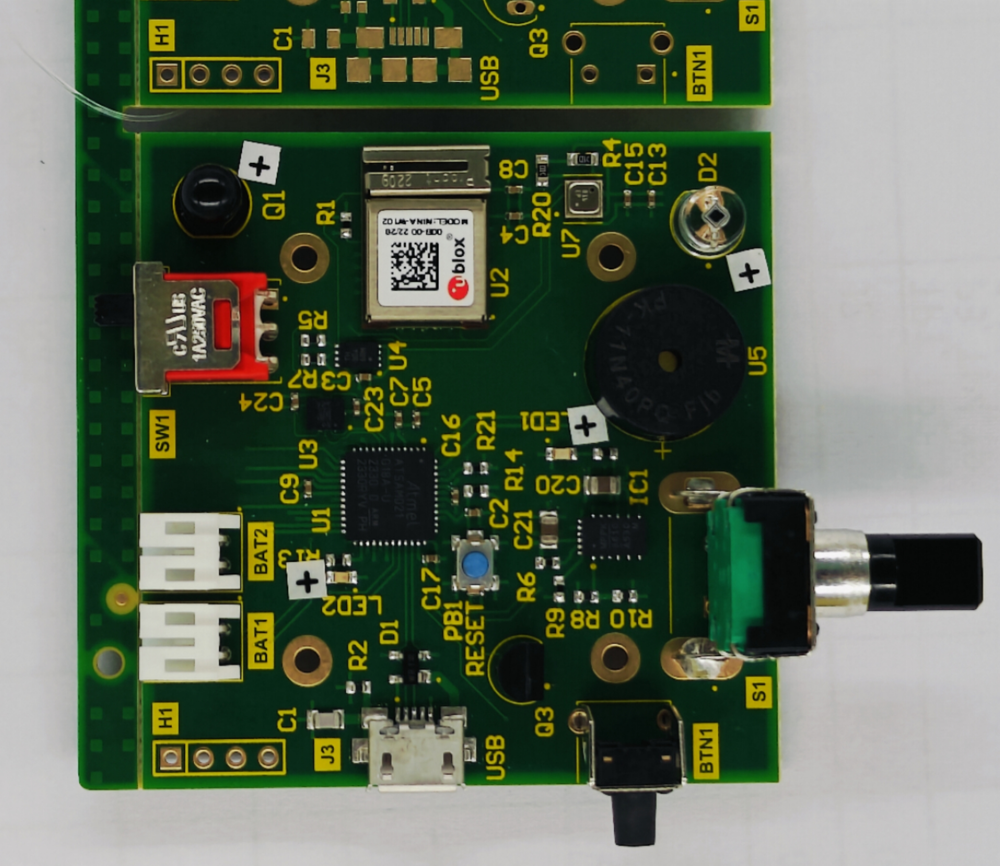
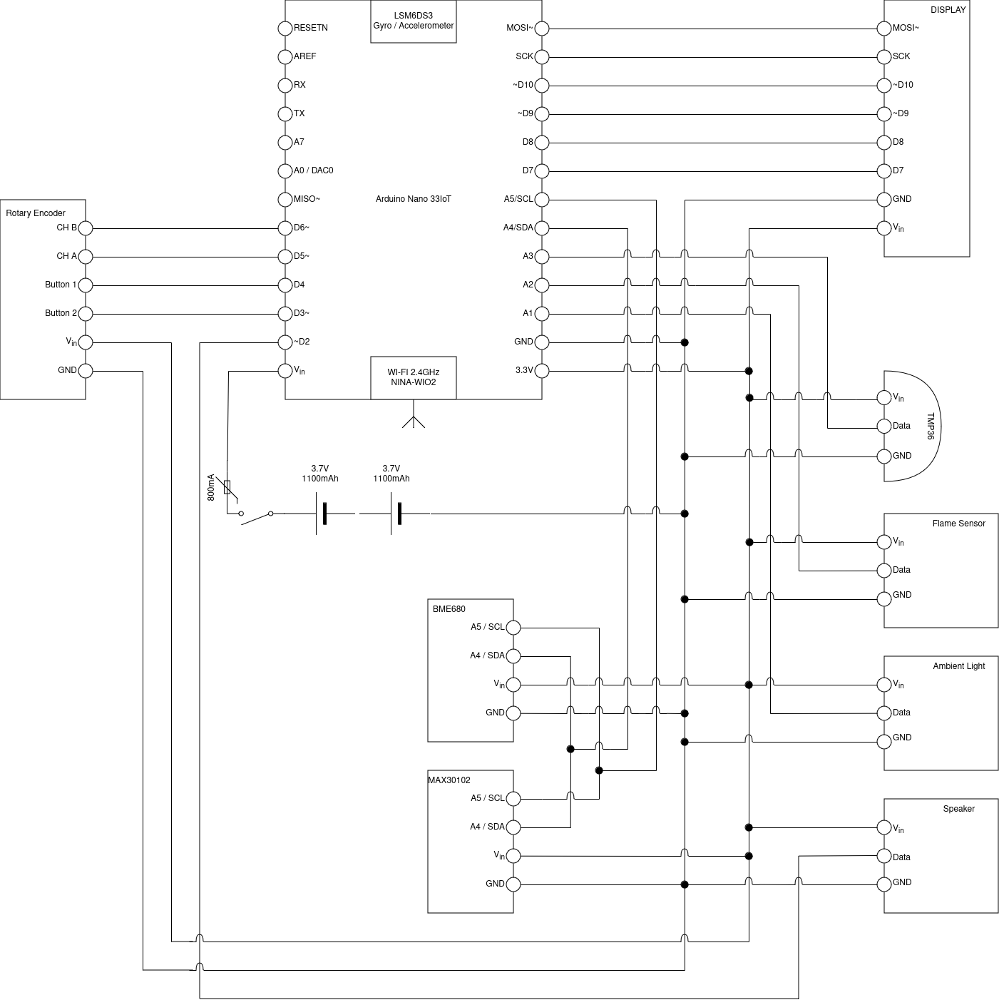

# Lachesis Hardware



This page and its siblings document the hardware for Redback-Operation's *Lachesis*.

## Background/Objective

Lachesis (*Lak-iss-iss*) is the middle sister of the three *Moirai* whose role is the alotter / measurer of each person's life and destiny. We thought the name was apt as this device is ostensibly attempting to provide real-time predictions about potentially life altering ailments.

The smartwatch aspect of this project will be the primary physical interface between our users and the work that has been conducted between each of our project teams. It is a bespoke design to facilitate the capture of data of interest to our Predictive Modelling and Analytics teams while also designed with the aim of providing a feature set that will encourage our users to actively engage with the device.

When designing the hardware we've had to balance the considerations between our data team and our end user. These considerations have included the physical interface of the device, where we've noted that the elderly tend to be averse to touch interfaces and have opted for our primary navigation to be tactile and mechanical using buttons and a wheel. The implemented sensor array has been selected primarily based on the requirements of the data analytics teams and with consideration to data that may be useful to them that isn't necessarily available on existing smart-watches.

## Getting Started

In the interest of making this as accessible to the developer as it is to the user, we have opted to base our device on the [Arduino Nano IoT 33](https://store-usa.arduino.cc/products/arduino-nano-33-iot). This means that coding for the device is pretty simple, barring some quirks outlined in [the notes from the board evaluation](./Board_shakedown.md).  

You can even use the Arduino IDE. And we did for a while but that lead to some shoddy code practices and massive inconvenience, so we've started a major code refactor using the [PlatformIO framework](https://platformio.org/).

Doing so gives easy organisation, dependency management, unit testing and support for many more boards in case it is decided to use a processor with more oomph down the line.
The only thing to really note if you are only used to Arduino IDE is that instead of programming in an Arduino abstraction of C++, you're programming in a C++ file that includes the Arduino Library.

i.e.
`` #include <Arduino.h> ``

If you're very proficient you can do away with Arduino altogether and start using Zephyr RTOS as the platform, but that will probably require another major code refactor so only do it if you feel confident that you can reimplement the existing codebase and more importantly, document it for future students

With a way to work on the codebase now installed and configured, you may find the device software under  
``./Codebase/Complete_Code/``  

:::warning
Please ensure that any API keys in use are added to `secrets.h` and that it is still present in.gitignore
:::

Work on the Prototype 2 PCB was conducted in [Altium Designer](https://www.altium.com/altium-designer) however the source files were not added to the repo by the designer can be imported into KiCAD.

## Prerequisites

You can install the PlatformIO extension in VS Code (recommended) or any of the other text editors listed [here](https://platformio.org/install/integration)
Once the extension is installed simply use it to open the project folder, and it will automatically retrieve the required libraries outlined in the `platformio.ini`  

The packages below are listed for posterity because while you don't have to go through the trouble of manually installing them anymore, they generally also have references to each library's documentation.

- [SPI.h - Built into Arduino.](https://www.arduino.cc/reference/en/language/functions/communication/spi/)
  - Enables communication with the Serial Peripheral Interface Protocol.

- [WiFiNINA.h - Available through the Library Manager and on GitHub.](https://github.com/arduino-libraries/WiFiNINA)
  - Allows using the WiFiNINA module to perform wireless tasks.

- [Adafruit_Sensor.h - Available through the Library Manager and on GitHub.](https://github.com/adafruit/Adafruit_Sensor)
  - Prerequisite Framework for other Adafruit Libraries.

- [Adafruit_GFX.h - Available through the Library Manager and on GitHub.](https://github.com/adafruit/Adafruit-GFX-Library)
  - Core graphics library for Adafruit displays.

- [Wire.h - Available through the Library Manager.](https://www.arduino.cc/reference/en/language/functions/communication/wire/)
  - Enables communication with the I2C protocol.

- [Adafruit_BME680.h - Available through the Library Manager and on GitHub.](https://github.com/adafruit/Adafruit_BME680)
  - Library for the Temperature, Pressure, Humidity and Gas Sensor.

- [Arduino_LSM6DS3.h - Available through the Library Manager.](https://www.arduino.cc/reference/en/libraries/arduino_lsm6ds3/)
  - Library for the Nano IoT 33's Inbuilt Accelerometer, Gyroscope and Temperature Sensor.

- [RTCZero.h - Available through the Library Manager.](https://www.arduino.cc/reference/en/libraries/rtczero/)
  - Permits RTC functions.

- [WiFiUDP.h - Available through the Library Manager.](https://www.arduino.cc/reference/en/libraries/wifi/wifiudp/)
  - Library for UDP packet Tx / Rx.

- [DFRobot_MAX30102](https://github.com/DFRobot/DFRobot_MAX30102)
  - Library for the Heart-Rate and Oximeter Sensor.
  - To Install, download the library from the repo and save in your \Arduino\libraries directory.

- [ThingSpeak](https://github.com/mathworks/thingspeak-arduino)
  - Communications library for writing to the ThingSpeak API endpoints. This is no longer being used due to data privacy concerns.
  - Get in touch with the data warehouse team because requirements have been established for capturing data and storing it in a secured Uni system however that got backburnered due to more pressing issues



## Installation

A fresh from the fab Mk2 PCB will require the burning of a bootloader before it can be programmed over USB
Detailed overview of this process is available in the [Board Bootloader page](./Board_Init.md) but for a quick overview check out the [official Arduino page](https://support.arduino.cc/hc/en-us/articles/8991429732124-Burn-the-bootloader-on-Arduino-Nano-33-IoT)
Notes:
    - I used a Flipper Zero with the [DAP link community app](https://lab.flipper.net/apps/dap_link) because all the JTAG debuggers available to me did not support CMSIS-DAP / SWD (but I was just pilfering the old stuff from the hacker space so go figure) and I came across [this video](https://www.youtube.com/watch?v=CvNKtrzIV8Y) which instantly cured my Kickstarter backer buyer's remorse. It's a very interesting watch if you want to learn about debug interfaces.
    - Just make sure that whatever you're using works over 3.3V, or you'll probably fry the PCB

## Folder Structure

The folder structure compartmentalizes the three aspects of our hardware repository,

- CAD_Designs
  - Contain the designs for our case and custom PCB
- Codebase
  - Contains the functioning code in [Complete Code](https://github.com/Redback-Operations/Elderly_Wearable_Tech/tree/main/IoT_Wearable/Codebase/Complete_Code) as well as experiments, examples and archived efforts in their respective folders.
- Documentation
  - Contains written and visual deliverables, research notes, data sheets and guides. More yet to come.

```text
.
├── CAD_Designs
│   ├── Case
│   └── PCB
├── Codebase
│   ├── Archive
│   ├── Complete_Code
│   ├── Example_Code
│   └── Experiments
└── Documentation
    ├── DataSheets
    ├── Figures
    ├── ReleaseForms
    └── Videos

```

## Project Status

T3-24 was spent attempting to bring the board to an operational state and while it technically is, it is mired with issues which are outlined on the [Board Shakedown Page](./Board_shakedown.md)
Due to the time spent trying to resolve these issues, the Code refactor isn't up to feature parity with the previous breadboard based prototype and assuming that the board isn't written off, work will need to be done to bring it back up to scratch.

Work has begun on a helper library for the new WaveShare display as writing arbitrary elements to the screen is somewhat cumbersome. This venture is being led by Marcel Rumy who has taken the extension and will hopefully have more to say about it in January.

## Future Considerations

We've reached the limit of the Arduino IoT Nano 33's available I/O and so any further additions will require either clever hacks to consolidate the I/O or migration to a new base Microcontroller. This was perhaps the prime motivator behind the migration to PlatformIO, but all the previously noted features are definitely a factor.  

Considering the difficulty involved in hardware manufacture and the issues outlined in the hand-over document, it might even be worth pivoting the project to an off the shelf smartwatch and writing an app for it to integrate with the other aspects of the project. This decision will be left in your hands dear reader as I have no idea what sort of talents will be available to you.

## Compliance and Safety

As this is a data collection platform targeting health data in particular, it is **paramount** that any subjects who have their data captured provide informed consent to the data capture.
Anyone working on this must complete and understand the Redback ethics and security module to understand their responsibilities.

:::danger
An issue noted during shakedown testing is that due to a fault in the hardware design, the TMP36 temperature sensor becomes untouchably hot after a very short time of the board being powered.
If the board is not decommissioned due to this issue alone, please be wary
:::

It was mentioned above however it bares repeating:
Credentials and Secrets such as API_Keys are scraped from public repos **constantly**.\
 Please make use of the secrets.h file for Wi-Fi credentials, user accounts and API keys and add it to your `.gitignore`.\
Failure to do so will be grumbled at and subsequently mocked.  

## License

The Hardware of this project is bound under the terms of a [Creative Commons Noncommercial Sharealike 4.0 license](https://creativecommons.org/licenses/by-nc-sa/4.0/deed.en) inherited from the Arduino Nano 33 IoT it is based on.\
The software is bound under [GPLv3](https://www.gnu.org/licenses/gpl-3.0.en.html).\
The Data sheets are the property of their relevant authors and are only provided here for reference.
Written Artifacts, reports and visual media are TBD

:::info
**Document Creation:** 05 September 2024. **Last Edited:** 08 January 2025. **Authors:** Lachlan Costigan
:::
