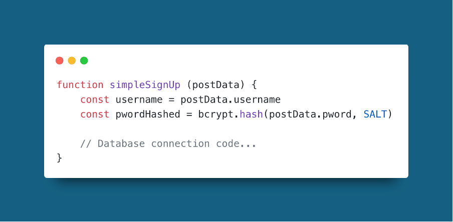
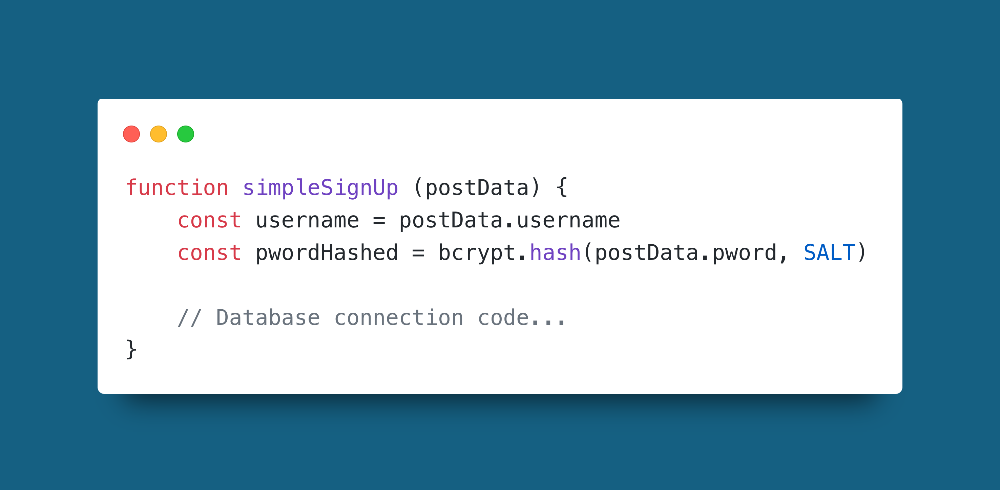
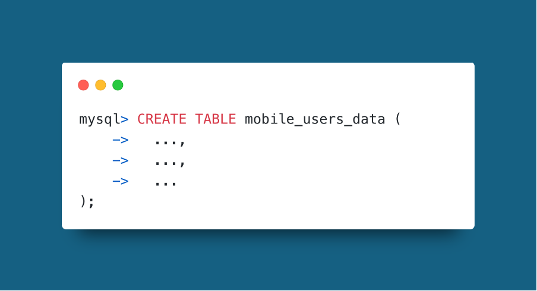
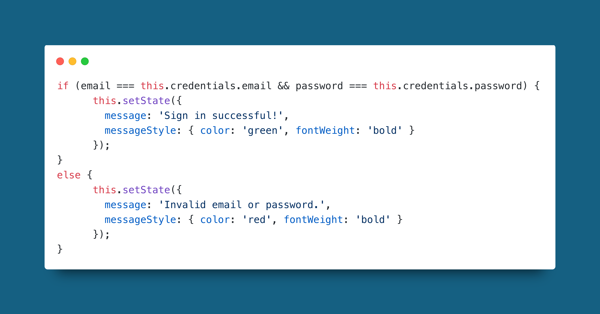
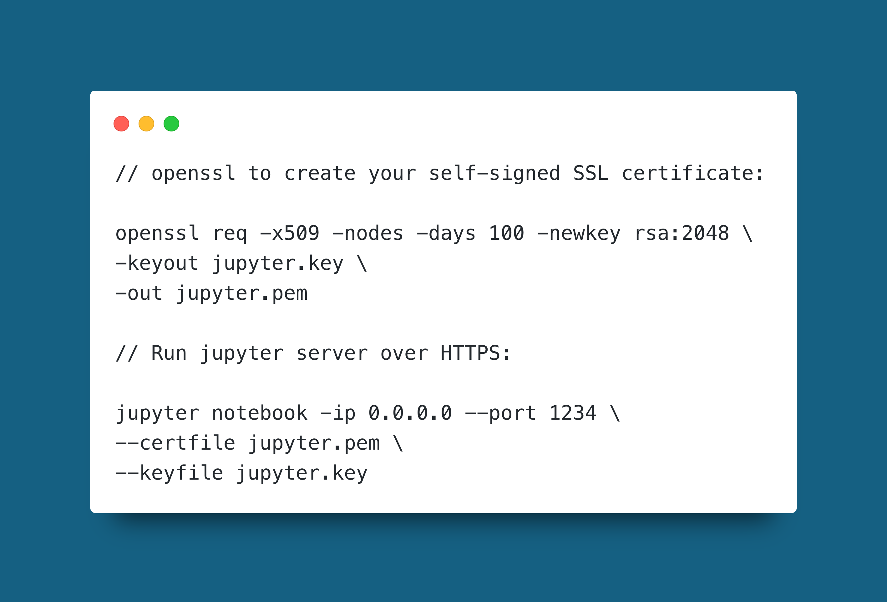

---

  <table style={{ width: '100%', borderCollapse: 'collapse' }}>
    <thead>
      <tr>
        <th style={{ width: '20%', textAlign: 'center' }}>Version</th>
        <th style={{ width: '20%', textAlign: 'center' }}>Modified By</th>
        <th style={{ width: '20%', textAlign: 'center' }}>Approver</th>
        <th style={{ width: '20%', textAlign: 'center' }}>Date</th>
        <th style={{ width: '20%', textAlign: 'center' }}>Changes made</th>
      </tr>
    </thead>
    <tbody>
      <tr>
        <td style={{ textAlign: 'center' }}>V1.0</td>
        <td style={{ textAlign: 'center' }}>Codey Funston</td>
        <td style={{ textAlign: 'center' }}>Codey Funston</td>
        <td style={{ textAlign: 'center' }}>01/01/2025</td>
        <td style={{ textAlign: 'center' }}>Document Creation</td>
      </tr>
    </tbody>
  </table>

## BRIEF OVERVIEW

This guide is based on the way that SecDevOps team members are advised to review pull requests from other projects. To reduce complexity for junior members and to ensure the most important security risks are looked out for, we check code against the OWASP top 10 web application critical security risks.

OWASP stands for the Open Web Application Security Project. It is an open-source project that reaches out to key industry players every 4-5 years and collects data on the most critical cyber security issues pertaining to application development. Based on the data they compose the top 10 most important issues and release this is in their awareness document. The most recent one is OWASP Top 10:2021, with the next one coming soon around mid 2025.

This source of security issues is well regarded in industry and is a perfect starting point for developers without much cyber security training. If you want to read more about it, the links below point to information from their website and good quality third parties.

- [OWASP Top Ten Overview](https://owasp.org/www-project-to- 
- [2021 Version – Extra Information](https://owasp.org/- 
- [10 Minute Youtube Video – By Cyber Citadel](https://www.youtube.com/watch?v=hryt-rCLJUA&t=68s)
- For those interested in LLM Security: [How the Top 10 Apply for LLM’s - IBM](https://www.youtube.com/watch?v=cYuesqIKf9A)
- For those who want to experiment with live examples of insecure web applications: [OWASP Top 10 Examples - GitHub](https://github.com/lighthouse-labs/owasp-top-10-examples)

In this guide I will be going through key things to look out for and examples from past semester’s pull requests in your project. Hopefully this will make it easier to understand and increase your ability to prevent un-safe code production from the start of the development life cycle.

Note: A lot of the examples are like pseudo code and wouldn’t be used as is, however, they are helpful for understanding the principle so that you can apply/avoid the preventative measure or risk respectively.

## 1. BROKEN ACCESS CONTROL

### **_Gist_**

Access to resources and functionality should be enforced based on who is accessing it. Everything should be denied by default with any access given with the least amount of privilege possible. This is referred to as _whitelisting_.

### **_Look Out For_**

- API’s having the same permissions for all methods. This isn’t just important for “setters” like POST, but “getters” like GET. For example, you may centre your concern around preventing any damage to data through malicious POST and DELETE operations. However, that is more of a concern for maintaining the state of a system, not protecting it from getting data stolen with a GET request.

- Exposing sensitive data through complex manipulation in the back end. For example, as illustrated in the example, SQL queries could result columns being returned that hold sensitive information. In the case of your exercise data there may be location information. To prevent this there should be a good understanding of data fields and data manipulation effects.

### **_Example_**

  

This example is quite basic and clearly not safe by using the wildcard (\*). However, it highlights the concept of a data query returning unwanted fields (latitude and longitude).

## 2. CRYPTOGRAPHIC FAILURES

### **_Gist_**

Are the correct protocols, tools, and standards being used to protect data at rest and in transit? If not, they should be updated to be as secure as “reasonably practicable” (it is a balancing act as too much security can slow down software or add more complexity). For example, it would be unnecessary to use multi factor authentication for a login that is only used for marketing purposes since this would slow down the user for no extra gain.

### **_Look Out For_**

- Try to use HTTPS over HTTP.

- Encrypt sensitive data when moving it between stores.

- Don’t place sensitive data in the public facing GitHub repository.

- Regularly check the encryption versions used if manually encrypting data on servers. Use the latest ones once they have been tested.

- Store passwords as their hashes.

### **_Example_**

  

This is similar to a common issue that comes up in pull request reviews, where login credentials are hardcoded for request code. Similarly, even if the passwords are stored on a database on the server, no extra effort is required for attackers to work out passwords once stolen if they are plain text.

## 3. INJECTION

### **_Gist_**

Input from the user should not be used directly without checks and changes if necessary. Even if the data is being stored or used somewhere that is not vital to the program, or consists of sensitive information, it can still be used maliciously with clever syntax tricks.

### **_Look Out For_**

- Escape characters which have logical meaning in the language that is working with the data.

- Something mentioned on the OWASP website which I think is pretty cool is preventing users from entering data structure names that cannot be escaped. One way to get around this with SQL tables is to name them differently to their front-end display. This is what I used in the example instead of a standard SQL injection with special characters.

- Parameterize database queries.

### **_Example_**

  

Here the table name is “obfuscated” slightly by not using an obvious name like “users”.

## 4. INSECURE DESIGN

### **_Gist_**

Insecure design's a funny one because it isn't a specific feature of a piece of software that you should avoid or implement to prevent security risks. Instead it is more about how to approach the development process to ensure that security flaws are not built in to your system. Essentially you should consider the security risks of each part of your design and included risk assessments as you go.

### **_Look Out For_**

- Think about how an attacker might take advantage of a process, data storage, or core piece of logic.

- Perform security checks regularly, trying to adhere to a secure DevOps practice, or "SecDevOps".

- Use industry proven designs if possible, or seek advice from others with security experience when creating designs in-house.

- **IMPORTANT: Don't leave security to last in the development process!**

### **_Example_**

  

The example I have used here is from the project's web app code. This is definitely not poorly written or designed as the sign in function was not fully setup when I was writing this :) If this code was left as is it would be prone to a brute force attack. This is because there is no functionality to stop allowing the client to try their username and password combination after a certain amount of tries.
­

## 5. SECURITY MISCONFIGURATION

### **_Gist_**

The software and environment settings should be planned, documented, reviewed and kept consistent. Make sure you check any 3rd party tools for default settings which add security risks to your system.

### **_Look Out For_**

- Use whitelist approach with permission configurations.

- Keep configurations consistent across all environments and setups of the software.

- Don't give global access to make configuration changes.

- Consult other team members before making changes such as ports or user access.

- Remove/change default credentials because these are very easy to find online with searches on forums.

### **_Example_**

  

In this example I provided what looks to be a really secure and safe running of Jupyter notebook, a tool that you would use regularly in data analysis with potentially sensitive data sets. However, 

## 6. VULNERABLE AND OUTDATED COMPONENTS

## 7. IDENTIFICATION AND AUTHENTICATION FAILURES

## 8. SOFTWARE AND DATA INTEGRITY FAILURES

## 9. SECURITY LOGGING AND MONITORING FAILURES

## 10. SERVER-SIDE REQUEST FORGERY (SSRF)

