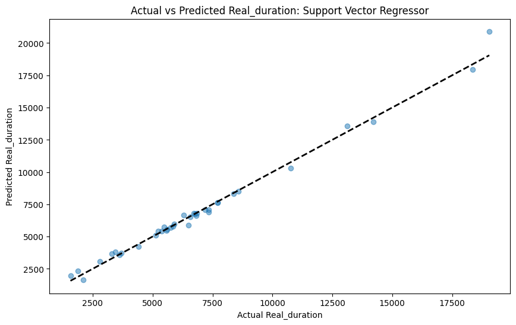
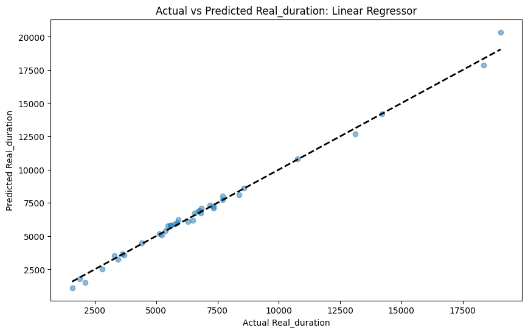

# Cycling duration prediction models

A number of experiments were performed to test prediction models for duration of a workout based upon previous workout details. These experiments can been seen in the [Python Notebook](https://github.com/redbackoperations/Projects/blob/main/Sports%20Performance%20Analysis/frontend/Cycling%20Analysis/Duration%20Prediction.ipynb) in the Project [GitHub repository](https://github.com/redbackoperations/Projects/blob/main/Sports%20Performance%20Analysis/frontend/).

# **Data Loading and Preprocessing**:

*   The notebook starts with loading cycling data that has been exported from Strava and that contains numerous attributes like distance, speed, heart rate, power, etc.
    
*   The data contains information for 181 Ride activities and 164 Run activities.
    

# **Feature Selection and Model Training**:

*   A correlation analysis is done which shows that the highest correlations to Movint Time (duration) are:  
    `Power Count 0.998145`  
    `Distance 0.982650 Total`  
    `Work 0.940714`  
    `Calories 0.787830`  
    `Maximum Power 2.0 hr 0.717964`  
    `Relative Effort 0.575082`  
    `Maximum Power 1.5 hr 0.568730`  
    `Dirt Distance 0.560717`  
    `Elevation Gain 0.504852`
    
*   Many of these features are essentially proxies for distance as Work, Elevation Gain, Calories and others are going to increase as the duration of the workout increases.
    
*   Fields that are too closely related to Moving Time (duration) are removed before creating predictive models. These fields are Elapsed Time, Power Count, Moving Time and Average Elapsed Speed.
    

# **Model Evaluation**:

*   Several different models are the created to test accuracy. These are:
    
    *   Random Forest Regressor
        
    *   Support Vector Regressor
        
    *   Linear Regressor
        
    *   Neural Network
        
*   Mean squared error is the primary metric used to quantify the model's performance.
    
*   Each model is used to plot actual versus predicted durations to visualise model performance.
    
*   The available data was split 80/20 for training/testing.
    
*   GridSearchCV is used to optimise hyper parameters for Random Forrest Regressor and Support Vector Regressor.
    
*   Multiple NN architectures and numbers of epochs were tested.
    

# **Visualisation and Performance**:

*   The visualisations of each model are:
    
    
    
    
    
    
    
    
    
*   A scatter plot was also produced of the Actual versus Predicted durations with the values connected to show how close each prediction was.
    
    
    
*   These Mean Squared Error for each model is.
    

| **Model** | **RMSE** | **Time** |
| --- | --- | --- |
| Random Forest Regressor | 566.94 | 8.1s |
| Support Vector Regressor | 409.94 | 0.2s |
| Linear Regressor | 321.32 | 0.1s |
| Neural Network | 361.08 | 11.8s |

*   Across the 37 test cases, the average difference between the predicted duration and the real duration was 14.3s for rides averaging 1:53:58.
    

# **Conclusions**:

*   The Neural Network model performed quite well when tuned but the Linear Regressor still produced a smaller RMSE.
    
*   The Linear Regressor was also the fastest model.
    
*   It was concluded that a simple Linear Regression model could accurately predict workout duration and required the least resources to do so.