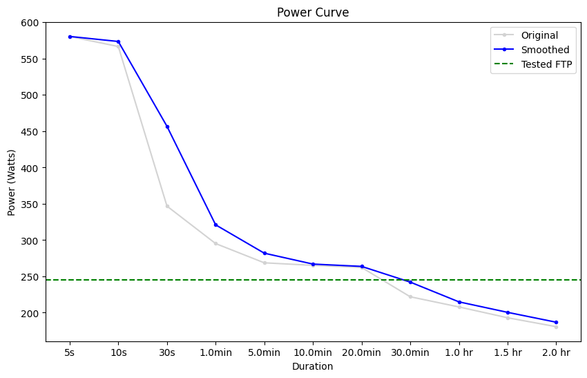
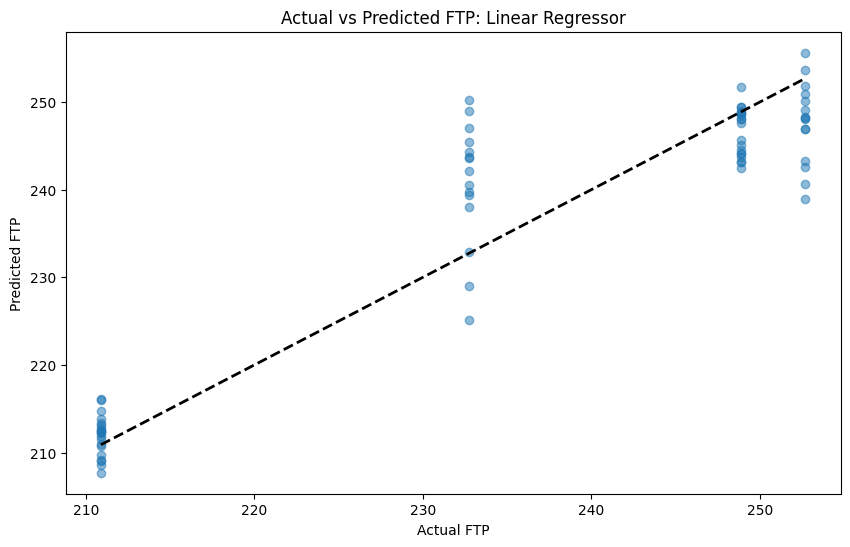
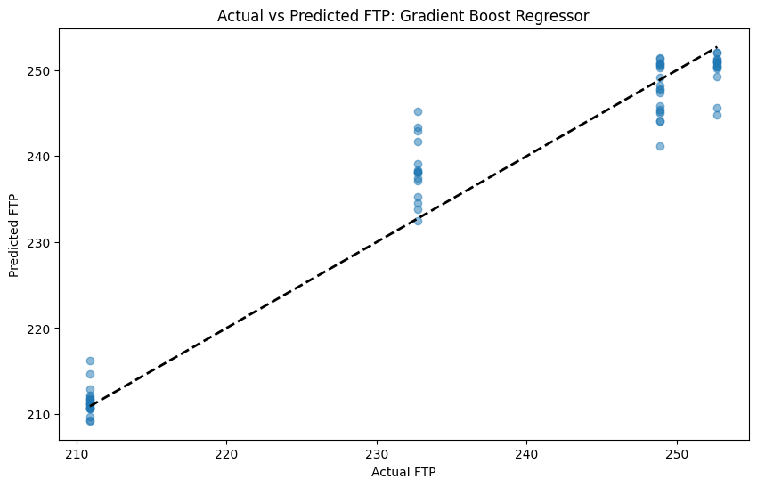

**Last updated by:** brendankntb, **Last updated on:** 31/03/2024

**Last updated by:** brendankntb, **Last updated on:** 31/03/2024

# Cycling FTP prediction models

A number of experiments were performed to test prediction models for duration of a workout based upon previous workout details. These experiments can been seen in the [Python Notebook](https://github.com/redbackoperations/Projects/blob/main/Sports%20Performance%20Analysis/frontend/Cycling%20Analysis/FTP%20Prediction.ipynb) in the Project [GitHub repository](https://github.com/redbackoperations/Projects/blob/main/Sports%20Performance%20Analysis/frontend/). FTP is a critical performance metric in cycling, indicating the highest power a rider can sustain for an hour.

# **Data Preparation**

*   The notebook starts with loading cycling data that has been exported from Strava and that contains numerous attributes like distance, speed, heart rate, power, etc.
    
*   The data contains information for 181 Ride activities and 164 Run activities.
    
*   A power curve is created and visualised to give a view of the data being used.
    
    
    

# **Feature Engineering and Selection**

*   Some exploration of outliers is done but they do not have a significant impact on averages remaining so there is no further attempt to remove outliers.
    
*   Fields are removed from the dataset that are not connected to FTP. These fields are Activity ID, Activity Name, Activity Type, Commute, Activity Gear, Filename, Dirt Distance and Total Steps.
    
*   Known FTP values from external FTP testing is then merged with the data. There are 5 dates with FTP tests which were all don with the 20 minute test method.
    

# **Model Building and Evaluation**

*   An initial Linear Regression machine learning model is constructed to predict FTP based on the selected features. This model is trained on historical data, learning the relationship between the features and FTP.
    
    
    
*   The Linear Regression model has a MSE of 39.1.
    
*   A Gradient Boost model is the created as well.
    
    
    
*   The Gradient Boost model has an MSE of 15.6.
    
*   A HistGradientBoostingRegressor was tried as it is able to handle NaN inputs but it did not produce any substantially better results.
    
*   The results were clumped because the relatively small number of FTP tests meant that there were only ever four correct values across the test set. To counter this, The FTP results were interpolated between tests to create a more continuous distribution. This resulted in significantly better performance.
    
    
    
*   MSE was reduce to 1.7.
    
*   A change in how the input data was then tried. Instead of including the Maximum Power for each ride in the input data, it was replaced with a 60 day Maximum Power which obviously included the Maximum Power for the leading two months. The created a sliding window effect to the input data.
    
*   The accuracy of the model significantly improved again.
    
    
    
*   The MSE was further reduced to 0.03.
    

# **Conclusions and Insights**

*   The Random Forest Regressor was chosen as the appropriate model along with the interpolated FTP and the 60 day maximum power values in the training data.
    
*   This model produced an average error of 0.12W against an average 237W FTP.
    
*   The notebook might also suggest improvements or further areas for research, such as incorporating additional features or testing different machine learning algorithms.
    
*   The model was then incorporated into a FtpPredictor Python class.
    
*   Various samples of the class were created.
    
*   The FtpPredictor class was documented to support automated solution documentation.
    
*   Unit tests were added for the class.