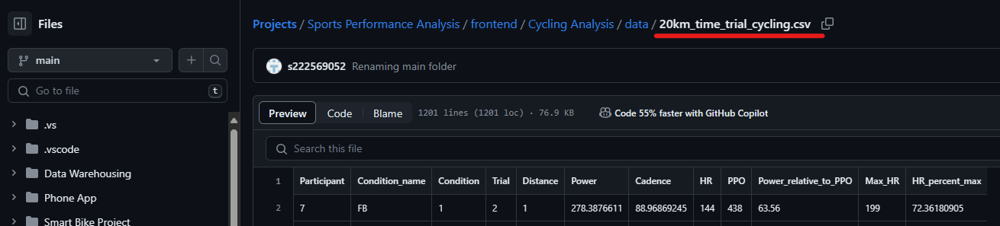
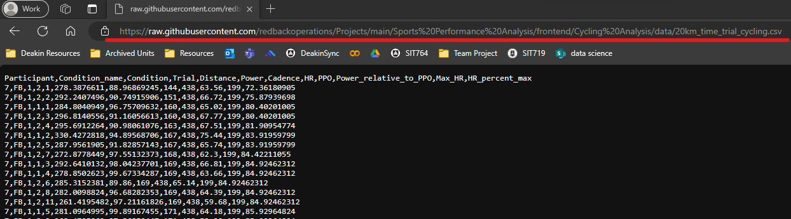
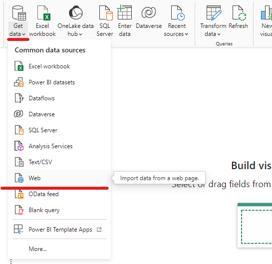
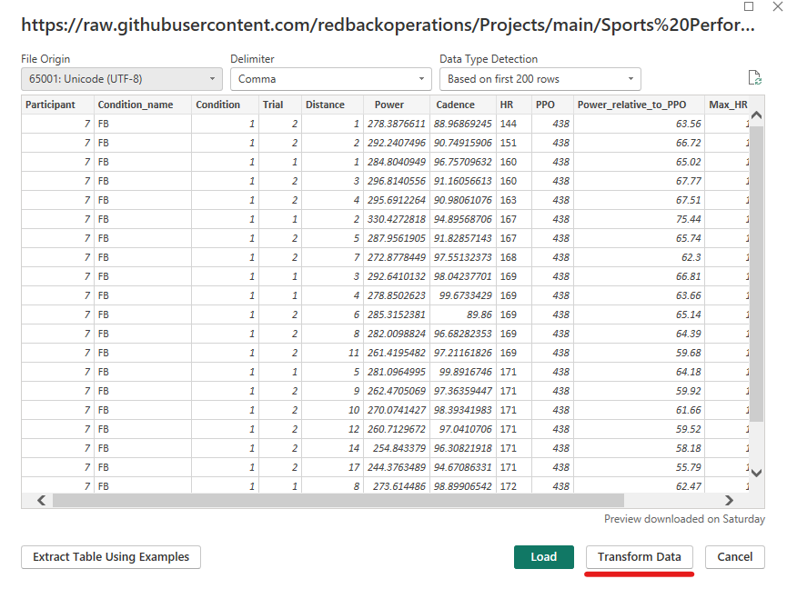

# Power BI & GitHub Integration

## Introduction

**Power BI** and **GitHub** are powerful tools in data analysis and software development, respectively. Integrating Power BI with GitHub allows users to visualise and analyse data hosted on GitHub repositories. The primary advantage of this integration is the seamless update process. Any modifications made to the data in GitHub are easily synchronised with the Power BI dashboard, eliminating the need to establish a new connection for each update.

This guide provides a step-by-step guide approach to establish a direct connection between Power BI and GitHub, enabling efficient data analysis and reporting.

## Step-by-Step Guide

### Finding Data in GitHub

1.  Identify the repository containing the data you wish analyse, and navigate to the data file you wish to use.
    

2.  Click **Raw**.
    

3.  Copy the URL.
    

### Connecting GitHub Data to Power BI

1.  Open Power BI and select **Get Data**.
    
2.  Choose **Web** as the data source.
    

3.  Paste the copied URL from GitHub and click **OK**.
    

4.  Check the data load appears correct and adjust parameters as required. Use the Power Query Editor in Power BI to transform or modify the data as needed.
    

5.  Load the data to create reports and visualisations.
    

## Useful Resources

*   Power BI Documentation: [Power BI documentation - Power BI | Microsoft Learn](https://learn.microsoft.com/en-us/power-bi/)
    
*   GitHub Help Documentation: [GitHub Docs](https://docs.github.com/en)