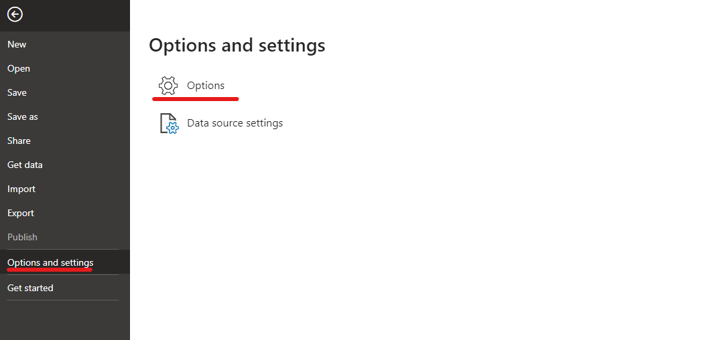
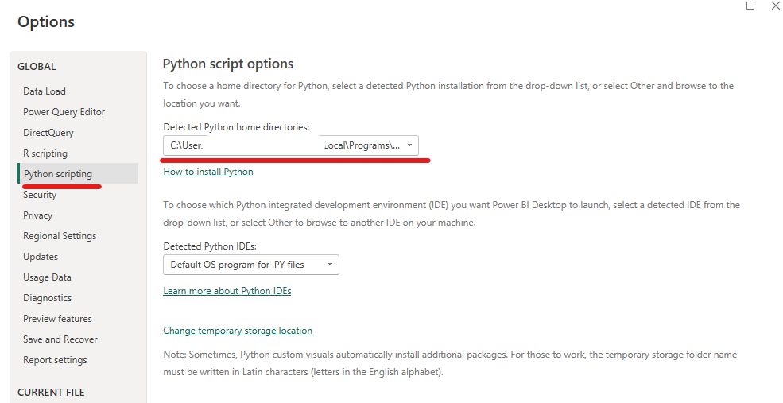
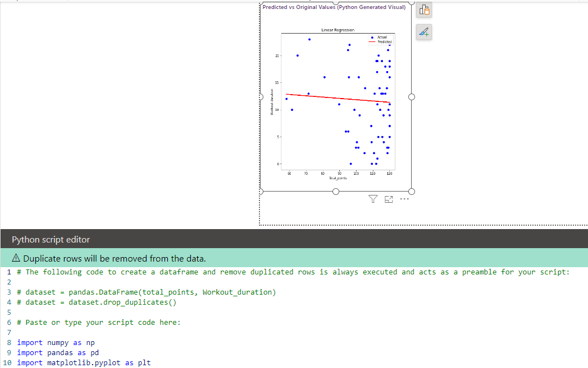

# Power BI & Python Integration

## Introduction

This guide is designed to walk you through the process of integrating Python into Power BI, a synergy that unlocks a new realm of possibilities for data analysis and business intelligence.

## Prerequisites

1.  **Install Python**: Ensure python is installed on your computer.
    
2.  **Install Power BI Desktop**: If you haven’t already, install Power BI desktop from the Microsoft Store.
    

## Step-by-Step Guide

### Setting Up Python in Power BI

1.  **Open Power BI Desktop**.
    
2.  **Go to Options**: In the top menu, click on `File` then `Options and settings` and select `Options`
    

3.  **Python Scripting Settings**: In the `Options` window, navigate to the `Python scripting` section. Here, you can specify the Python home directory and the IDE to be used.
    

## Using Python in Power BI

#### Get and Model Data with Python

1.  Click Home, then `Get Data` and select `Python script`.
    

2.  Enter your python script to retrieve and model data. For example, you could use pandas to read CSV file and import relevant machine learning libraries to create a predictive model.
    

3.  Once the script is executed, you can select the Data Frame you want load to the Power BI model. Once selected, click `Load` to finalise or `Transform Data` if you want to transform the data further using Power Query.
    

#### Python Visuals

1.  In the report view, select `Python visual` icon in the `Visualisations` pane.
    

2.  Add the data fields you want to include in your Python script.
    

3.  A Python script editor will open at the bottom where you can write your script to create a visual. Libraries like matplotlib and seaborn can be used here.
    

4.  Once you added your python script, click the play button in the top right-hand corner and your visual will render.
    
    
    

## Useful Resources

*   Power BI Documentation: [Power BI documentation - Power BI | Microsoft Learn](https://learn.microsoft.com/en-us/power-bi/)
    
*   Python Documentation: [Python 3.12.1 Documentation](https://docs.python.org/3/)