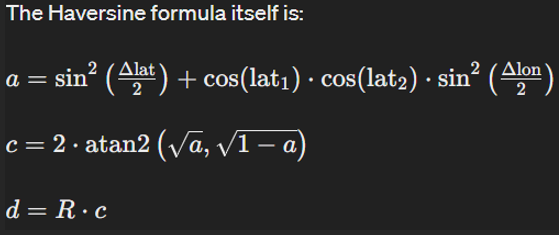

# GPS Code Document

Documentation and Future Guide for Haversine and GPS_Code 

:::info
*Author:* Ishaan Gupta
:::

## Haversine Formula

The Haversine formula is used to calculate the shortest distance between two points on a sphere, given their latitude and longitude coordinates. It's commonly used in navigation and GIS (Geographic Information Systems) applications to compute distances between locations on Earth, where the Earth's surface can be approximated as a sphere.



- **Δlat** is the difference in latitude between the two points (in radians),
- **Δlon** is the difference in longitude between the two points (in radians),
- **lat1** and **lat2** are the latitudes of the two points (in radians),
- **R** is the radius of the Earth (mean radius = 6,371,000 meters or 6,371 kilometers),
- **a** is the square of half the chord length between the points,
- **c** is the angular distance between those points in radians,
- **d** is the distance between the two points (in the same units as the radius of the Earth).

[GitHub: Working GPS Code](https://github.com/Redback-Operations/redback-orion/blob/main/IoT_GPS/Working_gps_code.ino)

## Explanation of the Code

### 1. Library Inclusions and Object Initialization:
- `TinyGPSPlus gps;`: Creates an instance of the TinyGPS++ object for GPS data processing.
- `#define EARTH_RADIUS 6371000`: Defines the Earth's radius in meters.

### 2. Conversion Function:
- `double toRadians(double degree)`: Converts degrees to radians using the formula:
  ```cpp
  radians = degrees × (π / 180)

### 3. Haversine Formula Function:
- `double haversine(double lat1, double lon1, double lat2, double lon2)`:
  - Converts the latitude and longitude differences from degrees to radians.
  - Computes the haversine of the central angle using the differences.
  - Calculates the angular distance `c` using `atan2`.
  - Returns the distance `d` by multiplying `c` with the Earth's radius.

### 4. Setup Function:
- `Serial.begin(9600);`: Initializes serial communication for debugging.
- `Serial1.begin(9600);`: Initializes serial communication with the GPS module.

### 5. Loop Function:
- Reads GPS data from the GPS module.
- Checks if the GPS data is valid and retrieves the current latitude and longitude.
- Calculates the distance between the current and previous coordinates every 5 seconds.
- Prints the previous and current coordinates and the calculated distance to the serial monitor.
- Updates the previous coordinates and time for the next calculation.

## Summary
The Haversine formula is a fundamental tool for calculating distances between two points on the Earth's surface using latitude and longitude. This detailed explanation and the provided Arduino code illustrate how to implement the formula in a practical project, enhancing navigation and GIS applications. By understanding the formula and the code, you can accurately compute distances between geographic locations using Arduino.
