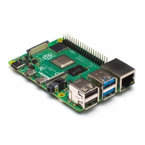



**PiCamandRaspberryPisetup**

:::info

*Author:* AyushKumarSom. **Date:** 20/May/2024.

:::

8

**1.Introduction**

The Raspberry Pi, a versatile and affordable mini-computer, in combination with the Pi Camera (Pi Cam), provides a powerful platform for live-streaming video content. This guide explores the process of capturing live footage with a Pi Cam and streaming it on a website, making it accessible to a broad audience.

**2.Hardware Setup**

ComponentsRequired:

- Raspberry Pi 4

  

- Raspberry Pi Camera Module (Pi Cam)

  

- MicroSD card (minimum 16GB, Class 10 recommended)

  

- Power supply for Raspberry Pi

  

- Internet connection

  

AssemblingtheHardware:

1. **Mount the Pi Cam:** Carefully attach the Pi Cam to the Raspberry Pi's camera port, ensuring the ribbon cable is securely connected.
1. **Prepare the MicroSD Card:** Flash the Raspberry Pi OS onto the MicroSD card using software like Raspberry Pi Imager.
1. **Power Up:** Insert the MicroSD card into the Raspberry Pi, connect the power supply, and boot up the device.![ref1]

**3.Software Setup**

ConfiguringtheCamera:

1. **Enable Camera Support:** Use ‘sudo raspi-config’to enable the camera in the Interface Options.
1. **Test the Camera:** Capture a test image with ‘raspistill -o test.jpg’to verify the camera is working.

InstallingStreamingSoftware:

1. **Update and Upgrade:** Run ‘sudo apt update’and ‘sudo apt upgrade’to ensure all packages are up to date.
1. **Install FFmpeg:** Install FFmpeg by running ‘sudo apt install ffmpeg’, which is a versatile tool to handle video streaming.![ref1]

**4.SettingUpthe Stream**

UsingFFmpegforLiveStreaming:

1. **Capture and Stream:** Use FFmpeg to capture video from the Pi Cam and stream it. Abasic command to start streaming

   **Create a streaming Directory** mkdir ~/streaming

   cd ~/streaming

   **Start Streaming**

   ‘ffmpeg -f v4l2 -i /dev/video0 -f mpegts udp://YOUR\_SERVER\_IP:PORT’

2. **Adjust Parameters:** Experiment with different FFmpeg parameters to optimize the stream quality and performance based on your network conditions.

**5.StepstofollowtoSetupStreaming**

After assembling your hardware as per the initial steps, you'll need to ensure your Raspberry Pi is ready for the task.

1\.EnableCameraSupport

1. Open Raspberry Pi Configuration Tool sudo raspi-config
1. Navigate to Interface Options > Camera and enable it.
1. Reboot your Raspberry Pi to apply changes.

2\.InstallingFFmpeg

FFmpeg is a powerful tool that will handle the video capture and streaming. sudo apt update

sudo apt install ffmpeg

3\.CapturingVideofromthePiCamandStreaming

This step involves using FFmpeg to capture video from the Pi Camera and stream it. For simplicity, we'll stream using the HLS (HTTP Live Streaming) protocol, which is widely supported on web platforms.

Stream with FFmpeg

1. Create a Streaming Directory

   This directory will store the HLS segments and playlist.

   mkdir ~/streaming cd ~/streaming

2. Start Streaming

   Replace YOUR\_STREAM\_KEYwith your unique stream identifier. This command captures video from the camera and starts an HLS stream.

   ffmpeg -f v4l2 -i /dev/video0 -c:v libx264 -preset veryfast -maxrate 3000k -bufsize 6000k -pix\_fmt yuv420p -g 50 -c:a aac -b:a 160k -ac 2 -ar 44100 -f hls -hls\_time 2 -hls\_playlist\_type event stream.m3u8

This command configures FFmpeg to:

- Use the video4linux2 (v4l2) input device, which is standard for capturing video on Linux, including the Raspberry Pi.
- Encode the video using the libx264 codec, which is efficient and widely supported.
- Set a fast encoding preset to reduce latency.
- Configure video bitrate and buffer sizes for quality and smooth streaming.
- Output the stream in the HLS format, which is compatible with many web players.

4\.SettingUpaSimpleHTTPServertoServetheStream

You can use Python's HTTP server module to serve the stream directly from your Raspberry Pi. This is a straightforward method to make your stream accessible over the network.

cd ~/streaming python3 -m http.server

This command starts a simple HTTP server on port 8000, serving files out of the *~/streaming* directory. You can access the stream by navigating to *http://<Raspberry\_Pi\_IP>:8000/stream.m3u8* from a device on the same network.

5\.EmbeddingtheStreaminaWebPage

To display your live stream on a webpage, you can use the HTML5 <video> tag. However, since we're using HLS, you might need a JavaScript library like hls.js to ensure compatibility across all browsers.

Sample HTMLwith hls.js

1. **Add hls.js to Your Web Page**

   Include the hls.js library in your HTMLheader:

   

2. **Embed Your Live Stream**

   Add a video element and script to initialize hls.js:

   <video id="video" controls autoplay></video>

   

Replace **<Raspberry\_Pi\_IP>** with your Raspberry Pi's IP address. This script checks if the browser supports HLS natively or through hls.js and plays the stream accordingly.

**6.Website Integration**

EmbeddingtheLiveStream:

1. **Streaming Server:** Set up a streaming server that can ingest the stream from the Raspberry Pi and serve it to web clients. NGINXwith the RTMP module is a popular choice.
1. **Web Player:** Embed a video player on your website to play the live stream. Video.js is a popular open-source player that supports various streaming formats.

SampleHTMLCode:

<video id="liveStream" controls>

<source src="http://YOUR\_SERVER\_IP:PORT/live/stream.m3u8" type="video/mp4"> </video>

SecurityMeasures:

- Implement HTTPS for your website to secure the viewer's connection.
- Use authentication and access control for the streaming server to restrict unauthorised access.![ref1]

**7.TroubleshootingandOptimization**

- **Network Bandwidth:** Ensure your network bandwidth is sufficient for live streaming, considering both upload from the Raspberry Pi and download by viewers.
- **Latency:** Use low-latency streaming protocols like WebRTC if real-time interaction is crucial.
- **Power Supply:** Ensure a stable power supply for the Raspberry Pi, especially for long-duration streams.![ref1]

**Conclusion**

This guide provides a foundation for setting up a live-streaming project with a Raspberry Pi and Pi Cam. With this setup, you can embark on various projects, from home surveillance systems to wildlife monitoring or live event broadcasting. Experiment with different configurations and software to tailor the system to your needs and optimize the streaming quality.

[ref1]: img/Aspose.Words.de9d713f-e027-4030-9a63-812ba2ca541f.010.png
