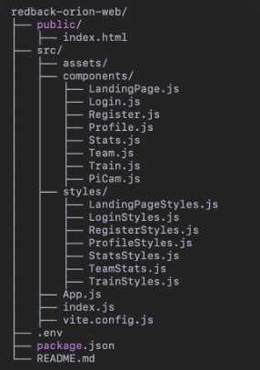
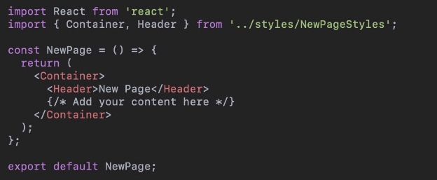
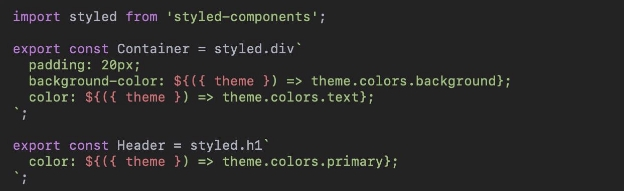
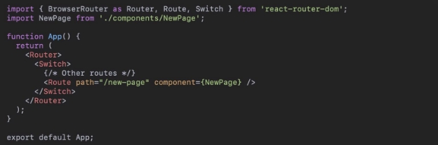
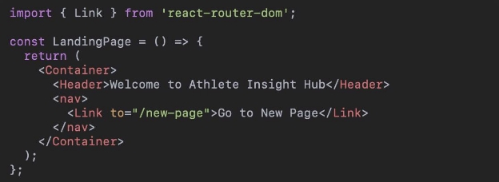



**SettingUpthe Athlete Insight HubWebsite UsingVite React**

SIT782-CapstoneTeamProject (B)

:::info

*Author:* AyushKumarSom

:::

6

**1.Introduction:**

This report provides a comprehensive guide on setting up the Athlete Insight Hub website on a desktop using the GitHub repository [https://github.com/Ayush-Som/redback-orion-web)] and Vite for React. Vite is a modern front-end build tool that offers a fast development experience by leveraging native ES modules.

**2.Prerequisites:**

Before starting, ensure you have the following installed on your system:

- **Node.js** (version 14.x or later)
- **npm** (Node package manager) or **yarn**
- **Git**

**3.ProjectStructure Overview:**

The Athlete Insight Hub project follows a structured directory layout. Here is an overview of the main directories and files:

- **public/**: Contains static files, including the index.html file.
- **src/**: Contains the source code of the application.
  - **assets/**: Contains image and asset files.
  - **components/**: Contains React component files.
  - **styles/**: Contains styled-components files for styling the components.
- **App.js**: The main application component.
- **index.js**: Entry point for the React application.
- **vite.config.js**: Configuration file for Vite.
- **.env**: Environment variables file.
- **package.json**: Contains project metadata and dependencies

**4.Step-by-StepGuide:**

**Cloning the Repository**

First, clone the repository from GitHub to your local machine.

**Installing Vite**

Ifyou don’t already have Vite installed globally, you can install it using npm or yarn:

**Installing Project Dependencies**

Navigate to the project directory and install the necessary dependencies.

**Updating Vite Configuration**

Ensure that the project is configured to use Vite. You should have a vite.config.js file in your project root. Ifit doesn’t exist, create it with the following content:

**Configuring Environment Variables**

Ensure that any necessary environment variables are set up. Create a .env file in the root of your project if it doesn’t already exist, and add the necessary environment variables. Example:

VITE\_API\_URL[=http://localhost:5000](http://localhost:5000)

Adjust the values according to your environment.

**Starting the Development Server**

To start the development server, run the following command:

Vite will start the development server, and you should see output indicating that the server is running. Open your browser and navigate to http://localhost:3000 (or the port you specified) to view the website.

**Building for Production**

To build the project for production, use the following command:

This will create an optimized production build in the dist directory. **Previewing the Production Build**

To preview the production build locally, you can use the following command:

This command will serve the files from the dist directory and allow you to verify that the production build works correctly.

**Setting Up Pi Cam Streaming**

For the Pi Cam streaming feature, ensure you have PiCamServer.py running on a device connected to your network. Update the environment variables or configuration in your React app to point to the correct IP address and port of the Pi Cam server.

Example:

VITE\_PICAM\_URL[=http://192.168.0.197:5000](http://192.168.0.197:5000)

Ensure that the Pi Cam server is accessible from your local network.

**5.OverviewofExistingPages:**

The Athlete Insight Hub website comprises several key pages designed to offer various functionalities to the users. The **Landing Page** serves as the homepage, providing an overview of the platform’s features. The **Login Page** and **Register Page** facilitate user authentication, allowing users to log in or create new accounts, respectively. The **My Profile Page** enables

users to view and edit their personal information, including a profile picture upload feature and additional options accessible via a hamburger menu. The **My Stats Page** and **Team Stats Page** present detailed statistics and insights about individual and team performance, utilizing visual elements like radar and line charts. The **Training Suggestions Page** offers workout plans and motivational quotes, while the **Pi Cam Streaming Page** allows users to view live streams from a Raspberry Pi camera integrated into the local network setup.

**6.AddingNewPages:**

To add a new page to the website, follow these steps:

1. **Create the Component:**

Create a new file in the components directory, e.g., NewPage.js.

2. **Create the Styles:**

Create a corresponding styles file in the styles directory, e.g., NewPageStyles.js.

3. **Update Routes:**

Update the App.js or the main routing file to include the new page.

4. **Navigate to the New Page:**

Add navigation links or buttons to direct users to the new page. This can be done in the LandingPage.js or any other relevant component.

**7.Conclusion:**

Setting up the Athlete Insight Hub website using Vite React is a straightforward process that involves cloning the repository, installing dependencies, and configuring the environment. The website is structured to provide a seamless user experience, with various pages offering functionality such as user authentication, profile management, performance tracking, and live streaming. By following the steps outlined in this report, developers can easily set up the project and extend its capabilities by adding new pages.

**8.References:**

- [Vite Documentation](https://vitejs.dev/guide/)
- [React Documentation](https://reactjs.org/docs/getting-started.html)
- [GitHub Repository](https://github.com/Ayush-Som/redback-orion-web)

This comprehensive guide should help you set up and extend the Athlete Insight Hub website efficiently. Ifyou have any questions or need further assistance, feel free to reach out.
