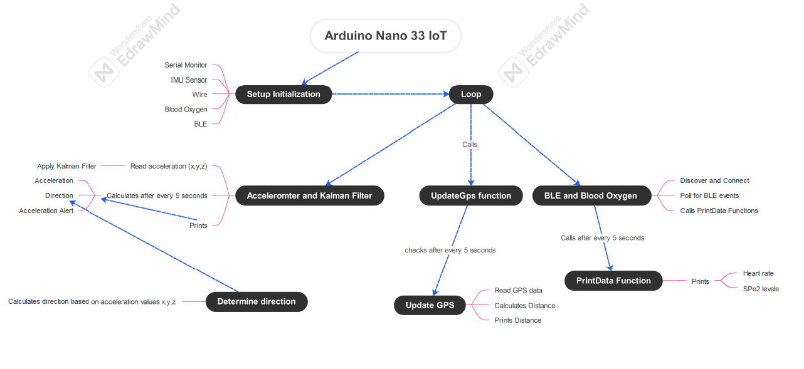

# Integrated Code Document
Documentation and Future Guide for Integration and Final code

:::info

*Author:* Ishaan Gupta

:::

# Comprehensive Documentation of the Multi-Sensor Code

This document provides a detailed explanation of the multi-sensor code, including its functionality, required libraries, installation instructions, challenges addressed, and considerations for future integration.

## Code Functionality

The code integrates an Arduino board with various sensors to create a multi-sensory data acquisition system. It captures data from the following sensors:

- **Accelerometer (IMU):** Measures acceleration along the X, Y, and Z axes, enabling movement detection and safety monitoring (e.g., identifying high-acceleration events).
- **Blood Oxygen Sensor (MAX30102):** Estimates blood oxygen saturation (SpO2) using pulse oximetry.
- **Heart Rate Sensor (BLE):** Reads heart rate data from a Bluetooth Low Energy (BLE) device, typically a fitness tracker or chest strap.
- **GPS (TinyGPSPlus):** Tracks geographical location using GPS data received through a serial port (Serial1).

### The code performs the following key tasks:

1. **Initialization:**
    - Sets up serial communication (Serial and Serial1) for data output and GPS input.
    - Initializes the IMU, Blood Oxygen Sensor, BLE, and GPS modules using specific libraries (`Arduino_LSM6DS3`, `ArduinoBLE`, `TinyGPSPlus`, `DFRobot_BloodOxygen_S_I2C`).
    - Defines constants and variables like thresholds, intervals, and sensor instances.

2. **Continuous Loop:**
    - **Accelerometer and Kalman Filter:**
        - Reads accelerometer data at regular intervals (INTERVAL) using `IMU.readAcceleration()`.
        - Implements a Kalman filter (KalmanFilter) to reduce noise and improve data accuracy in the X, Y, and Z readings.
        - Calculates total acceleration and determines direction using `determineDirection()`.
        - Prints acceleration, direction, and high-acceleration alerts (`Serial.println()`).

    - **BLE and Blood Oxygen Sensor:**
        - Periodically calls `discoverAndConnect()` to discover and connect to the BLE device (e.g., TICKR 0A5B).
        - Polls for BLE events (`BLE.poll()`).
        - Checks for characteristic value updates within a BLE interval (BLE_INTERVAL). If updated, calls `printData()` to process and print heart rate and SpO2 data.
        - Reads SpO2 data from the Blood Oxygen Sensor using `MAX30102.getHeartbeatSPO2()`.

    - **GPS:**
        - Updates GPS data at intervals (GPS_INTERVAL) using `updateGPS()`.
        - Reads available GPS data from Serial1.
        - Parses the data using `TinyGPSPlus.encode()`.
        - Checks if a valid location is obtained (`gps.location.isValid()`). If so, calculates distance traveled using the `haversine()` function and prints it (`Serial.println()`).

## Necessary Libraries and Installation

The code relies on several external libraries to interact with the sensors and perform specific tasks. Here's how to install them:

1. **Arduino_LSM6DS3:** For the LSM6DS3 accelerometer/gyroscope.
    - Open the Arduino IDE.
    - Go to Sketch -> Include Library -> Manage Libraries.
    - Search for "Arduino_LSM6DS3" in the search bar.
    - Click on "Install" for the library.

2. **ArduinoBLE:** For Bluetooth Low Energy communication.
    - Follow the same steps as for Arduino_LSM6DS3, but search for "ArduinoBLE".

3. **TinyGPSPlus:** For parsing GPS data.
    - Follow the same steps as for Arduino_LSM6DS3, but search for "TinyGPSPlus".

4. **DFRobot_BloodOxygen_S_I2C:** For the MAX30102 blood oxygen sensor.
    - Download the library from the provided repository.
    - Unzip the downloaded file.
    - Copy the unzipped folder (usually named DFRobot_BloodOxygen_S_I2C) to your Arduino libraries folder. This is typically located at `Documents/Arduino/libraries` on Windows or consult the Arduino IDE documentation for your specific operating system.

## Challenges Faced and Solutions

The development process encountered a few challenges that were addressed through code modifications and potential hardware considerations:

- **Overlapping Time Intervals:** The initial code used the same interval for all sensors, which could lead to missed readings from some sensors. This is resolved by setting different intervals based on sensor requirements:
    - 5 seconds for accelerometer and SpO2 (less critical for continuous monitoring).

- **BLE Disconnection due to Prolonged Delays:** Delays in processing sensor data, especially from the GPS, could cause the BLE connection to drop. Here are two approaches to address this:
    - **Code Optimization:** Review the code and optimize calculations or data processing tasks to minimize delays.
    - **Increase BLE Interval:** If optimization is limited, consider increasing the BLE interval (BLE_INTERVAL) to allow more time for other sensor readings. This is a trade-off between BLE data frequency and potential disconnections.

- **Power Supply Limitations:** Supplying enough power for all sensors simultaneously can be challenging. Here are some strategies:
    - **Battery Selection:** Use a battery with sufficient capacity to handle the combined sensor power consumption.
    - **Power Management Techniques:** Implement power management techniques in the code, such as putting unused sensors in sleep mode to reduce power draw.
    - **External Power Source:** If battery capacity is insufficient, consider using an external power supply.

## Things to Keep in Mind While Integrating Sensors

Here are some crucial aspects to consider when integrating various sensors into your project:

- **Sensor Compatibility:** Ensure compatibility between the sensors and the Arduino board in terms of voltage levels, communication protocols (I2C, SPI, etc.), and library support.
- **Sensor Power Requirements:** Check the power consumption of each sensor and choose a power supply that can handle the combined load.
- **Sensor Data Rates:** Consider the data rates of each sensor and ensure the Arduino can process the data efficiently without overwhelming its resources.
- **Sensor Placement:** Proper sensor placement is crucial for accurate data collection. For example, the accelerometer should be securely mounted to capture valid motion data. Refer to the sensor's datasheet for recommended placement guidelines.
- **Calibration:** Some sensors may require calibration to ensure accurate readings. Follow the calibration procedures outlined in the sensor's datasheet.
- **Data Fusion:** While this code focuses on collecting data from individual sensors, you can explore data fusion techniques to combine information from multiple sensors for a richer understanding of the monitored system.

## Additional Notes

- The code uses the `haversine()` function to calculate distance between GPS coordinates. This function assumes a spherical Earth model, which may introduce slight inaccuracies for very large distances.
- The Blood Oxygen Sensor readings (SpO2) obtained from this code are estimates and may not be as accurate as medical-grade pulse oximeters.
- Consider adding comments throughout the code to explain specific sections and functions, improving code readability and maintainability.

## Data Flow Diagram

Integrating multiple sensors into a single system offers both challenges and rewards. By addressing specific issues such as overlapping time intervals, BLE disconnections, and power supply management, the final system provides a robust platform for collecting and processing sensor data. This project serves as a valuable lesson in hardware integration, software optimization, and practical application of sensor technology.
