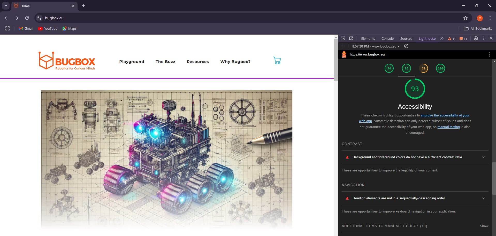
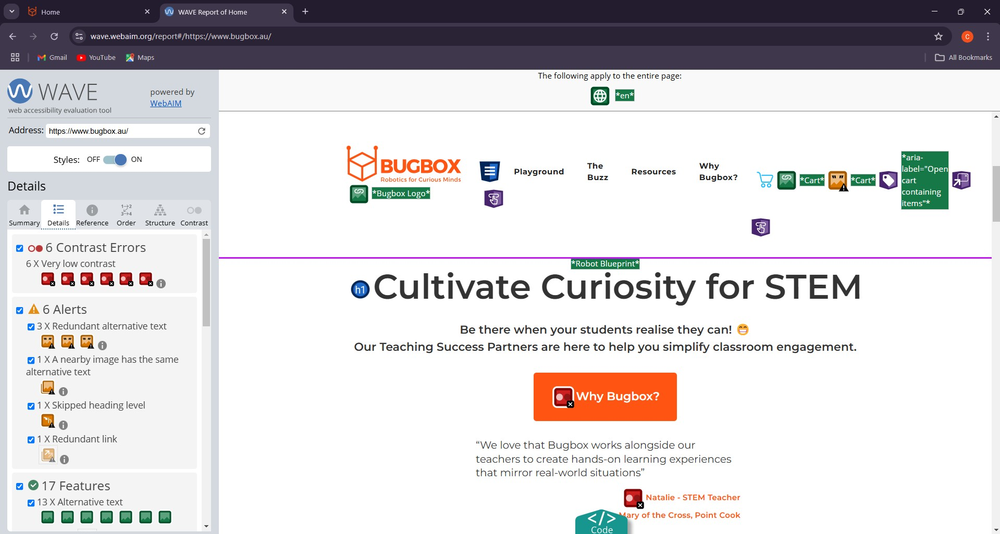
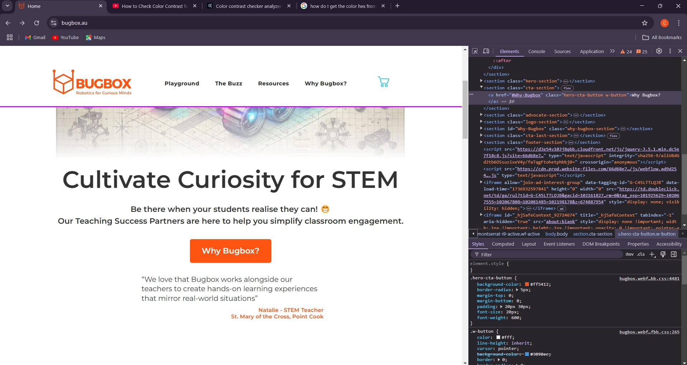
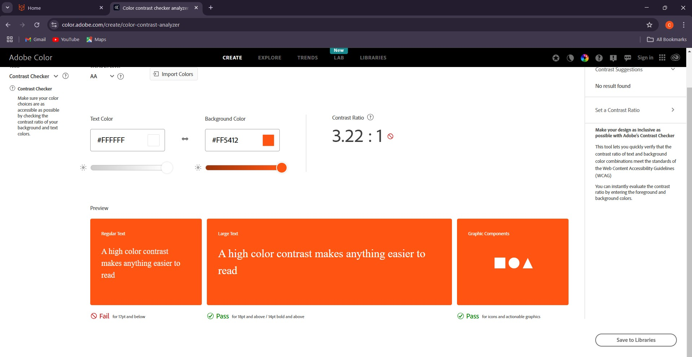

# Accessibility Validation Tools and Their Implementation 

:::info
By **Corrina Maria Glover**
:::

## Introduction 

We will explore the various tools available for accessibility validation, which are essential in ensuring that digital platforms, like Bugbox, are accessible to all users, including those with disabilities. This includes both automated and manual tools, as well as the steps for using them to identify and address potential barriers to accessibility. 

## 1. Automated Accessibility Testing Tools: 
    Automated accessibility testing tools are a great first step in identifying common accessibility issues. While they cannot catch everything, they help pinpoint major problems like missing alt text, color contrast issues, and navigational challenges. 

    Here are some popular automated accessibility tools and steps to use them:

### Google Lighthouse 
    Google Lighthouse is a built-in tool in Google Chrome that provides audits for accessibility, performance, SEO, and other best practices. It generates an accessibility score and suggests improvements. 

**Steps to Use Google Lighthouse:**

1. Open Google Chrome and press **F12** (or **Ctrl + Shift + I**) to open Developer Tools. 

2. Go to the “Lighthouse” tab. 

3. Select “Accessibility” under the Audit category. 

4. Click “Generate Report” to run the audit and view suggestions for improvement. 

### WAVE 
    WAVE is a user-friendly tool that highlights accessibility issues in real time on webpages. It shows detailed feedback on issues such as missing alt text, structural problems, and color contrast. 

**Steps to Use WAVE:**

1. Visit the WAVE website [link to wave website](https://wave.webaim.org/) and enter the URL of the webpage you want to test. 

2. Alternatively, you can install the WAVE browser extension to analyze pages in real-time. 

3. Review the report to identify the issues and follow the suggested fixes. 

## 2. **Manual Testing** 

    Although automated tools are a great start, manual testing is essential for finding more complex issues that may not be captured by these tools. Manual testing requires physically interacting with the website or app to ensure it is fully accessible. 

    Here are some key manual accessibility tests and how to perform them: 

### Keyboard Navigation 
    To ensure that a site is accessible to users who rely on keyboards instead of a mouse, test the website’s navigation using only the keyboard. 

**Steps for Keyboard Navigation:** 

1. Use the **Tab** key to navigate through all clickable elements (links, buttons, forms). 

2. Ensure each element can be activated using the **Enter** key, and modals or pop-ups can be closed with **Esc**. 

3. Check that focus indicators (such as highlighting) are visible as you tab between elements. 

### Screen Reader Testing 
    Screen readers are essential for visually impaired users. Testing a website with screen readers ensures that it is navigable and content is read aloud in a logical order. 

**Steps for Screen Reader Testing:** 

1. Use screen readers like VoiceOver (for macOS), TalkBack (for Android), or NVDA (for Windows). 

2. Navigate through the page and listen to how the content is read aloud. 

3. Ensure that the reading order makes sense, and that images and other non-text content are described by alternative text (alt text). 

### Color Contrast 
    It is important to ensure that text has enough contrast against its background to be readable, especially for users with low vision. 

**Steps for Color Contrast Testing:** 

1. Use a tool like Adobe Color Contrast Analyser to check the contrast ratio between text and its background. 

2. Make sure that the contrast ratio meets the WCAG (Web Content Accessibility Guidelines) standards (at least *4.5:1* for normal text and *3:1* for large text). 

## User Testing with People with Disabilities 

    The best way to ensure that a website or app is fully accessible is to test it with real users, particularly those with disabilities. They can provide direct feedback on their experience and highlight any issues that may have been missed. 

 

## Demonstration Example 

Let’s do a quick run down of how Accessibility Validation tools can be used, using the [bugbox site](https://www.bugbox.au/) site 

1. Using Lighthouse 
    As we can see, the accessibility parameter is really good, and it satisfies most conditions. Using Lighthouse allows us to view what is non-compliant, and we can work to make the page better.

2. WAVE 
    In my opinion, WAVE is a much better tool as it analyzes and shows exactly where the issue lies on the webpage.

3. Color Contrast Analyser 
    We can check the color contrast of any section of the page by accessing the color from the styles section and checking it.

## Conclusion 

    Ensuring the accessibility of a digital platform, such as Bugbox, is essential for providing an inclusive and empowering learning experience for all users. By using a combination of automated testing tools, manual checks, and user testing, developers can identify and fix accessibility issues to create a more inclusive product. Regular testing and continuous improvements are necessary to maintain accessibility and ensure that all users, including those with disabilities, can fully engage with the platform. 
