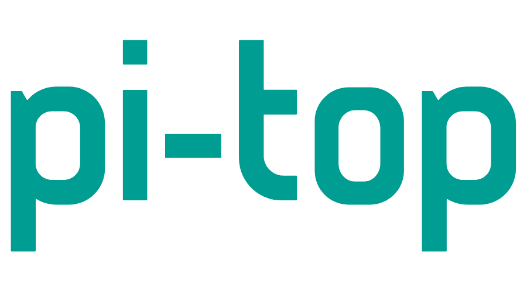
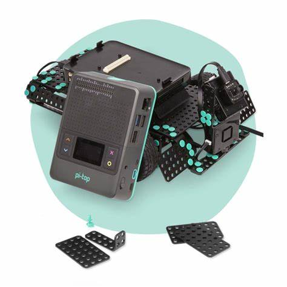
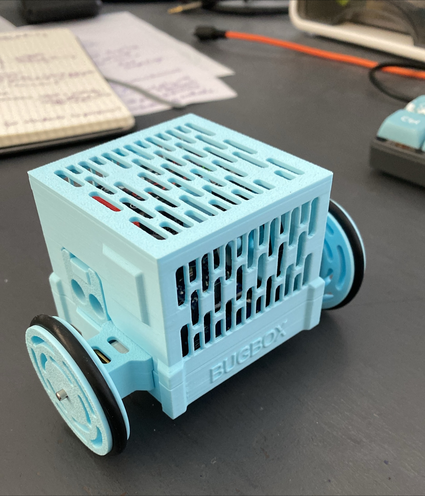
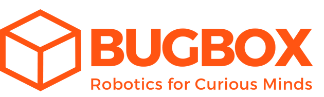

# Research Report: Analysis of Pi-Top as a Competitor to BugBox

:::important

By **Archit Gupta**. **5 January 2025**

:::

## 1. Introduction
   
This report provides an in-depth analysis of Pi-Top’s offerings, evaluating its position as a competitor to BugBox in the educational technology sector. The focus is on Pi-Top’s hardware, software, market strategy, and educational approach, with particular emphasis on its potential impact on BugBox’s growth and market differentiation. The findings aim to inform strategic decisions that enhance BugBox’s value proposition in STEM education.

## 2. Overview of Pi-Top’s Offerings
   

### 2.1 Modular Hardware
- Pi-Top [4]: A modular computing device powered by Raspberry Pi, designed for hands-on STEM learning. It supports a wide range of accessories and sensors for robotics, IoT, and AI projects (Pi-Top, 2023).

- Robotics Kits: Modular kits that enable students to build and program robots, encouraging creativity and problem-solving (Pi-Top, 2023).

- Target Audience: Primarily middle school to high school students, with scalability for advanced learners (Knowledge Base, 2023).

### 2.2 Software Ecosystem
- Pi-Top OS: A Linux-based operating system tailored for STEM education, offering pre-installed tools for coding, circuit design, and 3D modeling (Pi-Top, 2023).

- Coding Environments: Includes block-based programming (Scratch-like) for beginners and Python for advanced learners, catering to a broad skill range (Further Interactive Learning Platform, 2023).

- Integrated Learning Tools: Features guided tutorials, project ideas, and virtual classroom management tools for educators (Pi-Top, 2023).

## 3. Educational Approach
   

### 3.1 Inquiry-Based Learning
Pi-Top emphasizes inquiry-based learning, encouraging students to explore, experiment, and solve real-world problems. This approach fosters critical thinking, creativity, and hands-on engagement, making STEM concepts more accessible and enjoyable (Pi-Top, 2023).

### 3.2 Project-Based Activities
Pi-Top’s ecosystem supports project-based learning through activities like building robots, programming IoT devices, and designing circuits. These projects align with modern educational standards, emphasizing practical application over theoretical knowledge (Pi-Top, 2023).

### 3.3 Educator Support
Pi-Top provides extensive resources for educators, including training materials, lesson plans, and classroom management tools, making it easier for teachers to integrate technology into their curricula (Pi-Top, 2023).

## 4. Competitive Analysis: Pi-Top vs  BugBox

## vs 
 
   

### 4.1 Technological Strengths of Pi-Top
- Hardware Modularity: Pi-Top’s modular design allows for hardware upgrades and customization, making it versatile and scalable (Pi-Top, 2023).

- Integration with Raspberry Pi: Leveraging the Raspberry Pi platform gives Pi-Top access to a vast community of developers and resources (Pi-Top, 2023).

- Comprehensive Ecosystem: The combination of hardware, software, and learning resources creates a seamless user experience (Pi-Top, 2023).

### 4.2 Differentiation Opportunities for BugBox

  
- Simplicity and Accessibility: BugBox can focus on being user-friendly for younger learners (ages 8+), emphasizing ease of use over advanced modularity.

- Compact Design: Highlighting BugBox’s smaller, more straightforward design can appeal to primary schools with limited technical resources.

- Gamification of Learning: Integrating gamified elements such as challenges, rewards, and storytelling could set BugBox apart in engaging younger audiences.

- Cost-Effectiveness: BugBox can position itself as a more affordable alternative, especially for schools with budget constraints.

## 5. Insights from Pi-Top’s Market Strategy
   

- Focus on Scalability: Pi-Top’s hardware can grow with the learner, supporting advanced projects over time. BugBox can adapt this strategy by offering modular upgrades for additional functionality.

- Community Building: Pi-Top’s integration with Raspberry Pi fosters a collaborative community. BugBox could consider creating a similar platform for sharing projects and ideas.

- Educator Training: Pi-Top invests in educator support to ensure successful classroom adoption. BugBox could develop targeted training programs for teachers to boost confidence in using the device.

## 6. Recommendations for BugBox
   

- Enhance Educational Value: Expand the range of programming activities and offer a dual-mode interface (block-based and Python) to cater to different skill levels.

- Focus on Younger Audiences: Simplify hardware and software interfaces to make them more accessible for younger students while maintaining growth potential for advanced learners.

- Develop Gamified Learning Tools: Integrate engaging features like leaderboards, progress tracking, and themed challenges to make learning more interactive and fun.

- Invest in Modular Upgrades: Introduce modular hardware that allows schools to add functionality over time, such as cameras, sensors, and advanced robotics capabilities.

- Strengthen Educator Support: Provide lesson plans, tutorials, and virtual support to help teachers effectively use BugBox in classrooms.

## 7. Conclusion
   

Pi-Top represents a strong competitor in the educational technology space due to its comprehensive ecosystem and focus on project-based learning. However, BugBox has significant opportunities to carve out its niche by focusing on simplicity, affordability, and gamified learning experiences tailored for younger students. By leveraging these insights and recommendations, BugBox can enhance its offerings and position itself as a leader in STEM education for primary school students.

References 

[- Pi-Top. (2023). Official website ](https://www.pi-top.com/)  
[- Knowledge Base. (2023) ](https://knowledgebase.pi-top.com/)  
[- Further Interactive Learning Platform. (2023) ](https://further.pi-top.com)

