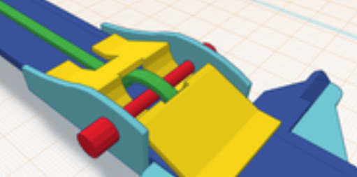
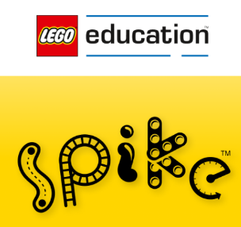
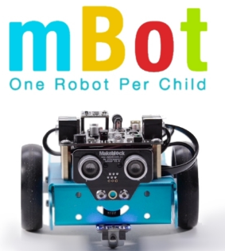
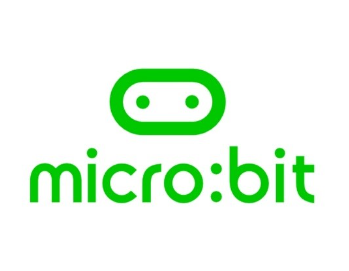

**Last updated by:** Kaleb, **Last updated on:** 26/09/2024

**Last updated by:** Kaleb, **Last updated on:** 26/09/2024

# Competitors Research Report 

Identify competitors to BugBox

:::important

By **Rishubh Sethi** . **06 August 2024**

:::

## Importance of Cybersecurity

For a startup like Bugbox, which focuses on integrating technology into classrooms with engaging and gamified learning experiences, cybersecurity is crucial for several reasons such as protecting sensitive data, maintaining trust with educators and schools, compliance with regulations and ensuring platform integrity. A strong cybersecurity infrastructure is also vital to prevent popular forms of cyberattack such as Distributed Denial of Service (DDoS) attacks. Additionally, cybersecurity is essential to safeguarding intellectual property as Bugbox’s innovative curriculum and gamified learning experiences are valuable intellectual property. Effective cybersecurity helps protect these assets from theft and unauthorised access which is essential for maintain Bugbox’s competitive edge and ensuring the continued growth of the company. 

## Competitors approach to Cybersecurity 

Here we will look at some of Bugbox’s direct competitors and analyse their approaches to cybersecurity. These competitors include tinkercad, Lego Spike, mbot and microbit.  

## Competitor 1 - Tinkercad (by Autodesk) 

   

### Approach to Cybersecurity

Tinkercad, an online 3D design and modeling tool, is part of Autodesk, which is known for its strong commitment to security. Tinkercad uses HTTPS for secure communication, ensuring data transmitted between users and the platform is encrypted. Autodesk implements multi-factor authentication (MFA) for its services to enhance account security. Regular updates and security patches are applied to address vulnerabilities. Tinkercad also has comprehensive privacy policies and terms of service that comply with global data protection regulations, including GDPR. 

### Key Security Features

 

Encryption: Data is encrypted during transmission with HTTPS. 

Authentication: Multi-factor authentication (MFA) is used. 

Privacy Policies: Compliant with data protection regulations like GDPR. 

## Competitor 2 - Lego Spike

   

### Approach to Cybersecurity

LEGO SPIKE Prime, a robotics and coding kit for education, is part of the LEGO Group, which adheres to stringent data protection and security measures. LEGO SPIKE devices communicate with the LEGO Education software, which uses secure, encrypted communication channels. LEGO Education also ensures that software updates are delivered securely and regularly. Privacy policies are designed to protect user data, especially since LEGO SPIKE is used in educational environments where data protection is crucial. 

### Key Security Features

Encryption: Secure communication channels for data exchange. 

Updates: Regular and secure software updates. 

Privacy Policies: Strong focus on protecting user data in educational settings. 

## Competitor 3 - mBot (by Makeblock)

   

### Approach to Cybersecurity

Makeblock's mBot is a programmable robot used for educational purposes. The company employs basic cybersecurity practices, including encrypted communication between the mBot and its associated software. Makeblock provides firmware updates to address vulnerabilities and enhance security. User data protection is addressed through privacy policies, although the specifics might vary depending on regional regulations. The company is responsive to security issues, releasing updates as needed. 

### Key Security Features

 
Encryption: Basic encryption for communication. 

Updates: Firmware updates to address security vulnerabilities. 

Privacy Policies: Address user data protection, with regional variations. 

## Competitor 4 - Micro (by the Micro Educational Foundation) 

   

### Approach to Cybersecurity

The Micro Educational Foundation focuses on providing a secure environment for learning and coding with the Micro microcontroller. The platform uses HTTPS to encrypt data transmitted between the Micro and associated software. The Foundation provides regular software updates and has a clear privacy policy to protect user data. Additionally, they promote secure coding practices and offer resources to help educators and students understand cybersecurity basics. 

### Key Security Features

Encryption: Data is transmitted securely using HTTPS. 

Updates: Regular software updates for security. 

Privacy Policies: Clear policies to protect user data and promote secure coding practices. 

## Summary

Each competitor employs a range of cybersecurity measures to protect user data and ensure secure interactions with their platforms. Tinkercad and LEGO SPIKE emphasize encrypted communication and strong privacy policies, while mBot focuses on basic encryption and firmware updates. Micro combines secure data transmission with educational resources to promote cybersecurity awareness. For Bugbox, adopting similar practices—such as encryption, regular updates and strong privacy policies—will be crucial in ensuring the security and trustworthiness of the platform. 

