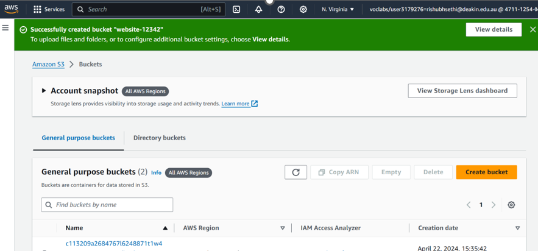
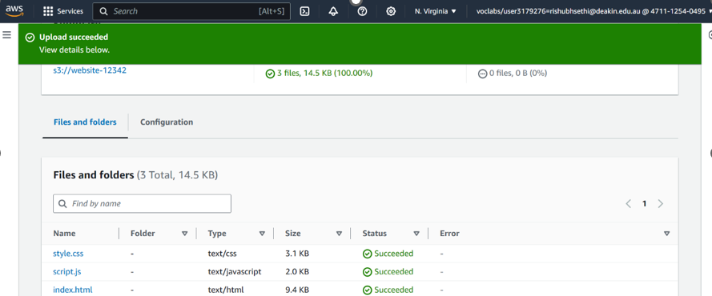
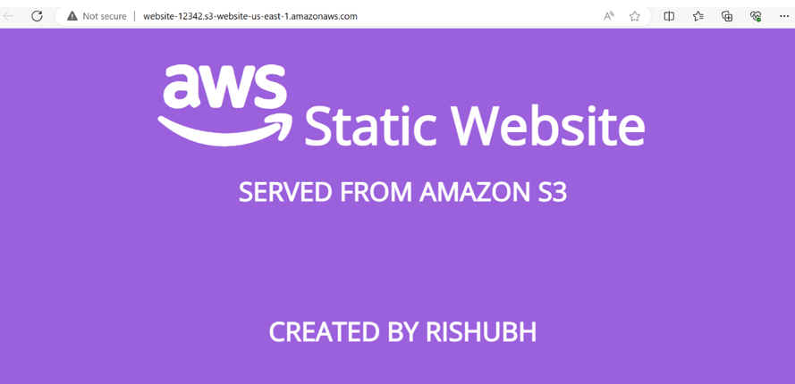

**Last updated by:** veewd, **Last updated on:** 28/09/2024

**Last updated by:** veewd, **Last updated on:** 28/09/2024

# Report on Purchasing vs In-house Cybersecurity Solutions for BugBox

:::important

By **Rishubh Sethi** . **27 September 2024**

:::

## Introduction
In this report, I will be reviewing whether in-house or purchased (outsourced) cybersecurity infrastructure is more suitable for BugBox’s needs, considering BugBox’s size and resources as a start-up company and associated opportunity costs with both approaches.

## Recommendation
When deciding between purchasing third-party cybersecurity solutions and developing them in-house, the optimal approach for Bugbox would be a balanced strategy that combines the use of cloud-based cybersecurity services with in-house development and control. This approach allows Bugbox to leverage the strengths of established, secure cloud platforms while maintaining the flexibility and control to implement custom cybersecurity practices tailored to its specific needs.

## Cloud-Based Cybersecurity Solutions
In today’s day and age, companies no longer have to own dedicated IT infrastructure to host their servers and other key databases. Cloud-based services, such as Software as a Service (SaaS), allow organizations to piggyback on the resources of companies specializing in cloud computing infrastructure and services. This is feasible due to the exponential growth in internet speeds, capacity, and bandwidth.

Cloud platforms such as Amazon Web Services (AWS), Google Cloud Platform (GCP), and Microsoft Azure offer robust, scalable, and cost-effective cybersecurity services. These providers invest heavily in maintaining top-tier security, offering services that are constantly updated to protect against the latest threats. Bugbox can benefit from these investments without having to reinvent the wheel by developing security solutions from scratch.

### Key Advantages of Cloud-Based Security:
- **Scalability:** Cloud platforms offer security features that can scale seamlessly as Bugbox’s user base grows. For instance, AWS provides tools like AWS Shield (for Distributed Denial of Service protection) and AWS Identity and Access Management (IAM) (for access control), which can easily be adapted to Bugbox’s needs without significant overhead.
- **Compliance and Certifications:** Cloud providers comply with a wide range of security certifications such as ISO 27001, SOC 2, GDPR, and COPPA. Bugbox can leverage these certifications to meet regulatory compliance without having to invest heavily in achieving them independently.
- **Cost-Effective Security Infrastructure:** Cloud platforms provide security tools and services on a pay-as-you-go basis. Bugbox can avoid large upfront costs for hardware and software, instead paying for what it uses.

### Recommended Cloud Services for Bugbox:
- **AWS KMS (Key Management Service):** Provides strong encryption and secure key management for data-at-rest. AWS KMS also integrates with other AWS services, ensuring that all sensitive data is encrypted both in transit and at rest.
- **AWS Shield and AWS WAF (Web Application Firewall):** To protect against DDoS attacks and malicious web traffic. These services provide managed threat detection and mitigation, ensuring Bugbox is always protected from common attack vectors.
- **AWS CloudTrail and AWS GuardDuty:** For monitoring and logging. CloudTrail records API calls, which is crucial for auditing, while GuardDuty continuously monitors for suspicious activity, reducing the burden of manual security monitoring.

 
 
### Outsource Routine Security Operations
By using managed security services like AWS Security Hub or Azure Security Center, Bugbox can benefit from pre-configured, industry-standard security controls and monitoring without the need to dedicate significant in-house resources. These services provide real-time monitoring, vulnerability assessments, and automatic compliance checks, helping Bugbox maintain a strong security posture.

## In-House Control Strategy
While Bugbox can rely on cloud providers for the infrastructure and security management, it is critical that the organization retains in-house control over key security practices such as access control, user management, and incident response.

### Custom In-House Controls:
- **Role-Based Access Control (RBAC):** Bugbox should develop in-house RBAC policies tailored specifically to its platform’s user base, such as students, educators, and administrators. This ensures that users only have access to the information and tools relevant to their role, reducing the risk of data breaches.
- **Multi-Factor Authentication (MFA):** Although services like AWS Cognito or Microsoft Azure AD provide MFA solutions, Bugbox should manage the policies and enforcement of MFA internally to ensure all users adhere to Bugbox-specific security requirements.  
  *I will be covering RBAC in detail in another report, while my groupmate is working on MFA.*

### Secure Application Development
For custom features specific to the Bugbox platform, such as student data handling, classroom management systems, and gamified learning environments, Bugbox should retain control over how security is integrated into the development lifecycle.

### In-House Secure Development Lifecycle (SDL):
- **Secure Coding Practices:** Bugbox developers should be trained to follow secure coding standards, such as those defined by OWASP (Open Web Application Security Project), ensuring the platform is secure from common vulnerabilities like XSS, SQL injection, and insecure authentication mechanisms.
- **In-House Penetration Testing:** Bugbox should conduct regular penetration testing on its platform to identify and fix vulnerabilities that may not be detected by automated tools. This testing can be outsourced for the actual execution, but the management and understanding of results should be controlled in-house.
- **Custom Security Audits:** While third-party cloud solutions provide infrastructure-level security monitoring, Bugbox’s development team should conduct internal audits focusing on application-level security, such as how user data is handled within its custom-built features.

## Incident Response and Business Continuity
Cloud platforms provide excellent disaster recovery solutions, but Bugbox should have its own incident response plan (IRP) and business continuity plan (BCP) to deal with cybersecurity incidents. The in-house team should be responsible for detecting, responding to, and mitigating incidents as they happen, including breaches involving sensitive student data.

Bugbox can use cloud-based logging and monitoring solutions like AWS CloudWatch and GuardDuty, but its Security Operations Center (SOC) or equivalent in-house security team should manage response efforts. This ensures Bugbox can take immediate action when incidents occur.

## Analysis and Review of Balanced Approach
### Cost Efficiency
Cloud services such as AWS provide pre-built, scalable solutions that Bugbox can integrate without having to hire and maintain a full in-house security team for routine operations. Bugbox can purchase key security features—such as encryption, DDoS protection, and compliance checks—while focusing its internal resources on higher-value activities like policy development and custom platform security features.

### Scalability and Agility
Cloud services provide scalability on demand, ensuring that as Bugbox’s user base grows, security features scale accordingly without the need for significant in-house reengineering. Bugbox can also take advantage of continuous improvements in cloud security, as providers regularly update their platforms to meet the latest security threats.

### Focused In-House Development
By leveraging cloud infrastructure for routine tasks and core cybersecurity services, Bugbox’s in-house team can focus on customized, user-specific security features that enhance the platform's unique use case. This includes developing secure authentication flows, student data management, and classroom oversight controls, all designed with the needs of primary-aged students in mind.

## Conclusion
For Bugbox, adopting a hybrid cybersecurity strategy that balances cloud-based security solutions with in-house control over key aspects of its platform is the optimal choice. By leveraging the advanced security features offered by cloud providers like AWS, Bugbox can secure its infrastructure with minimal overhead, while in-house efforts can focus on building and maintaining custom security policies, access controls, and incident response mechanisms. This balanced approach allows Bugbox to scale securely, meet compliance requirements, and continue providing a safe, engaging learning environment for students and educators.
