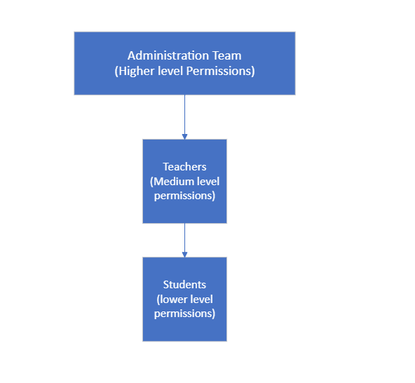
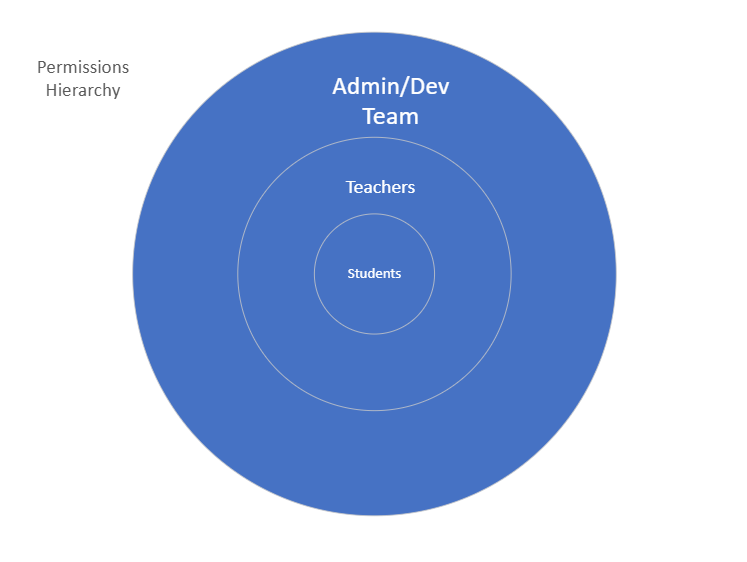

# Report on Role-Based Access Control and Data-at-Rest Management

:::important

By **Rishubh Sethi** . **25 September 2024**

:::

## Introduction

Bugbox, as an edtech educational platform, deals with sensitive data, including student records, lesson plans, and intellectual property. To ensure a secure environment, two key cybersecurity practices need to be implemented: Role-Based Access Control (RBAC) and Data-at-Rest management. This report provides a comprehensive understanding of these two cybersecurity strategies, focusing on both technical and non-technical aspects. It explains the rationale behind implementing these measures and how they can be applied effectively to Bugbox's unique environment.

## Role-Based Access Control (RBAC)

Role-Based Access Control (RBAC) restricts access to data and resources based on a user's role within an organization. In RBAC, instead of assigning individual permissions to each user, users are grouped into roles (e.g., student, teacher, administrator), and each role is granted specific permissions. This ensures users only have access to the information and functions necessary to perform their job or task.

For Bugbox, RBAC ensures that educators have access to classroom management tools, while students only have access to their individual learning materials. Administrators may have broader permissions, such as managing users and overseeing data analytics.

### Why RBAC is Important for Bugbox

RBAC minimizes the potential for accidental and malicious data breaches by restricting access based on user roles. Sensitive data, such as student records and lesson plans, are only available to those who need it. For example, an educator should not have access to administrative functions, and a student should not be able to access a teacher's resources. This system enhances security and streamlines permission management, particularly as the platform grows.

From a technical perspective, implementing RBAC in Bugbox involves defining user roles and assigning corresponding permissions. These permissions are enforced using Access Control Lists (ACLs) at both the application and database levels, ensuring users can only perform actions allowed by their role. Bugbox can also enhance security by incorporating Attribute-Based Access Control (ABAC), which applies additional criteria like location or time of access to refine permissions.

### Technical Implementation of RBAC

The technical implementation of RBAC within Bugbox's platform can follow these key steps:

- **Define Roles and Permissions**:
  - **Role Definitions**: Identify core roles like students, teachers, administrators, and support staff.
  - **Permission Assignments**: Define which resources (e.g., lesson plans, student data) and operations (e.g., view, edit, delete) are allowed for each role.
  
- **Access Control Lists (ACLs)**:
  - **Implementation**: Use ACLs at both the application and database levels to specify which role can perform which operation on a resource.
  - **Example**: Teachers may be granted permission to edit lesson plans but not modify administrative settings.

- **Role Hierarchies**:
  - **Nested Roles**: Implement hierarchies where higher-level roles (e.g., administrators) inherit permissions from lower-level roles (e.g., teachers).

  
- **Attribute-Based Access Control (ABAC)**:
  - **Additional Security**: Incorporate ABAC to add contextual restrictions such as location, device, or time of access.

- **Audit Logs and Monitoring**:
  - **Tracking**: Implement logging to monitor access control events, tracking unauthorized access attempts.
  - **Tools**: Use tools like Graylog or Splunk for real-time access monitoring.

## Data-at-Rest Management

Data-at-Rest management ensures that data stored on physical storage devices is encrypted, preventing unauthorized access. Even if an attacker gains access to the storage media, encrypted data remains unreadable without the correct decryption keys.

For Bugbox, encrypting student records, credentials, and educational content is essential to prevent data theft, particularly if physical devices or cloud infrastructure are compromised. 

### Technical Implementation of Data-at-Rest Encryption

The technical implementation of Data-at-Rest Encryption involves the following steps:

- **Choose the Encryption Algorithm**:
  - **AES-256**: Use AES-256, a symmetric encryption standard, to encrypt all sensitive data.
  - **TLS for Encryption Keys**: Ensure encryption keys used for AES-256 are encrypted during transmission using TLS and stored securely.

- **Encrypt Databases**:
  - **Database-Level Encryption (TDE)**: Use Transparent Data Encryption (TDE) to encrypt databases and their backups (e.g., MySQL TDE, PostgreSQL’s pgcrypto).
  - **Column-Level Encryption**: Encrypt sensitive columns like passwords and email addresses.

- **File System Encryption**:
  - **Linux Systems (LUKS)**: Use LUKS for encrypting file systems on Linux-based environments.
  - **Windows Systems (BitLocker)**: Use BitLocker for file system encryption on Windows environments.

- **Cloud Storage Encryption**:
  - **AWS KMS**: For cloud storage, use AWS KMS or Azure Key Vault for key management and encryption services.
  - **Envelope Encryption**: Use envelope encryption, where data is encrypted with a Data Encryption Key (DEK), and the DEK is encrypted with a Master Key.

- **Key Management and Rotation**:
  - **HSM**: Store encryption keys in a Hardware Security Module (HSM) or cloud-based KMS.
  - **Separation of Duties**: Ensure encryption keys are stored separately from the data to prevent unauthorized decryption.

- **Audit and Monitoring**:
  - **Logging and Alerts**: Implement systems to log access to encrypted data and trigger alerts if suspicious activity is detected.
  - **Key Access Tracking**: Continuously track who has access to decryption keys.

### Importance of Data-at-Rest Encryption for Bugbox

- **Protects Sensitive Data**: Encrypting sensitive data ensures that even in the event of a breach, the information remains secure.
- **Compliance**: Encryption helps Bugbox comply with data protection regulations like GDPR and COPPA.
- **Prevents Data Theft**: Encryption protects Bugbox’s intellectual property from being stolen or tampered with.

## Conclusion

Implementing RBAC and Data-at-Rest management through encryption is crucial for Bugbox to secure its platform and maintain compliance with data protection regulations. RBAC limits access based on user roles, reducing the risk of unauthorized access, while encryption ensures that even if data is accessed, it remains protected. Together, these security measures provide a comprehensive approach to securing Bugbox’s educational platform.

