# 2-step Authentication

Creating a extra step in secure login for kids

:::info
**Document Creation:** 15 September, 2024. **Last Edited:** 13 December, 2024. **Author:** Jessica Maugueret
:::

## Avatar Creation Progress
I was tasked by Dylan, my mentor, to create avatars for the drag-and-drop game, with the goal of bringing a robotic feel to the characters while maintaining the design integrity of the AI-generated images provided. Dylan had initially created an AI image that served as the starting point, offering the basic shapes and design language. My role was to adapt these forms, adding mechanical elements and enhancing them with shading and texture to give them a more dynamic, industrial look.

Using Procreate, I took the AI-generated avatars and reimagined them with a robotic twist, ensuring that each model had distinct features while staying true to the game's futuristic aesthetic. One of the major focuses was on texturing and shading, which played a crucial role in making the avatars appear more three-dimensional and lifelike. These techniques helped bring a sense of depth and tactile realism to the designs, which will enhance the player’s overall experience. 

In addition to designing the avatars, I also created the backing slots where the avatars will snap into place within the game. These backing slots are essential for providing clear visual cues to players about where to place the avatars, ensuring a smooth drag-and-drop experience. The backing slots are designed to complement the robotic aesthetic of the avatars, using similar color schemes and textures to keep the game's interface consistent. These slots are not only functional but also add to the overall immersive feel of the game.

You can see a timelapse of my work, showcasing the development of these avatars in Procreate, via the following link: https://youtu.be/IF8CXxdNBWU 

## Images

### Geo - Blue Robot
Designed with a friendly and approachable appearance, the blue robot features a smiling expression, making it more appealing to children. The use of a generic, vibrant blue color enhances its broad appeal, creating a character that feels safe and inviting for younger audiences.

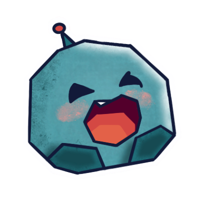 
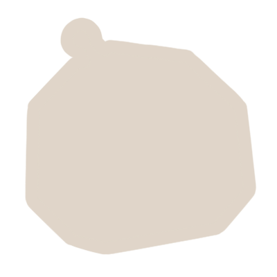

### Toast - Orange Robot
The orange robot has a more rustic and edgy design, highlighted by its slightly mischievous grin. The color palette was chosen to give it a rugged look, which contrasts with the other characters, giving it a unique personality that might resonate with those who enjoy a more playful and less conventional character.

 

### Tally - Beige Robot
This robot has a cutesy, rounded form, with wide, expressive features. The two-tone color scheme softens its appearance, making it a more comforting and approachable character. Its design is meant to appeal to users who favor warmth and familiarity.

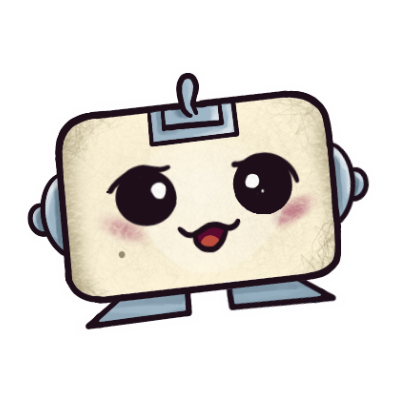 

### Chim - Green Robot
With a more 3D appearance, the green robot stands out due to its distinctive pattern and structural design. The texture gives it depth, and its geometric shape makes it feel more modern and mechanical, attracting users who appreciate a more complex, detailed look.

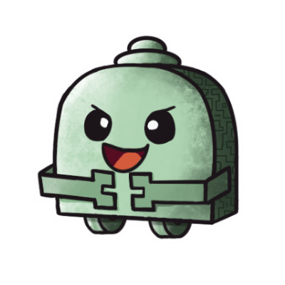 

### Zappy - Purple Robot
This character has a goofy and playful design, with exaggerated features like its wide mouth and antenna-like shapes. The use of purple makes it more whimsical, creating an energetic and fun character that can appeal to users who enjoy more lighthearted and quirky designs.

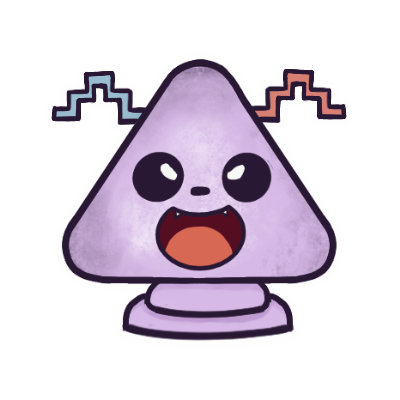 
 

### Squeak - Yellow Robot
The yellow robot radiates cheerfulness with its rounded form and lively expression. Its simple and vibrant design, highlighted by soft pigtails, makes it highly approachable for younger audiences. The character exudes energy and joy, appealing to those who enjoy playful and lighthearted themes.

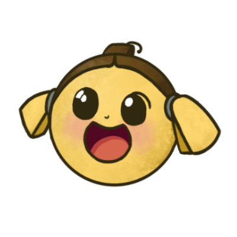 
 

### Chopper - Pink Robot
The pink robot is designed to resemble an octopus, blending marine-inspired elements with a playful robotic style. Its spherical body and tentacle-like base give it a soft yet dynamic look, while the propeller on top adds a whimsical touch. The textured shading and blush tones enhance its charm, making it a delightful character for users who enjoy unique and adorable designs.

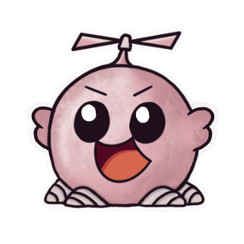 
 

### Grumpy - Red Robot
The red robot takes inspiration from a crab, with its angular, shell-like design and claw-like arms. Its tank-like body and claw-like features bring a sense of strength and resilience, while the sharp angles and deep red tones emphasize its assertive personality. Despite its tough exterior, the playful design ensures it remains engaging and fun for all users..

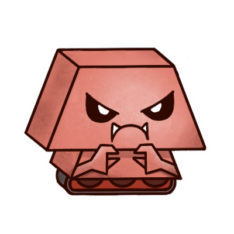 
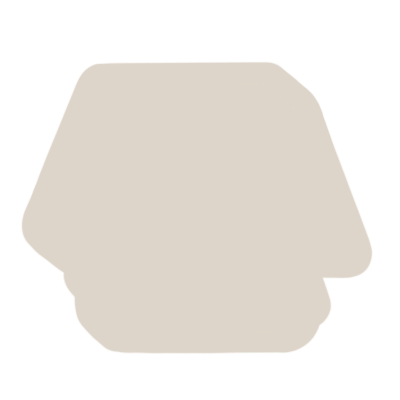 

Together, all the characters are designed to cater to different tastes and preferences, ensuring that there is a robot for everyone.

  

## Figma Prototyping

After finalizing the avatars, I transitioned to Figma, where I built a working prototype of the drag-and-drop game. This allowed me to combine both the visual assets and the game's functionality into a cohesive prototype that aligns with the overall concept. The prototype simulates how the avatars will interact with the game mechanics, providing a clear representation of the final user experience.

You can explore the development of the game through the following Figma links:

:::tip

To trial or play the actual drag and drop game, click on the Prototype Mode!!

If you don't know where to click, click on the page randomly and options will pop up for you.

:::

**[Development mode](https://www.figma.com/design/uKne8K75bIKJJVesM2T63o/Bugbox-Game)**

**[Prototype mode](https://www.figma.com/proto/uKne8K75bIKJJVesM2T63o/Bugbox-Game?node-id=33-220&t=wmGtNy42fhJPNxCI-1&starting-point-node-id=33%3A220)**

This entire process, from adapting AI-based designs to implementing them into a functional game prototype, marks significant progress toward the final version of the game.

  

### Gameplay

**Here’s a step-by-step breakdown of how the authentication game works:**

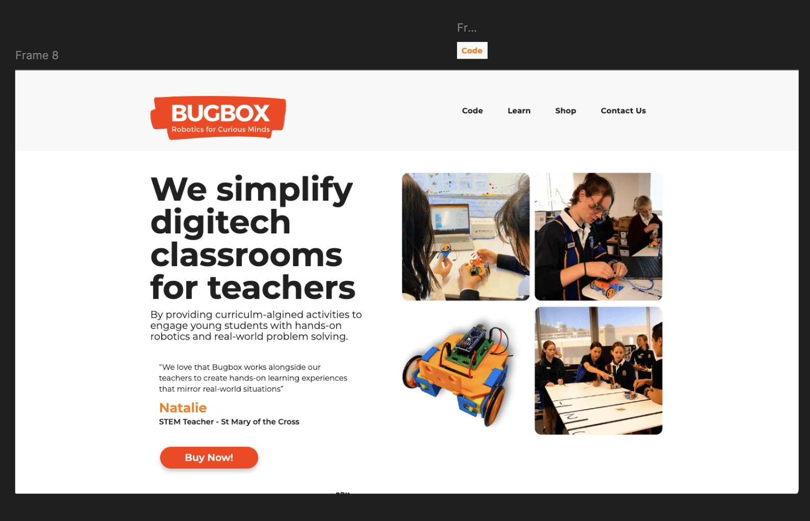 

**1. Starting the Game (Frame 8 - Homepage)**

- The game begins on the homepage of the BugBox website.
- The user is prompted to click the "Code" button, which turns orange when hovered over.

**2. Launching the Mini-Game**

- Once the    button is clicked, the mini-game starts. 
- Proposed Randomization Feature: Each time the mini-game starts, we want the positions of the avatar slots are randomized to ensure that the game is different every time the user plays. This is not apparent in the prototype.

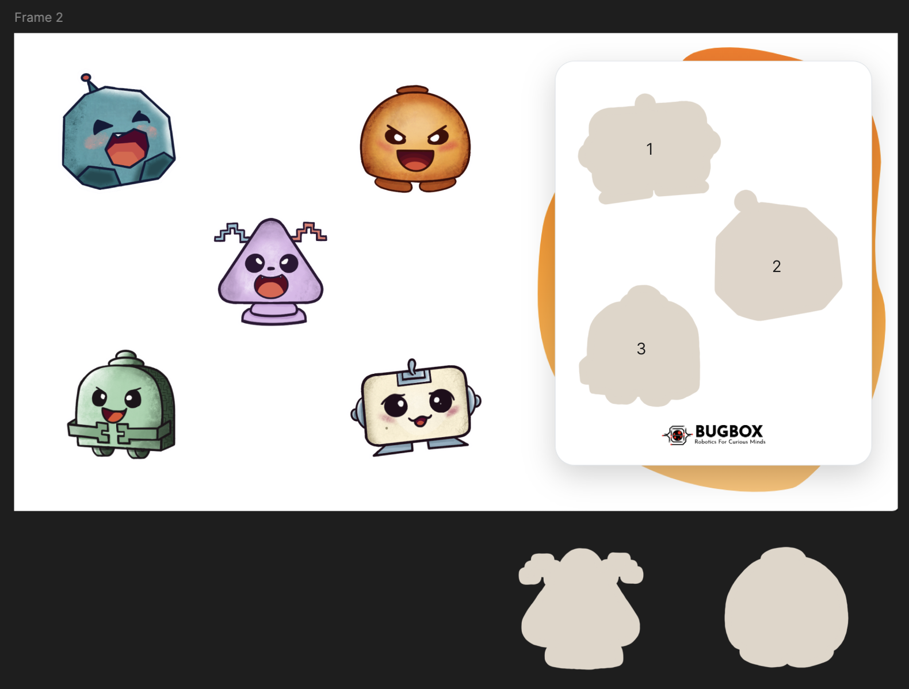 

**3. Playing the Mini-Game**

- The user sees a set of three avatars and their corresponding slots.
- The goal is to drag each avatar into the correct slot.
:::info

- **Correct Move:** If the user drags an avatar into the correct slot, the game advances to the next frame (Frame 2 → Frame 3 → Frame 4).

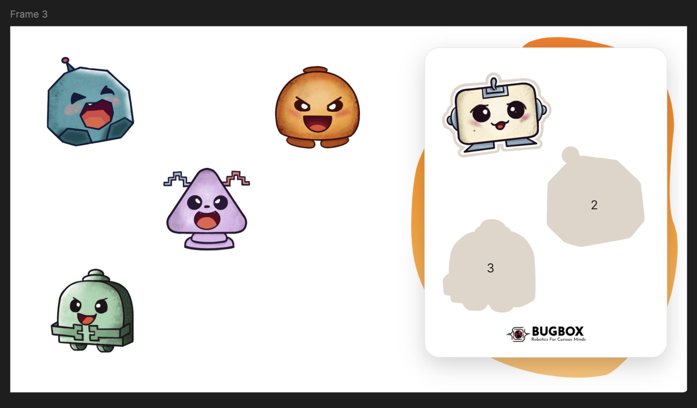 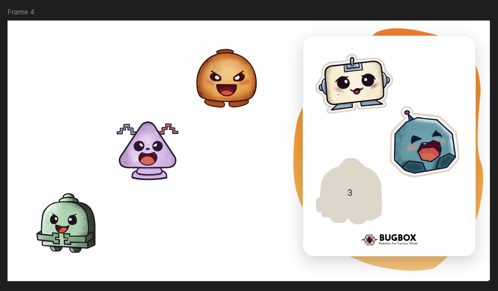 

:::

:::danger

- **Wrong Move:** If an avatar is placed in the wrong slot, the game will prompt the user to restart (Frame 7).

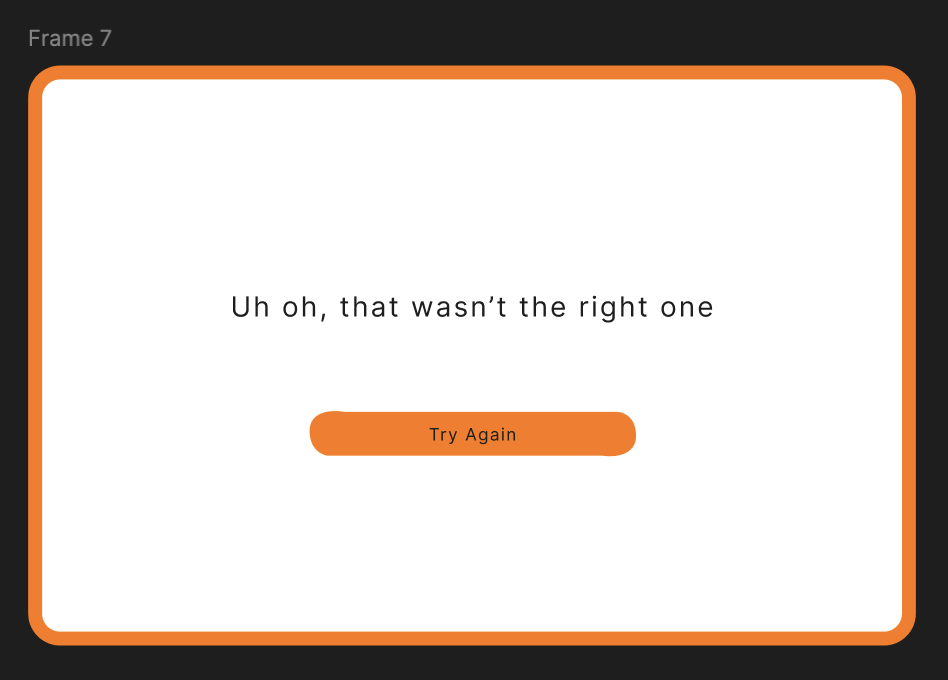

:::
  

**4. Completing the Mini-Game**

- Once all three avatars are placed correctly, the game reaches the final frame (Frame 5).
- The user is prompted to click the "Go Play" button.

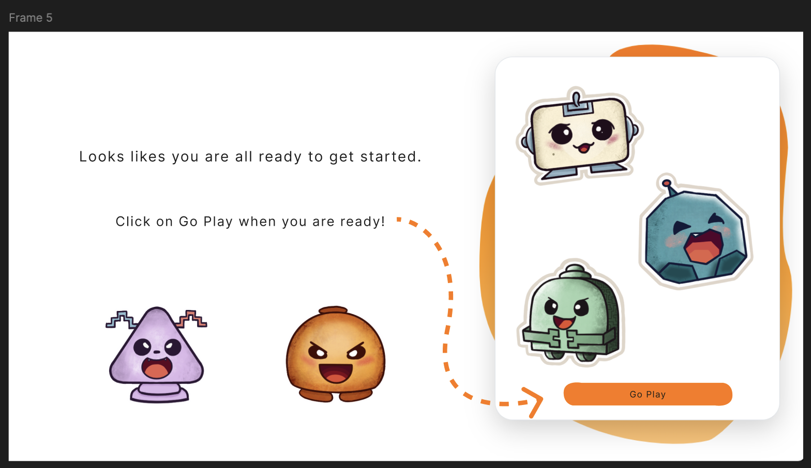 

**5. Login Page**

- After clicking "Go Play," the user is directed to the login page (previously at the start of the game).
- The user generates their credentials to log in.

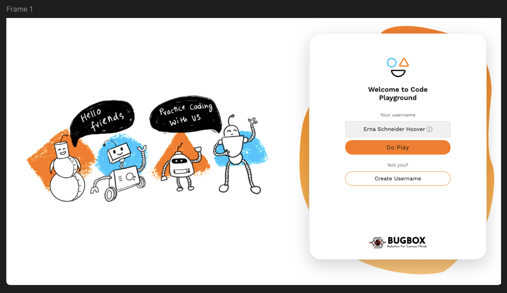 

**6. Accessing the Code Playground**

- After logging in, the user clicks "Go Play" again.
- The user is then taken to Frame 6, which is the BugBox code playground.

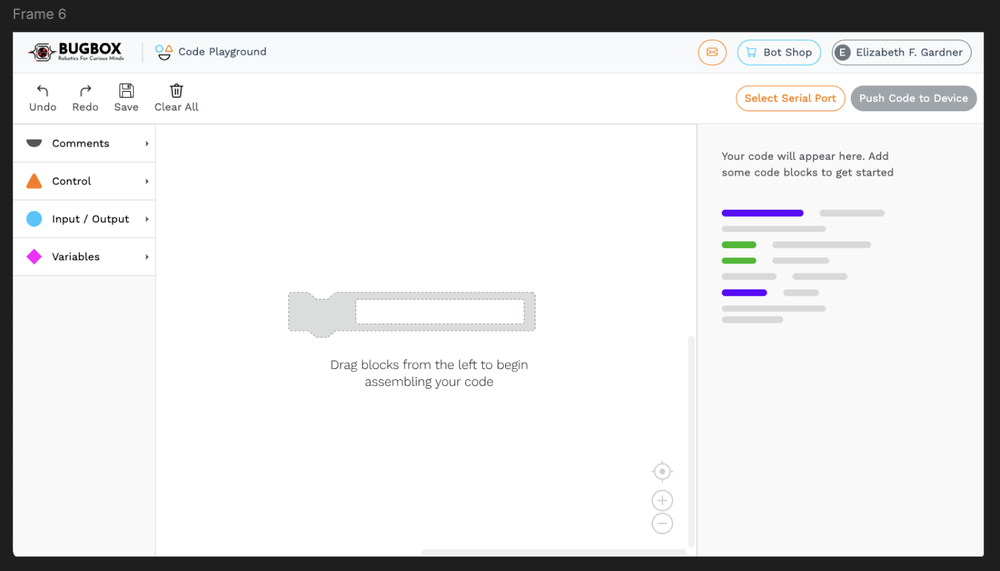 

This structure ensures that the game is played first, adding an interactive layer to the login process, as suggested by Dylan.
