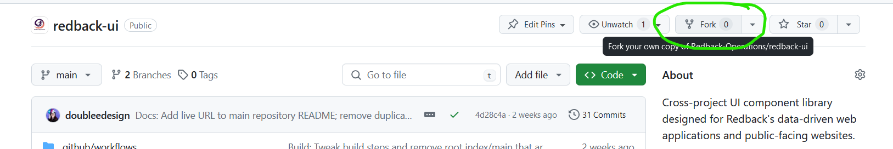

**Last updated by:** Leesa Ward, **Last updated on:** 11/07/2024


**Last updated by:** Leesa Ward, **Last updated on:** 11/07/2024


# Getting started with a project

> **Document Creation:** 23 March, 2024. **Last Edited:** 10 July, 2024. **Authors:** Leesa Ward.

## Prerequisites
- [Git](https://git-scm.com/downloads) installed
- [Node.js](https://nodejs.org/en/download/current) installed
- IDE or editor of choice (e.g., WebStorm, VS Code)
- Terminal of choice (e.g., Git Bash, Command Prompt, WSL, MacOS Terminal)
- Web browser
- Git credentials configured on your machine

### Recommended
- React Dev Tools browser extension for [Chrome](https://chrome.google.com/webstore/detail/react-developer-tools/fmkadmapgofadopljbjfkapdkoienihi), [Firefox](https://addons.mozilla.org/en-US/firefox/addon/react-devtools/), or [Edge](https://microsoftedge.microsoft.com/addons/detail/react-developer-tools/gpphkfbcpidddadnkolkpfckpihlkkil)

### Optional
- Git GUI such as GitKraken, SourceTree, GitHub Desktop (if you prefer this over working only with terminal commands)

## Getting Started
1. Fork the repository you will be working on to your own account
   

2. Clone the repository to your local machine
    ```bash
    git clone https://github.com/your-username/your-repo-name.git
    ```
   (or SSH if you have set up SSH access to your GitHub account)
3. Select a task to work on from the [Planner Board](https://tasks.office.com/deakin365.onmicrosoft.com/en-US/Home/Planner/#/plantaskboard?groupId=d4b3d587-9b20-4ac0-9de2-b842fd9dce46&planId=TOGdCftBI0mZ937fEIW0jsgAHPsL). If a suitable task does not exist for you but you have identified something that needs to be done, create a task for it and assign yourself. If it is a large feature, break it up into small, discrete tasks.
4. Create a branch for your current work, following the Capstone [Branching Guidelines](https://verdant-raindrop-f3e404.netlify.app/processes/quality-assurance/git-contributions-guide/#branching-guidelines)
    ```bash
    git branch <branch-name>
    ```
5. Check out your branch
    ```bash
    git checkout <branch-name>
    ```
6. Open your terminal and navigate to the project directory
    ```bash
    cd path/to/your-repo-name
    ```
7. Run `npm install` to install the project dependencies
    ```bash
   npm install
    ```
8. Run `npm run dev` to start the development server
    ```bash
    npm run dev
    ```
9. Open a web browser and navigate to `http://localhost:5173` to view the application (or different port if specified in the terminal output).
10. Make your changes.
11. Commit your changes regularly and push your branch up to GitHub.


## Useful links
- [Deakin Capstone Git contribution guide](https://verdant-raindrop-f3e404.netlify.app/processes/quality-assurance/git-contributions-guide/)
- [Redback-specific tutorials](help/tutorials.md)
- [React docs](https://react.dev/)
- [TypeScript docs](https://www.typescriptlang.org/docs/)
- [React Router docs](https://reactrouter.com/)
- [Styled Components docs](https://styled-components.com/)
