import { ProcessWizard, ProcessWizardStep } from "../../../src/components/ProcessWizard";

# Redback UI

> **Document Creation:** 7 May, 2024. **Last Edited:** 29 September, 2024. **Authors:** Leesa Ward.

## Using Redback UI

:::info

You can find the lastest version of Redback UI on [NPM](https://www.npmjs.com/package/@redbackops/redback-ui).

:::

Installation instructions (for projects not already using it) and overall guidance on how to get started can be found in the [repository README](https://github.com/Redback-Operations/redback-ui/blob/main/README.md). (Note: This is the same as what is shown on the NPM page - NPM automatically uses the README file from the latest release.)

Please visit the [Redback UI Storybook](https://redback-operations.github.io/redback-ui/) for documentation of the individual components.

## Creating a new release

When a new feature, bug fix, enhancement, etc. is merged into the `main` branch, or a collection of them are merged and ready to be released at the same time, a new release must be created and published for the changes to be available to other projects.

:::warning

This process must be performed by someone with write access to the GitHub repository.

:::

<ProcessWizard>
    <ProcessWizardStep title="Increment version">
        Create a branch and update the version number in the `package.json` file.
        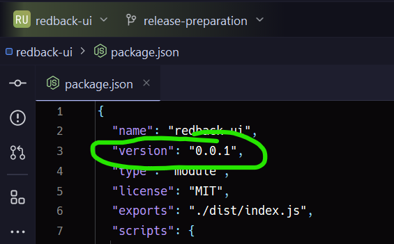

        Raise a PR to merge the changes into the `main` branch, and when it is approved and merged, you can proceed to the next step.
    </ProcessWizardStep>
    <ProcessWizardStep title="Begin in GitHub">
        From the main page of the GitHub repo, click on **Tags**.
        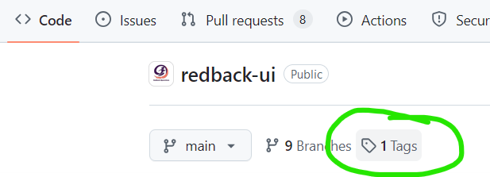

        Click on the **Releases** tab (top left) and then the **Draft a new release** button (top right).
        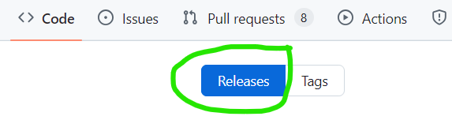
        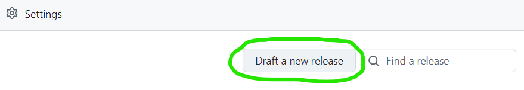
    </ProcessWizardStep>
    <ProcessWizardStep title="Tag and title">
        1. Click the **tag** dropdown (top left, under the Releases tab)
        2. Enter your version number from step 1 as the new tag
        3. Click **Create new tag: vX.X.X on publish**.
        4. Enter a title for the release (usually the version number, the same as the tag).
        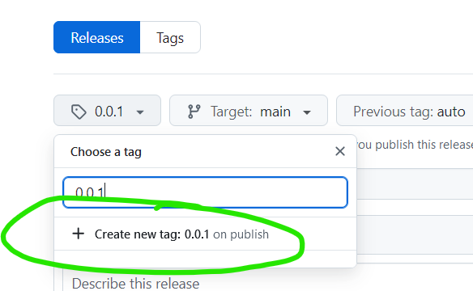
    </ProcessWizardStep>
    <ProcessWizardStep title="Add release notes">
        Click the **Generate Release Notes** button (top right) to automatically create release notes based on the commits since the last release.
        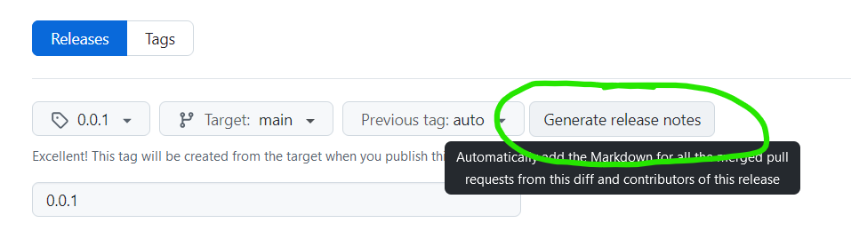

        Switch from the Write tab to the **Review** tab to view the release notes to make sure they are accurate and complete.
        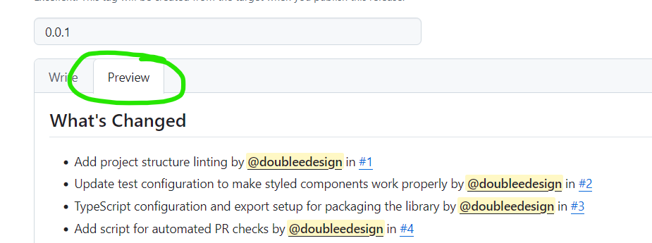
    </ProcessWizardStep>
    <ProcessWizardStep title="Publish release">
        At the bottom of the page, click the **Publish release** button.
        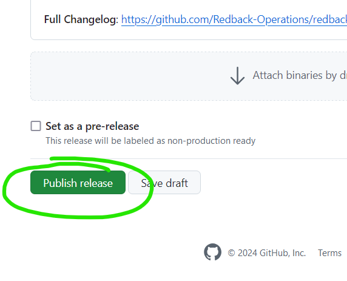
    </ProcessWizardStep>
    <ProcessWizardStep title="Monitor release action">
        Go to the **Actions** tab to monitor the automatic release action. The action you are looking for is called **Publish component library to NPM**.
        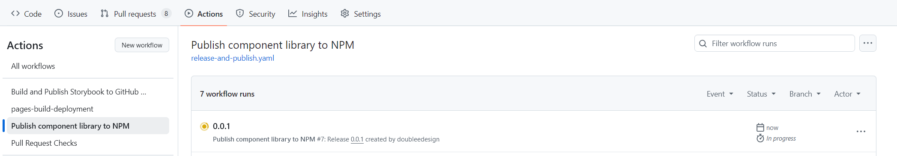

        If anything goes wrong with the release action, you can click on the failed job to see the details to help you troubleshoot.
        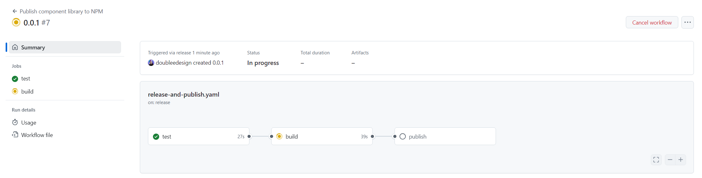
    </ProcessWizardStep>
    <ProcessWizardStep title="Check NPM">
        After the release action in GitHub has completed successfully, check the <a href="https://www.npmjs.com/package/@redbackops/redback-ui">Redback UI NPM page</a> to make sure the new version published as expected.
        In particular, check that the **Version** and **Last publish** fields are as you expect.
        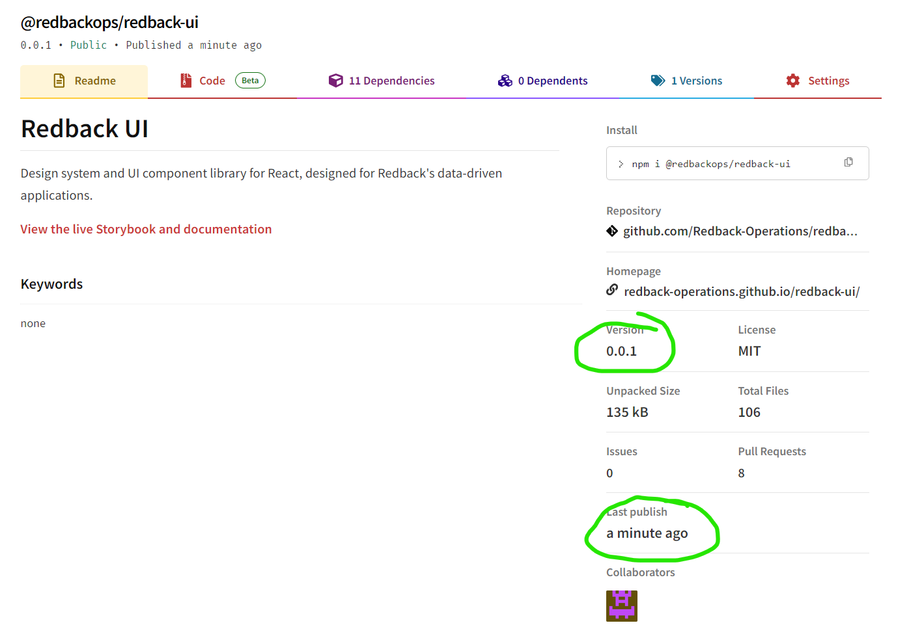
    </ProcessWizardStep>
</ProcessWizard>

